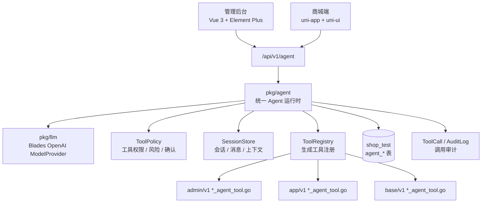
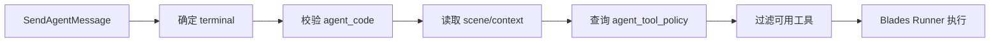
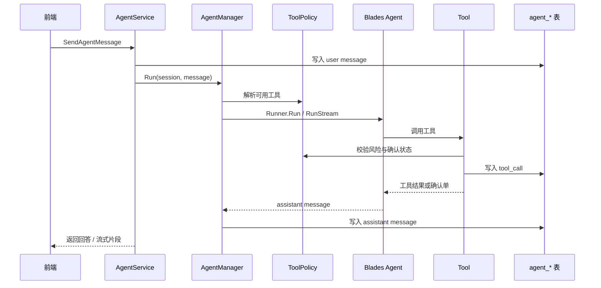

# 智能 Agent 全端设计

> 临时设计稿：本文档在功能开发与验证期间暂存于 `docs/_drafts`。等 Agent 功能完成、表结构和前后端交互稳定后，再迁移到正式 `docs` 目录，并同步更新 README 与专题文档索引。

## 文档目标

本文档说明商城项目基于 `github.com/go-kratos/blades` 建设全端智能 Agent 能力的完整方案，覆盖后端运行时、工具治理、数据库表结构、管理后台、商城端、权限审计、原型交互和验证方式。

当前项目已经完成以下基础能力：

- 后端已集成 `github.com/go-kratos/blades` 与 `github.com/go-kratos/blades/contrib/openai`，现有 `pkg/llm` 主要用于评价审核和评价 AI 摘要。
- `api/gen/go/**/_agent_tool.go` 已通过 `protoc-gen-go-agent-tool` 生成，可以将 Kratos Service 方法包装成 Blades `tools.Tool`。
- MCP 工具链已完成生成、注册和按 `base_api.mcp_enabled` 过滤。
- 管理后台和商城端已有稳定的 `src/api -> src/rpc -> 请求封装 -> 页面` 分层。

本方案目标不是新增一个临时聊天框，而是把 Blades Agent 作为统一智能编排层，让后台运营、移动端导购、客服辅助、推荐诊断和评价审核共享同一套底座，并按终端和场景控制工具边界。

## 范围与模块

| 模块 | 改动定位 | 说明 |
| --- | --- | --- |
| `backend` | Agent 运行时、统一接口契约、工具注册、会话和审计 | 统一承载模型、Agent、工具策略、会话和工具调用记录。 |
| `frontend/admin` | 后台助手页面、全局助手抽屉、工具治理页面 | 复用 Element Plus、ProTable、FormDialog、ProForm、现有请求封装。 |
| `frontend/app` | 商城端导购助手、场景入口、聊天页面 | 复用 uni-app、uni-ui、Xtx 组件、Pinia、现有请求封装。 |
| `sql` | 表结构、菜单、接口权限、初始化策略 | 所有新增表、菜单和接口权限落到 `sql/default-data.sql`。 |
| `docs` | 设计与使用说明 | 同步 README 和专题设计文档。 |

由于该能力横跨后端、后台、移动端、SQL 和文档，正式开发前必须先确认本设计范围。

## 第一版临时实现范围

第一版目标是先打通“后台 Element Plus X 聊天体验 -> 统一 Agent 接口 -> Blades Runner -> 生成工具调用 -> 自然语言结果”的主链路，暂不引入数据库表和工具策略管理页面。

### 第一版包含

| 模块 | 内容 | 说明 |
| --- | --- | --- |
| 后端统一接口 | `base/v1/agent.proto`、`/api/v1/agent/...` | 先提供创建会话、发送消息、查询内存消息等核心接口。 |
| 后端运行时 | `pkg/agent.Manager`、`ToolRegistry`、`StaticToolPolicy` | 会话、消息和工具调用记录暂存在进程内存。 |
| 模型接入 | 复用 `pkg/llm` OpenAI Provider | 不改现有评价审核和 AI 摘要链路。 |
| 工具接入 | 复用已生成的 `*_agent_tool.go` | 第一版全量注册工具，按风险分级自动执行或确认执行。 |
| 权限校验 | 继续使用现有 token、角色、接口权限和业务校验 | Agent 层不绕过现有认证鉴权。 |
| 管理后台 | 使用 Element Plus X 实现聊天主体 | 先做后台助手页面或全局抽屉，验证交互。 |

### 第一版暂不包含

- 不新增 `agent_session`、`agent_message`、`agent_tool_policy`、`agent_tool_call` 等数据库表。
- 不修改 `sql/default-data.sql` 中的 Agent 表结构初始化。
- 不做工具策略管理页面。
- 不做工具调用审计页面。
- 不做长期会话保存。
- 不做商城端 Agent 聊天页。
- 不把写操作和高风险工具永久禁用；第一版通过静态策略和内存确认单控制执行。

### 第一版限制

- 服务重启后会话和消息丢失。
- 多实例部署时会话不共享。
- 工具策略需要改代码调整。
- 无法长期追溯工具调用详情。
- 写操作确认单保存在内存，服务重启后未确认任务会丢失。

这些限制是可接受的，因为第一版用于验证产品交互和 Agent 工具链。等链路稳定后，再按本文后续章节迁移到落库、策略管理、审计和全端入口。

### 第一版工具执行策略

第一版需要接入全部已生成 Agent 工具，而不是只接查询工具。工具执行按静态风险策略处理：

| 风险等级 | 第一版行为 | 说明 |
| --- | --- | --- |
| `READ` | 自动执行 | 查询、列表、统计、详情等只读工具直接调用。 |
| `SUGGEST` | 自动执行 | 只生成建议或预览，不改变业务数据。 |
| `WRITE_CONFIRM` | 生成内存确认单，用户确认后执行 | 创建、更新、改状态等写操作进入确认流程。 |
| `HIGH_RISK_CONFIRM` | 生成强确认单，限制角色后执行 | 发货、退款、执行任务、批量变更等高风险工具。 |
| `FORBIDDEN` | 不执行 | 明确不允许 Agent 触发的工具，例如密钥读取、破坏性删除等。 |

静态策略可以先通过工具名、HTTP Method、RPC 方法名前缀推断：

- `Get`、`List`、`Page`、`Summary`、`Trend`、`Pie`、`Option` 默认为 `READ`。
- `Preview`、`Export`、`Doc` 默认为 `SUGGEST` 或 `READ`，按实际副作用确认。
- `Create`、`Update`、`Set`、`Save`、`Refresh` 默认为 `WRITE_CONFIRM`。
- `Delete`、`Refund`、`Pay`、`Ship`、`Execute`、`Start`、`Stop` 默认为 `HIGH_RISK_CONFIRM`。
- 无法识别的工具默认进入 `WRITE_CONFIRM`，避免模型自动执行未知副作用。

确认执行时仍然调用原有 Service 方法，因此现有 token、角色、接口权限、业务状态校验都会继续生效。Agent 静态策略只是在模型调用前增加一道执行门槛，不替代业务校验。

## 总体架构



后端只保留一套 Agent 运行时。不同终端通过 `terminal`、`scene`、`agent_code`、`tool_policy` 隔离能力，而不是为后台和商城端各写一套逻辑。

## Agent 类型

| Agent | 终端 | 主要场景 | 工具范围 |
| --- | --- | --- | --- |
| `admin_ops` | 管理后台 | 工作台分析、订单风险、商品和库存、评价审核、支付账单、任务状态 | 管理端查询工具为主，写工具需确认。 |
| `admin_recommend` | 管理后台 | 推荐请求解释、Gorse 诊断、兜底率分析、用户/商品推荐链路排查 | 推荐、商品、用户、事件、Gorse 查询工具。 |
| `admin_review` | 管理后台 | 评价和讨论审核建议、AI 摘要质量检查、口碑分析 | 评价、讨论、标签、AI 摘要和工作台口碑工具。 |
| `app_shopping` | 商城端 | 商品问答、导购推荐、评价摘要追问、服务说明、凑单建议 | 商品、分类、热门、推荐、评价公开数据。 |
| `app_order` | 商城端 | 我的订单、物流、售后规则、评价入口、复购建议 | 当前登录用户自己的订单、购物车、收藏和地址工具。 |
| `system_tool_admin` | 管理后台 | 工具治理、接口文档、Agent 策略、调用审计 | `base_api`、工具策略、会话和调用记录查询。 |

## 工具分级

Agent 工具不能直接全量开放。所有生成工具进入注册表后，必须按风险等级和终端策略过滤。

| 风险等级 | 代码 | 行为 | 示例 |
| --- | --- | --- | --- |
| 只读 | `READ` | Agent 可自动调用 | 列表、详情、统计、工作台指标、推荐请求详情。 |
| 建议 | `SUGGEST` | 只生成建议，不改数据 | 评价审核建议、推荐调参建议、商品运营建议。 |
| 确认写 | `WRITE_CONFIRM` | 先生成确认单，用户确认后执行 | 更新商品状态、人工审核评价、调整热门推荐。 |
| 高危确认 | `HIGH_RISK_CONFIRM` | 仅特定角色可见，强确认后执行 | 发货、退款、执行任务、批量状态变更。 |
| 禁止 | `FORBIDDEN` | Agent 永不调用 | 删除核心数据、支付动作、越权查询、密钥读取。 |

工具策略由后端执行，前端只负责展示状态和确认卡片。提示词只能作为辅助约束，不能作为安全边界。

## 后端包设计

建议新增或调整以下包和文件：

```text
backend
├── pkg
│   ├── llm
│   │   └── client.go              # 保留结构化审核，新增 ModelProvider 暴露方法
│   └── agent
│       ├── manager.go             # AgentManager：创建、运行、流式运行
│       ├── registry.go            # ToolRegistry：注册生成工具
│       ├── policy.go              # ToolPolicy：终端、场景、风险过滤
│       ├── session.go             # SessionStore：会话上下文持久化
│       ├── prompt.go              # PromptBuilder：场景提示词和上下文注入
│       ├── confirm.go             # ToolConfirm：确认单生成与执行
│       └── dto.go                 # 运行时内部 DTO
├── server
│   └── agent.go                   # 类似 mcp.go，集中注册 Agent Tools 并创建 Agent 运行时
├── service
│   └── base
│       ├── agent_service.go       # 统一 Base Agent 服务
│       └── biz/agent.go           # 统一 Agent Case，按 terminal 分流工具链
└── api/protos
    └── base/v1/agent.proto          # 统一 Agent 接口、消息、会话、工具调用结构
```

`pkg/llm` 的现有评价审核和 AI 摘要不要迁移到 Agent 内。它们是稳定结构化任务，继续直接调用模型；Agent 复用同一个模型配置即可。

## 统一接口设计

Agent 会话、消息发送、消息列表、反馈、工具确认、策略查询等服务端接口统一使用一套协议和一组 HTTP 路径，通过 `terminal`、`agent_code`、`scene` 和当前登录态决定可用工具链。

推荐做法是“服务端接口统一、终端能力隔离”：

- `base/v1/agent.proto` 定义唯一的 `AgentService` 和通用 message，例如 `AgentSession`、`AgentMessage`、`SendAgentMessageRequest`、`AgentToolCall`、`AgentFeedback`。
- HTTP 路径统一使用 `/api/v1/agent/...`，不再拆成 `/api/v1/admin/agent` 和 `/api/v1/app/agent`。
- 前端仍然分别维护 `frontend/admin/src/api/base/agent.ts` 与 `frontend/app/src/api/base/agent.ts`，但二者调用同一组后端路径和同一份生成类型。
- 后端实现走同一个 `pkg/agent.Manager`，Service 层负责解析当前登录态、校验 `terminal` 和 `agent_code` 是否匹配当前访问端。

统一接口不表示信任前端传入的终端类型。后端必须从 token、请求头、用户角色、匿名推荐主体和接口权限中校验访问来源。例如管理后台可传 `terminal=admin`，商城端可传 `terminal=app`，但最终以服务端校验结果为准。

前端请求仍然携带现有访问令牌，并继续经过当前项目的认证与接口权限校验。统一 Agent 运行时只是在认证通过后的业务层复用编排能力，不替代 JWT、角色、菜单、按钮、接口权限和业务归属校验。

统一入口参数如下：

| 字段 | 说明 | 后端来源 |
| --- | --- | --- |
| `terminal` | 终端类型：`admin`、`app` | 前端传入，后端结合 token、请求头和权限重新校验。 |
| `agent_code` | Agent 编码：`admin_ops`、`app_shopping` 等 | 前端可传，但后端按终端白名单校验。 |
| `scene` | 当前业务场景 | 前端传入，后端用于筛选工具策略和提示词。 |
| `context_type` | 上下文类型 | 前端传入，后端校验是否属于当前终端允许范围。 |
| `context_id` | 上下文主键 | 前端传入，后端通过工具或业务查询验证归属。 |
| `context_payload` | 上下文快照 | 只保存非敏感摘要，后端可裁剪。 |

工具链选择流程：



## 数据库表结构

### agent_session

保存一次 Agent 会话。后台和商城端共表，通过 `terminal` 与 `scene` 区分。

```sql
CREATE TABLE `agent_session` (
  `id` bigint NOT NULL AUTO_INCREMENT COMMENT '会话主键',
  `terminal` varchar(32) NOT NULL COMMENT '终端：admin/app/base',
  `agent_code` varchar(64) NOT NULL COMMENT 'Agent编码',
  `scene` varchar(64) NOT NULL COMMENT '业务场景',
  `title` varchar(128) NOT NULL DEFAULT '' COMMENT '会话标题',
  `user_id` bigint NOT NULL DEFAULT 0 COMMENT '用户ID',
  `anonymous_actor_id` bigint NOT NULL DEFAULT 0 COMMENT '匿名推荐主体ID',
  `context_type` varchar(64) NOT NULL DEFAULT '' COMMENT '上下文类型',
  `context_id` bigint NOT NULL DEFAULT 0 COMMENT '上下文主键',
  `context_payload` json DEFAULT NULL COMMENT '上下文快照',
  `status` tinyint NOT NULL DEFAULT 1 COMMENT '状态：1正常 2归档 3异常',
  `last_message_at` datetime DEFAULT NULL COMMENT '最后消息时间',
  `created_by` bigint NOT NULL DEFAULT 0 COMMENT '创建人',
  `updated_by` bigint NOT NULL DEFAULT 0 COMMENT '更新人',
  `created_at` datetime NOT NULL DEFAULT CURRENT_TIMESTAMP COMMENT '创建时间',
  `updated_at` datetime NOT NULL DEFAULT CURRENT_TIMESTAMP ON UPDATE CURRENT_TIMESTAMP COMMENT '更新时间',
  `deleted_at` datetime DEFAULT NULL COMMENT '删除时间',
  PRIMARY KEY (`id`),
  KEY `idx_agent_session_terminal_user` (`terminal`, `user_id`, `last_message_at`),
  KEY `idx_agent_session_agent_scene` (`agent_code`, `scene`, `last_message_at`),
  KEY `idx_agent_session_context` (`context_type`, `context_id`)
) ENGINE=InnoDB DEFAULT CHARSET=utf8mb4 COMMENT='Agent会话';
```

### agent_message

保存会话消息。消息正文保留 Markdown 文本，结构化扩展放 `metadata`。

```sql
CREATE TABLE `agent_message` (
  `id` bigint NOT NULL AUTO_INCREMENT COMMENT '消息主键',
  `session_id` bigint NOT NULL COMMENT '会话ID',
  `invocation_id` varchar(64) NOT NULL DEFAULT '' COMMENT 'Blades调用ID',
  `role` varchar(32) NOT NULL COMMENT '角色：user/assistant/tool/system',
  `content` mediumtext NOT NULL COMMENT '消息内容',
  `content_type` varchar(32) NOT NULL DEFAULT 'markdown' COMMENT '内容类型',
  `status` tinyint NOT NULL DEFAULT 1 COMMENT '状态：1生成中 2完成 3失败',
  `tool_call_count` int NOT NULL DEFAULT 0 COMMENT '工具调用次数',
  `error_message` varchar(512) NOT NULL DEFAULT '' COMMENT '错误信息',
  `metadata` json DEFAULT NULL COMMENT '消息元数据',
  `created_by` bigint NOT NULL DEFAULT 0 COMMENT '创建人',
  `updated_by` bigint NOT NULL DEFAULT 0 COMMENT '更新人',
  `created_at` datetime NOT NULL DEFAULT CURRENT_TIMESTAMP COMMENT '创建时间',
  `updated_at` datetime NOT NULL DEFAULT CURRENT_TIMESTAMP ON UPDATE CURRENT_TIMESTAMP COMMENT '更新时间',
  `deleted_at` datetime DEFAULT NULL COMMENT '删除时间',
  PRIMARY KEY (`id`),
  KEY `idx_agent_message_session` (`session_id`, `id`),
  KEY `idx_agent_message_invocation` (`invocation_id`)
) ENGINE=InnoDB DEFAULT CHARSET=utf8mb4 COMMENT='Agent消息';
```

### agent_tool_policy

保存工具治理策略。工具名来自生成工具的 `Tool.Name()`，可与 `base_api.mcp_tool_name` 保持一致。

```sql
CREATE TABLE `agent_tool_policy` (
  `id` bigint NOT NULL AUTO_INCREMENT COMMENT '策略主键',
  `terminal` varchar(32) NOT NULL COMMENT '终端：admin/app/base',
  `agent_code` varchar(64) NOT NULL COMMENT 'Agent编码',
  `scene` varchar(64) NOT NULL DEFAULT '*' COMMENT '业务场景，*表示全部',
  `tool_name` varchar(191) NOT NULL COMMENT '工具名',
  `service_name` varchar(191) NOT NULL DEFAULT '' COMMENT '服务名',
  `operation` varchar(191) NOT NULL DEFAULT '' COMMENT 'RPC操作',
  `risk_level` varchar(32) NOT NULL COMMENT '风险等级',
  `enabled` tinyint(1) NOT NULL DEFAULT 1 COMMENT '是否启用',
  `confirm_required` tinyint(1) NOT NULL DEFAULT 0 COMMENT '是否需要确认',
  `role_codes` json DEFAULT NULL COMMENT '允许角色编码列表',
  `remark` varchar(512) NOT NULL DEFAULT '' COMMENT '备注',
  `created_by` bigint NOT NULL DEFAULT 0 COMMENT '创建人',
  `updated_by` bigint NOT NULL DEFAULT 0 COMMENT '更新人',
  `created_at` datetime NOT NULL DEFAULT CURRENT_TIMESTAMP COMMENT '创建时间',
  `updated_at` datetime NOT NULL DEFAULT CURRENT_TIMESTAMP ON UPDATE CURRENT_TIMESTAMP COMMENT '更新时间',
  `deleted_at` datetime DEFAULT NULL COMMENT '删除时间',
  PRIMARY KEY (`id`),
  UNIQUE KEY `unique_agent_tool_policy` (`terminal`, `agent_code`, `scene`, `tool_name`),
  KEY `idx_agent_tool_policy_tool` (`tool_name`)
) ENGINE=InnoDB DEFAULT CHARSET=utf8mb4 COMMENT='Agent工具策略';
```

### agent_tool_call

保存每次工具调用。请求和响应只存摘要，避免大字段和敏感数据失控。

```sql
CREATE TABLE `agent_tool_call` (
  `id` bigint NOT NULL AUTO_INCREMENT COMMENT '工具调用主键',
  `session_id` bigint NOT NULL COMMENT '会话ID',
  `message_id` bigint NOT NULL DEFAULT 0 COMMENT '触发消息ID',
  `invocation_id` varchar(64) NOT NULL DEFAULT '' COMMENT 'Blades调用ID',
  `tool_call_id` varchar(128) NOT NULL DEFAULT '' COMMENT '模型工具调用ID',
  `terminal` varchar(32) NOT NULL COMMENT '终端',
  `agent_code` varchar(64) NOT NULL COMMENT 'Agent编码',
  `tool_name` varchar(191) NOT NULL COMMENT '工具名',
  `risk_level` varchar(32) NOT NULL COMMENT '风险等级',
  `confirm_status` tinyint NOT NULL DEFAULT 1 COMMENT '确认状态：1无需确认 2待确认 3已确认 4已拒绝',
  `request_summary` json DEFAULT NULL COMMENT '请求摘要',
  `response_summary` json DEFAULT NULL COMMENT '响应摘要',
  `success` tinyint(1) NOT NULL DEFAULT 0 COMMENT '是否成功',
  `duration_ms` int NOT NULL DEFAULT 0 COMMENT '耗时毫秒',
  `error_message` varchar(512) NOT NULL DEFAULT '' COMMENT '错误信息',
  `created_by` bigint NOT NULL DEFAULT 0 COMMENT '创建人',
  `updated_by` bigint NOT NULL DEFAULT 0 COMMENT '更新人',
  `created_at` datetime NOT NULL DEFAULT CURRENT_TIMESTAMP COMMENT '创建时间',
  `updated_at` datetime NOT NULL DEFAULT CURRENT_TIMESTAMP ON UPDATE CURRENT_TIMESTAMP COMMENT '更新时间',
  `deleted_at` datetime DEFAULT NULL COMMENT '删除时间',
  PRIMARY KEY (`id`),
  KEY `idx_agent_tool_call_session` (`session_id`, `id`),
  KEY `idx_agent_tool_call_tool` (`tool_name`, `created_at`),
  KEY `idx_agent_tool_call_agent` (`terminal`, `agent_code`, `created_at`)
) ENGINE=InnoDB DEFAULT CHARSET=utf8mb4 COMMENT='Agent工具调用';
```

### agent_tool_confirmation

保存写操作确认单。确认单与工具调用分离，便于前端展示和二次提交。

```sql
CREATE TABLE `agent_tool_confirmation` (
  `id` bigint NOT NULL AUTO_INCREMENT COMMENT '确认单主键',
  `session_id` bigint NOT NULL COMMENT '会话ID',
  `tool_call_id` bigint NOT NULL COMMENT '工具调用记录ID',
  `terminal` varchar(32) NOT NULL COMMENT '终端',
  `agent_code` varchar(64) NOT NULL COMMENT 'Agent编码',
  `tool_name` varchar(191) NOT NULL COMMENT '工具名',
  `title` varchar(128) NOT NULL COMMENT '确认标题',
  `summary` varchar(512) NOT NULL DEFAULT '' COMMENT '确认摘要',
  `payload` json NOT NULL COMMENT '待执行参数',
  `status` tinyint NOT NULL DEFAULT 1 COMMENT '状态：1待确认 2已确认 3已拒绝 4已过期 5执行失败',
  `expire_at` datetime DEFAULT NULL COMMENT '过期时间',
  `confirmed_by` bigint NOT NULL DEFAULT 0 COMMENT '确认人',
  `confirmed_at` datetime DEFAULT NULL COMMENT '确认时间',
  `created_by` bigint NOT NULL DEFAULT 0 COMMENT '创建人',
  `updated_by` bigint NOT NULL DEFAULT 0 COMMENT '更新人',
  `created_at` datetime NOT NULL DEFAULT CURRENT_TIMESTAMP COMMENT '创建时间',
  `updated_at` datetime NOT NULL DEFAULT CURRENT_TIMESTAMP ON UPDATE CURRENT_TIMESTAMP COMMENT '更新时间',
  `deleted_at` datetime DEFAULT NULL COMMENT '删除时间',
  PRIMARY KEY (`id`),
  KEY `idx_agent_tool_confirmation_session` (`session_id`, `status`),
  KEY `idx_agent_tool_confirmation_tool_call` (`tool_call_id`)
) ENGINE=InnoDB DEFAULT CHARSET=utf8mb4 COMMENT='Agent工具确认单';
```

### agent_feedback

保存用户反馈，后续用于优化提示词、工具策略和回答质量。

```sql
CREATE TABLE `agent_feedback` (
  `id` bigint NOT NULL AUTO_INCREMENT COMMENT '反馈主键',
  `session_id` bigint NOT NULL COMMENT '会话ID',
  `message_id` bigint NOT NULL COMMENT '消息ID',
  `user_id` bigint NOT NULL DEFAULT 0 COMMENT '用户ID',
  `rating` tinyint NOT NULL COMMENT '评分：1有用 2无用',
  `reason` varchar(512) NOT NULL DEFAULT '' COMMENT '反馈原因',
  `created_by` bigint NOT NULL DEFAULT 0 COMMENT '创建人',
  `updated_by` bigint NOT NULL DEFAULT 0 COMMENT '更新人',
  `created_at` datetime NOT NULL DEFAULT CURRENT_TIMESTAMP COMMENT '创建时间',
  `updated_at` datetime NOT NULL DEFAULT CURRENT_TIMESTAMP ON UPDATE CURRENT_TIMESTAMP COMMENT '更新时间',
  `deleted_at` datetime DEFAULT NULL COMMENT '删除时间',
  PRIMARY KEY (`id`),
  UNIQUE KEY `unique_agent_feedback` (`message_id`, `user_id`),
  KEY `idx_agent_feedback_session` (`session_id`, `created_at`)
) ENGINE=InnoDB DEFAULT CHARSET=utf8mb4 COMMENT='Agent反馈';
```

## Proto 接口草案

统一接口建议放在 `backend/api/protos/base/v1/agent.proto`，前端 admin/app 都从生成后的 `base/v1/agent.ts` 引用同一份类型。

```proto
service AgentService {
  // 创建Agent会话
  rpc CreateAgentSession(CreateAgentSessionRequest) returns (AgentSession) {
    option (google.api.http) = {
      post: "/api/v1/agent/session"
      body: "*"
    };
  }

  // 查询Agent会话列表
  rpc PageAgentSessions(PageAgentSessionsRequest) returns (PageAgentSessionsResponse) {
    option (google.api.http) = {
      get: "/api/v1/agent/session"
    };
  }

  // 查询Agent消息列表
  rpc ListAgentMessages(ListAgentMessagesRequest) returns (ListAgentMessagesResponse) {
    option (google.api.http) = {
      get: "/api/v1/agent/session/{session_id}/message"
    };
  }

  // 发送Agent消息
  rpc SendAgentMessage(SendAgentMessageRequest) returns (SendAgentMessageResponse) {
    option (google.api.http) = {
      post: "/api/v1/agent/session/{session_id}/message"
      body: "*"
    };
  }

  // 确认执行工具
  rpc ConfirmAgentTool(ConfirmAgentToolRequest) returns (ConfirmAgentToolResponse) {
    option (google.api.http) = {
      post: "/api/v1/agent/tool-confirmation/{confirmation_id}/confirmation"
      body: "*"
    };
  }

  // 查询工具策略
  rpc PageAgentToolPolicies(PageAgentToolPoliciesRequest) returns (PageAgentToolPoliciesResponse) {
    option (google.api.http) = {
      get: "/api/v1/agent/tool-policy"
    };
  }

  // 更新工具策略
  rpc UpdateAgentToolPolicy(UpdateAgentToolPolicyRequest) returns (google.protobuf.Empty) {
    option (google.api.http) = {
      put: "/api/v1/agent/tool-policy/{agent_tool_policy.id}"
      body: "agent_tool_policy"
    };
  }

  // 提交回答反馈
  rpc SaveAgentFeedback(SaveAgentFeedbackRequest) returns (google.protobuf.Empty) {
    option (google.api.http) = {
      post: "/api/v1/agent/message/{message_id}/feedback"
      body: "*"
    };
  }
}

message AgentSession {
  int64 id = 1;
  string terminal = 2;
  string agent_code = 3;
  string scene = 4;
  string title = 5;
  string context_type = 6;
  int64 context_id = 7;
}

message SendAgentMessageRequest {
  int64 session_id = 1;
  string agent_code = 2;
  string scene = 3;
  string content = 4;
  string context_type = 5;
  int64 context_id = 6;
  string context_payload = 7;
}

message SendAgentMessageResponse {
  AgentMessage message = 1;
  repeated AgentToolCall tool_calls = 2;
  repeated AgentToolConfirmation confirmations = 3;
}
```

工具策略、调用审计、确认执行等治理接口虽然路径统一，但后端只允许管理后台角色访问。商城端调用这些接口时应返回 `PERMISSION_DENIED`。流式输出建议在 HTTP 层使用 SSE 或兼容 Streamable HTTP；若项目短期不做流式，可先用 `SendAgentMessage` 返回完整回答，前端保持接口层可替换。

## 权限与上下文

### 管理后台

- 使用现有登录态、角色、菜单和接口权限。
- 前端通过 `src/utils/request.ts` 携带 token，后端仍按现有认证中间件和接口权限校验请求。
- Agent 工具调用进入 Service 时必须携带当前用户上下文，不能用系统用户绕过权限。
- 工具策略中的 `role_codes` 是 Agent 层额外限制；最终仍以现有 token 认证、接口权限和业务校验为准。
- 高危工具必须记录确认人、确认时间、参数摘要和执行结果。

### 商城端

- 匿名用户仅能使用公开商品、分类、热门推荐、评价摘要等工具。
- 登录用户只能访问自己的订单、购物车、收藏、地址、评价。
- 商城端通过 `src/utils/http.ts` 携带 token，后端仍按现有认证逻辑识别当前用户；未登录请求只能进入允许匿名访问的 Agent 场景。
- 推荐相关上下文需要携带 `X-Recommend-Anonymous-Id`，登录后复用现有匿名主体绑定逻辑。
- Agent 不直接执行支付、退款、删除订单等动作，只引导进入现有页面。

## 管理后台前端设计

### 技术与组件

管理后台不从零搭建 UI，继续复用现有技术栈和组件：

| 能力 | 复用内容 | 用法 |
| --- | --- | --- |
| 页面框架 | Vue 3、Vite、TypeScript、Pinia | 新增 `src/views/agent` 页面域。 |
| UI 组件 | Element Plus、`@element-plus/icons-vue` | 聊天、抽屉、表格、确认弹窗、标签、时间线。 |
| 表格 | `ProTable` | 会话列表、工具策略、工具调用审计。 |
| 表单弹窗 | `FormDialog`、`ProForm` | 工具策略编辑、风险等级调整。 |
| 请求 | `src/utils/request.ts` | 新增 `src/api/admin/agent.ts`。 |
| 类型 | `src/rpc/base/v1/agent.ts` | 由 proto 生成，不手写业务等价类型。 |
| 样式 | `src/styles/common.scss`、`element-dark.scss` | 兼容亮色、暗黑、灰色、色弱模式。 |

### 社区组件调研结论

后台侧优先保持 Element Plus 生态，不引入整套新的管理后台 UI。社区组件可以作为聊天主体或 AI 消息渲染的加速器，但需要避免把后台主题切到 Tailwind / shadcn / Vuetify 等第二套体系。

| 组件 / 方案 | GitHub | 适配度 | 结论 |
| --- | --- | --- | --- |
| Element Plus `Drawer`、`Input`、`Scrollbar`、`Timeline`、`Tag`、`Button` | https://github.com/element-plus/element-plus | 高 | 与当前后台完全一致，适合作为默认实现。官方 `Drawer` 支持 `v-model`、右侧抽屉、嵌套和自定义 header；适合全局助手抽屉。 |
| `Element Plus X` / `vue-element-plus-x` | https://github.com/element-plus-x/Element-Plus-X | 高 | 基于 Vue 3 + Element Plus 的企业级 AI 组件库，提供 `Bubble`、`BubbleList`、`Sender`、`Conversations` 等 AI 对话组件，支持 Markdown、打字机效果和按需引入。与当前后台技术栈最贴合，应作为后台聊天主体首选。 |
| `deep-chat` | https://github.com/OvidijusParsiunas/deep-chat | 高 | GitHub 约 3k+ star，框架无关 Web Component，支持自定义请求、Readable Stream、自定义按钮，适合 AI Chat 场景。可嵌入 Vue3，但样式与工具确认卡片需要二次封装。 |
| `vue-advanced-chat` | https://github.com/advanced-chat/vue-advanced-chat | 中 | GitHub 约 2k star，Vue 可注册 Web Component，提供房间、消息、输入、附件、表情、移动端布局等完整 IM 能力。适合会话/消息 UI，但偏 IM，不是专门 Agent 工具流。 |
| `AI Elements Vue` | https://github.com/vuepont/ai-elements-vue | 中 | GitHub 约 600+ star，AI 原生组件更完整，包含 conversation、message、prompt-input、tool、confirmation、reasoning、code-block 等；但依赖 shadcn-vue、Tailwind CSS 和 AI SDK，和当前 Element Plus 后台主题冲突较大。可参考组件设计，不建议整体引入。 |
| `vue3-beautiful-chat` | https://github.com/PeakTai/vue3-beautiful-chat | 低 | Intercom 风格浮窗，backend agnostic，适合轻客服入口；但生态和 Agent 工具调用展示能力弱，不建议作为主方案。 |

推荐策略：

1. 后台聊天主体首选 `Element Plus X`：它直接基于 Element Plus 设计体系，能最大限度减少主题割裂和二次封装。
2. 全局抽屉、策略管理、调用审计、工具确认卡片仍复用 Element Plus + 项目现有 ProTable/FormDialog/ProForm。
3. `deep-chat` 作为备选：如果后续发现 Element Plus X 的流式请求或自定义工具卡片能力不足，再评估它的 Web Component 方案。
4. 如果更看重会话房间、附件、表情和移动端聊天布局，可以评估 `vue-advanced-chat`，但需要裁剪 IM 色彩和房间概念。
5. `AI Elements Vue` 的 `tool`、`confirmation`、`reasoning`、`code-block` 设计值得参考；当前项目不建议直接引入 shadcn-vue/Tailwind 体系。
6. 不引入 Ant Design、Naive UI、PrimeVue 等第二套后台组件库，避免主题、体积和交互风格割裂。

参考资料：

- Element Plus Drawer 文档：https://element-plus.org/en-US/component/drawer
- Element Plus 组件总览：https://element-plus.org/en-US/component/overview
- Element Plus X：https://github.com/element-plus-x/Element-Plus-X
- Element Plus X 文档：https://element-plus-x.com/en/
- deep-chat：https://github.com/OvidijusParsiunas/deep-chat
- vue-advanced-chat：https://github.com/advanced-chat/vue-advanced-chat
- AI Elements Vue：https://github.com/vuepont/ai-elements-vue

### 页面结构

```text
frontend/admin/src/views/agent
├── assistant
│   └── index.vue              # 智能助手独立页面
├── session
│   └── index.vue              # 会话管理
├── tool-policy
│   └── index.vue              # 工具策略管理
└── audit
    └── index.vue              # 工具调用审计

frontend/admin/src/components/Agent
├── AgentDrawer.vue            # 全局右侧助手抽屉
├── AgentChatPanel.vue         # 聊天主体
├── AgentMessageList.vue       # 消息列表
├── AgentMessageInput.vue      # 输入区
├── AgentToolCallTimeline.vue  # 工具调用时间线
├── AgentConfirmCard.vue       # 工具确认卡片
└── AgentContextBar.vue        # 当前页面上下文条
```

`AgentDrawer` 可挂在 `layouts/components/Header/ToolBarRight.vue` 或 Layout 内，保持全局可唤起。独立页面用于长会话、审计和历史回放。

### 管理后台原型

#### 全局助手抽屉

```text
┌──────────────────────────────────────────────┐
│ 当前页面：订单管理 / 待发货                   │
│ Agent：运营助手        场景：订单风险分析     │
├──────────────────────────────────────────────┤
│ 用户：今天有哪些履约风险？                   │
│                                              │
│ 助手：我会先检查待发货订单、退款中订单和任务 │
│      状态，然后给出优先级。                  │
│                                              │
│ 工具调用                                    │
│  ✓ 查询工作台风险提醒     82ms              │
│  ✓ 查询订单分析汇总       104ms             │
│  ✓ 查询任务状态           66ms              │
│                                              │
│ 结论                                       │
│ 1. 待发货订单 12 单，其中 3 单超过 24 小时。 │
│ 2. 退款中订单 2 单，需要核对支付账单。       │
│ 3. 推荐同步任务正常，不影响商品曝光。        │
│                                              │
│ [查看订单] [生成处理清单]                    │
├──────────────────────────────────────────────┤
│ 输入问题...                           [发送] │
└──────────────────────────────────────────────┘
```

#### 工具确认卡片

```text
┌──────────────────────────────────────────────┐
│ 需要确认：修改商品状态                       │
├──────────────────────────────────────────────┤
│ 工具：admin_v1_goods_info_service_set_status │
│ 风险：WRITE_CONFIRM                          │
│ 目标：商品 #1024                             │
│ 变更：上架 -> 下架                           │
│ 原因：库存为 0 且存在连续投诉                │
│                                              │
│ [拒绝]                         [确认执行]    │
└──────────────────────────────────────────────┘
```

#### 工具策略管理

```text
┌──────────────────────────────────────────────────────────────────┐
│ 工具策略                                                         │
│ Agent [运营助手 v]  场景 [全部 v]  风险 [全部 v]  关键字 [____] │
├──────────────────────────────────────────────────────────────────┤
│ 工具名                         终端  风险等级       状态  操作   │
│ workspace_summary_metrics       admin READ           启用  编辑   │
│ goods_info_update               admin WRITE_CONFIRM  启用  编辑   │
│ order_refund                    admin HIGH_RISK      禁用  编辑   │
└──────────────────────────────────────────────────────────────────┘
```

## 商城端前端设计

### 技术与组件

商城端不从零搭建 UI，继续复用现有 uni-app 体系：

| 能力 | 复用内容 | 用法 |
| --- | --- | --- |
| 页面框架 | uni-app、Vue 3、TypeScript、Pinia | 新增主包助手入口和场景入口。 |
| UI 组件 | `@dcloudio/uni-ui` | `uni-icons`、`uni-popup`、`uni-load-more`、`uni-transition`、`uni-forms`。 |
| 现有组件 | `XtxEmptyState`、`XtxGuess`、`XtxSwiper` | 空态、推荐商品、轮播等复用。 |
| 请求 | `src/utils/http.ts` | 新增 `src/api/app/agent.ts`。 |
| 类型 | `src/rpc/base/v1/agent.ts` | 由 proto 生成。 |
| 状态 | Pinia | 新增 `src/stores/modules/agent.ts` 管理当前会话和快捷入口。 |
| 样式 | `src/styles/base.scss`、`src/uni.scss` | 使用 rpx，优先兼容微信小程序和 H5。 |

### 社区组件调研结论

移动端优先使用 uni-app 官方生态和当前项目已有 Xtx 组件。社区组件可以补齐聊天列表、气泡、弹窗、输入栏和移动端交互，但不建议为了一个 Agent 聊天页替换整套 UI。

| 组件 / 方案 | 源码 / 入口 | 适配度 | 结论 |
| --- | --- | --- | --- |
| `uni-ai-chat` 模板 | https://ext.dcloud.net.cn/plugin?id=11969 | 高 | DCloud 官方 AI 聊天模板，插件市场下载，不是独立 GitHub 仓库；包含聊天页、消息内容渲染、Markdown、流式响应解析思路。项目使用自有 Go 后端，因此只复用前端页面结构和消息组件思路，不使用其 uniCloud 云对象。 |
| `uni-list-chat` | https://github.com/dcloudio/uni-ui | 高 | uni-ui 官方聊天列表组件，适合会话列表，不适合完整消息气泡页。 |
| uni-app 基础 `input` / `textarea` | https://github.com/dcloudio/uni-app | 高 | 支持 `confirm-type="send"` 等移动端输入行为，适合消息输入框。 |
| `uView` | https://github.com/umicro/uView | 中 | GitHub 约 4k+ star，uni-app 社区高热度 UI 库，组件丰富；但主线偏 Vue2/uView1.x，当前项目是 Vue3，不能直接作为首选。 |
| `uview-plus` | https://github.com/ijry/uview-plus | 中 | GitHub 约 600+ star，面向 Vue3/uni-app 的 uView 系分支，组件丰富、支持多端；可按需引入 `u-popup`、`u-input`、`u-list` 等，但会与项目现有 `uni-ui + Xtx` 形成第二套移动组件风格。 |
| `ThorUI-uniapp` | https://github.com/dingyong0214/ThorUI-uniapp | 中 | GitHub 约 2.8k star，轻量移动端组件库，覆盖常见移动端场景；适合作为页面样式和移动组件参考，直接引入需评估授权、主题和体积。 |
| 腾讯 `chat-uikit-uniapp` | https://github.com/TencentCloud/chat-uikit-uniapp | 中低 | GitHub 约百 star，支持 Android、iOS、微信小程序、H5，提供会话、聊天、群组等组件；但强绑定腾讯云 Chat SDK，偏 IM 系统，和本项目自有 Agent 后端不匹配，不建议作为主方案。 |

推荐策略：

1. 商城端聊天页借鉴 `uni-ai-chat` 的页面结构、消息渲染和流式设计，接口替换为本项目 `/api/v1/agent`。
2. 会话列表使用 `uni-list` + `uni-list-chat`，减少手写列表样式。
3. 消息输入使用 uni-app 原生 `textarea/input` + `uni-icons`，保证 H5、微信小程序、APP 兼容。
4. 商品卡、订单卡继续复用或延展项目现有 `XtxGuess`、商品列表、订单卡片样式。
5. 若后续确实需要更完整的移动组件体系，优先评估 `uview-plus` 而不是 Vue2 时代的 `uView`；但首版 Agent 不建议整体替换 UI 库。
6. 腾讯 `chat-uikit-uniapp` 只适合未来接入真人客服/IM 时评估；当前 AI Agent 场景不建议引入它的 SDK 依赖。

参考资料：

- uni-ai-chat 官方说明：https://en.uniapp.dcloud.io/uniCloud/uni-ai-chat.html
- uni-ai-chat 插件市场：https://ext.dcloud.net.cn/plugin?id=11969
- uni-list / uni-list-chat 文档：https://en.uniapp.dcloud.io/component/uniui/uni-list.html
- uni-app input 文档：https://en.uniapp.dcloud.io/uni-app-x/component/input.html
- uView：https://github.com/umicro/uView
- uview-plus：https://github.com/ijry/uview-plus
- ThorUI-uniapp：https://github.com/dingyong0214/ThorUI-uniapp
- Tencent Cloud chat-uikit-uniapp：https://www-sg.tencentcloud.com/ind/document/product/1047/58660

### 页面和组件结构

```text
frontend/app/src/pages/agent
├── chat.vue                  # 智能助手聊天页
└── components
    ├── AgentMessageList.vue
    ├── AgentMessageInput.vue
    ├── AgentQuickPrompts.vue
    ├── AgentGoodsCard.vue
    ├── AgentOrderCard.vue
    └── AgentActionBar.vue

frontend/app/src/components
└── XtxAgentEntry.vue          # 可复用悬浮入口 / 场景入口
```

`pages.json` 新增主包页面 `pages/agent/chat`。商品详情、购物车、订单详情、我的页面只放轻入口，不把复杂聊天逻辑塞进各页面。

### 商城端入口

| 页面 | 入口形式 | 默认场景 | 上下文 |
| --- | --- | --- | --- |
| 首页 | 搜索下方或悬浮按钮 | `home_guide` | 当前推荐主体、首页推荐请求。 |
| 商品详情 | 商品问答卡片 | `goods_detail` | `goods_id`、SKU、推荐请求 ID。 |
| 评价列表 | AI 摘要追问 | `comment_summary` | `goods_id`、评价筛选条件。 |
| 购物车 | 凑单/搭配建议入口 | `cart` | 当前购物车商品。 |
| 订单详情 | 订单助手入口 | `order_detail` | 当前订单 ID。 |
| 我的 | 客服式入口 | `profile_support` | 当前用户、订单计数。 |

### 商城端原型

#### 商品详情问答入口

```text
┌──────────────────────────────┐
│ 商品图片 / 基本信息           │
├──────────────────────────────┤
│ 智能导购                      │
│ 这件商品适合什么场景？         │
│ [问尺码] [看评价总结] [推荐搭配]│
└──────────────────────────────┘
```

#### 商城端聊天页

```text
┌──────────────────────────────┐
│ < 智能导购                    │
├──────────────────────────────┤
│ 场景：商品详情  商品：山野外套 │
│                              │
│ 用户：这件适合春天通勤吗？     │
│                              │
│ 助手：适合。它的面料偏轻，评价 │
│      里提到“防风”和“版型利落” │
│      较多。若你经常骑车，建议 │
│      选大一码方便叠穿。        │
│                              │
│ 推荐搭配                       │
│ ┌──────────┐ ┌──────────┐     │
│ │ 商品卡片 │ │ 商品卡片 │     │
│ └──────────┘ └──────────┘     │
│                              │
│ [查看评价] [加入购物车]        │
├──────────────────────────────┤
│ 输入问题...              发送 │
└──────────────────────────────┘
```

#### 订单助手

```text
┌──────────────────────────────┐
│ 订单助手                      │
├──────────────────────────────┤
│ 当前订单：待发货              │
│                              │
│ 助手：商家尚未发货。若超过承诺 │
│      时间，你可以联系商家或申请 │
│      退款。                  │
│                              │
│ [查看物流] [申请退款] [联系客服]│
└──────────────────────────────┘
```

商城端按钮只跳转到现有业务页面或触发现有页面确认，不直接让 Agent 绕过业务动作。

## 会话上下文设计

Agent 会话创建时由前端传入上下文：

| 字段 | 后台示例 | 商城端示例 |
| --- | --- | --- |
| `terminal` | `admin` | `app` |
| `agent_code` | `admin_ops` | `app_shopping` |
| `scene` | `workspace`、`order_list`、`recommend_debug` | `goods_detail`、`cart`、`order_detail` |
| `context_type` | `order`、`goods`、`recommend_request` | `goods`、`cart`、`order` |
| `context_id` | 订单 ID、商品 ID、推荐请求 ID | 商品 ID、订单 ID |
| `context_payload` | 当前筛选条件、页面路由、关键参数 | SKU、推荐请求 ID、匿名主体 ID |

后端 PromptBuilder 只注入必要上下文，避免把页面全量数据塞给模型。敏感字段必须在工具响应摘要和上下文快照中脱敏。

## 工具注册策略

### 管理后台默认工具集

优先启用：

- 工作台：`WorkspaceServiceAgentTools`
- 订单分析和报表：`OrderAnalyticsServiceAgentTools`、`OrderReportServiceAgentTools`
- 商品分析和报表：`GoodsAnalyticsServiceAgentTools`、`GoodsReportServiceAgentTools`
- 用户分析：`UserAnalyticsServiceAgentTools`
- 评价管理：`CommentInfoServiceAgentTools`
- 推荐请求和 Gorse：`RecommendRequestServiceAgentTools`、`RecommendGorseServiceAgentTools`
- API 文档：`BaseApiServiceAgentTools`

谨慎启用：

- 商品、轮播、热门、配置、任务等写操作。
- 发货、退款、任务执行等高危操作。

### 商城端默认工具集

第一版同样全量注册商城端已生成 Agent 工具，但按当前用户、匿名主体、业务归属和风险策略控制执行：

- 商品：`GoodsInfoServiceAgentTools`
- 分类：`GoodsCategoryServiceAgentTools`
- 热门推荐：`ShopHotServiceAgentTools`
- 商城服务：`ShopServiceServiceAgentTools`
- 推荐：`RecommendServiceAgentTools`
- 评价：`CommentServiceAgentTools`
- 当前用户订单：`OrderInfoServiceAgentTools`
- 购物车：`UserCartServiceAgentTools`
- 收藏：`UserCollectServiceAgentTools`
- 地址：`UserAddressServiceAgentTools`
- 支付：`PayServiceAgentTools`
- 用户门店：`UserStoreServiceAgentTools`

执行边界：

- 非当前用户数据禁止访问。
- 后台管理端工具禁止出现在商城端工具链。
- 商品、分类、热门、服务、推荐、评价公开数据可自动查询。
- 购物车、收藏、地址、订单、评价、门店等写操作必须通过确认。
- 支付、退款、删除订单、提交评价等高风险动作必须强确认，并优先回到现有业务页面完成最终确认；若后端工具直接执行，也必须保留当前 Service 的业务状态校验。

## Prompt 设计

### 系统通用约束

- 回答使用中文，优先给出可执行建议。
- 工具调用必须遵守后端工具策略，无法调用时解释原因。
- 不猜测数据库不存在的数据，不把模型推断当作已发生事实。
- 写操作必须先生成确认单，未确认前不得执行。
- 商城端必须尊重用户可见范围，不输出其他用户或后台统计数据。

### 后台运营助手

重点强调：

- 先查数据再分析。
- 输出风险优先级、影响范围、建议处理入口。
- 对订单、支付、退款等状态判断以工具返回为准。

### 商城端导购助手

重点强调：

- 基于公开商品信息、评价摘要和推荐上下文回答。
- 用用户能理解的消费语言，不暴露内部字段。
- 涉及购买、退款、售后时，引导到现有业务页面确认。

## 后端执行流程



## 初始化数据

`sql/default-data.sql` 需要补充：

- `base_api`：新增 admin/app Agent 接口权限。
- `base_menu`：新增后台“智能助手”菜单、工具策略、调用审计、会话管理。
- `base_role`：管理员角色菜单列表纳入新菜单。
- `agent_tool_policy`：初始化默认工具策略。

推荐后台菜单：

```text
智能助手
├── 智能会话
├── 工具策略
└── 调用审计
```

商城端没有后台菜单，但需要在 `pages.json` 增加 `pages/agent/chat`。

## 组件复用清单

### 管理后台

| 位置 | 组件 | 用途 |
| --- | --- | --- |
| `src/components/ProTable` | `ProTable` | 会话、策略、审计表格。 |
| `src/components/Dialog/FormDialog.vue` | `FormDialog` | 工具策略编辑。 |
| `src/components/ProForm` | `ProForm` | 策略表单。 |
| Element Plus | `el-drawer` | 全局助手抽屉。 |
| Element Plus | `el-timeline` | 工具调用过程。 |
| Element Plus | `el-popconfirm` / `ElMessageBox` | 高危操作确认。 |
| Element Plus | `el-tag` | 风险等级、状态、终端。 |
| Icons | `ChatDotRound`、`Promotion`、`Warning`、`Operation` | 助手入口和按钮图标。 |

### 商城端

| 位置 | 组件 | 用途 |
| --- | --- | --- |
| `@dcloudio/uni-ui` | `uni-popup` | 快捷提问、确认、底部弹层。 |
| `@dcloudio/uni-ui` | `uni-icons` | 消息、发送、返回、更多。 |
| `@dcloudio/uni-ui` | `uni-load-more` | 回答生成中和历史加载。 |
| `src/components/XtxEmptyState.vue` | `XtxEmptyState` | 会话空态。 |
| `src/components/XtxGuess.vue` | `XtxGuess` | 推荐商品展示。 |
| 页面私有组件 | `AgentGoodsCard` | 商品推荐卡。 |
| 页面私有组件 | `AgentOrderCard` | 订单状态卡。 |

## 验证方案

### 后端

- 执行 `make gen` 生成 Go/OpenAPI/TS 产物。
- 执行 `make gorm-gen` 生成新增表模型和查询对象。
- 执行 `make wire` 更新依赖注入。
- 执行 `go test ./...`。
- 验证工具策略：禁用工具不可调用，写工具生成确认单，确认后才执行。
- 验证权限：普通后台角色和商城用户不能越权访问数据。

### 管理后台

- 执行 `pnpm lint:eslint`。
- 执行 `pnpm type:check` 或对应构建命令。
- 验证亮色、暗黑、灰色、色弱模式下抽屉、聊天、表格不重叠。
- 验证全局抽屉在工作台、订单、商品、推荐页面都能携带正确上下文。

### 商城端

- 执行 `pnpm lint`。
- 执行 `pnpm tsc`。
- 验证 H5 和微信小程序构建。
- 验证商品详情、购物车、订单详情、我的页面入口。
- 验证匿名用户、登录用户、登录失效、刷新 token 场景。

## 风险与约束

- 不能把所有生成工具直接暴露给 Agent，必须先走策略初始化和风险分级。
- 不能只依赖提示词做权限控制，所有工具调用必须由后端校验。
- 商城端不能访问后台工具，也不能通过 Agent 绕过现有订单、支付、退款、评价业务确认。
- 会话和工具调用日志可能包含敏感字段，必须做摘要和脱敏。
- 流式输出在 H5、微信小程序、APP 端支持方式不同，需要按平台能力封装；首版可以保留非流式接口，同时设计好流式替换点。
- 新增表后必须先落库，再执行 `make gorm-gen`，遵循后端模块规则。

## 实施顺序建议

1. 确认表结构和接口契约，落库新增 `agent_*` 表。
2. 定义统一的 `base/v1/agent.proto`。
3. 执行生成命令，补后端 Case、Service、Wire。
4. 在 `pkg/llm` 暴露 ModelProvider，新增 `pkg/agent` 运行时。
5. 新增 `server/agent.go`，注册并按策略过滤生成工具。
6. 第一版先在代码中初始化静态工具策略，全量注册工具，按风险分级自动执行或确认执行。
7. 完成管理后台助手页面、全局抽屉、工具策略和审计页面。
8. 完成商城端聊天页、商品/购物车/订单/我的页面入口。
9. 更新 `sql/default-data.sql`、README 和专题文档链接。
10. 执行后端、管理后台、商城端验证命令，并记录无法通过项。
