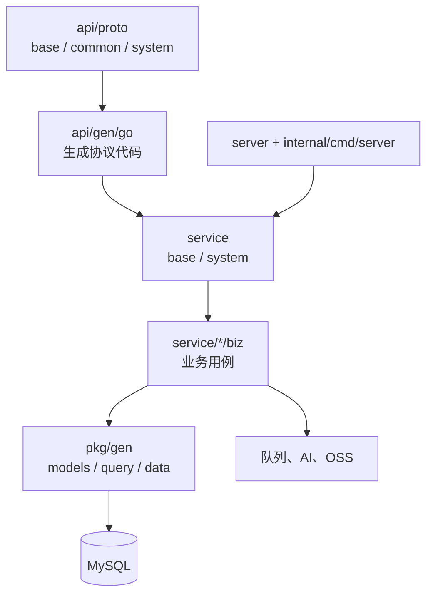
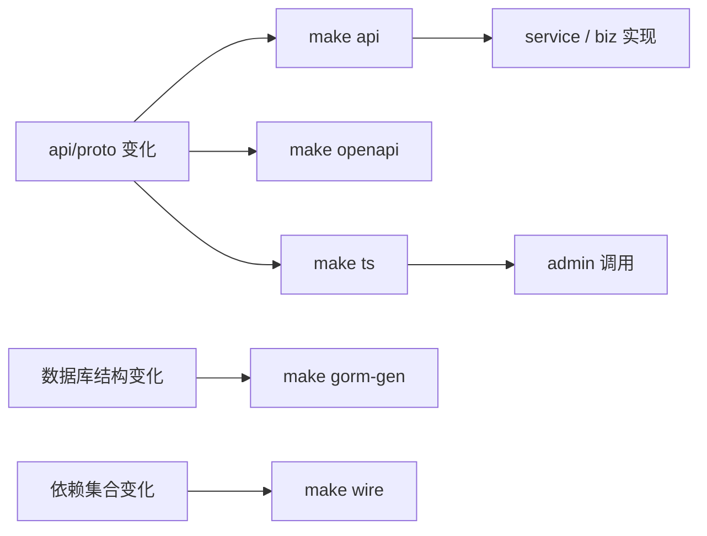

# 后端服务设计

## 文档定位

`backend` 是项目服务端模块。它以 Kratos 装配 HTTP、gRPC、SSE 与 MCP 入口，维护接口协议、领域服务、GORM 数据访问、运行任务、OpenAPI 和管理后台静态资源托管。

## 当前分层



| 目录 | 职责 |
| --- | --- |
| `api/proto` | 按公共能力和系统域划分的 Proto 契约。 |
| `api/gen/go` | Go、HTTP、gRPC、Agent Tool、MCP Tool 生成代码。 |
| `service/base` | 登录、OAuth、文件、SSE、AI 会话和 MCP 等公共能力。 |
| `service/system` | 用户、角色、菜单、租户、配置、任务、日志、代码生成等系统能力。 |
| `server` | 各域服务注册、HTTP/gRPC/MCP 装配和静态资源路由。 |
| `pkg` | GORM 生成代码、鉴权、任务框架、队列、公共工具与 Eino 适配层。 |
| `internal/cmd/server` | 应用启动、Wire、内嵌 OpenAPI 和模块装配入口。 |

## 域和终端划分

| 协议包 | 服务位置 | 消费端 |
| --- | --- | --- |
| `base.v1`、`common.v1` | `service/base` | 管理后台与应用壳子共用。 |
| `system.admin.v1` | `service/system/admin` | 系统管理后台。 |
| `system.app.v1` | `service/system/app` | 应用壳子的系统兼容接口。 |

HTTP 路由由 Proto 中的 `google.api.http` 映射生成。业务服务接收生成请求并调用对应 `biz` 用例；数据访问优先使用 `pkg/gen` 生成的模型、查询对象和数据层。菜单与接口权限同步维护在 `sql/default-data.sql`。

## 生成与装配



`make gen` 顺序执行 Go、OpenAPI、TypeScript、GORM、Wire 和格式化。以下目录为生成结果，禁止手工修改：`api/gen/go`、`pkg/gen`、`internal/cmd/server/assets/openapi.yaml`、`frontend/admin/src/rpc`。

## 运行任务和异步链路

任务注册框架位于 `pkg/job`，实际任务由服务域提供。队列、任务或定时回调不继承请求上下文，涉及租户和权限口径时必须由数据显式确定范围。

## 外部能力

- AI：`service/base/agent/ai` 管理会话、消息、SSE 和工具候选；`pkg/agent/eino` 隔离模型、工具、回调和中间件适配。
- MCP：服务启动时注册生成工具，并在现有 HTTP 服务上暴露 `/mcp/{terminal}`。
- 静态资源：`backend/data` 下含 `index.html` 的一级目录作为 SPA 挂载，当前管理后台使用 `/admin/`。

## 配置与验证

运行配置位于 `configs`：数据库使用 `data.yaml`/`data_local.yaml`，AI 使用 `ai.yaml`/`ai_local.yaml`，认证、OSS、OAuth、服务监听和日志分别由同名配置文件维护。

修改后端代码或契约时，至少执行：

```bash
cd backend
go test ./...
```

再按改动范围执行 `make api`、`make openapi`、`make ts`、`make gorm-gen`、`make wire` 或 `make gen`。
