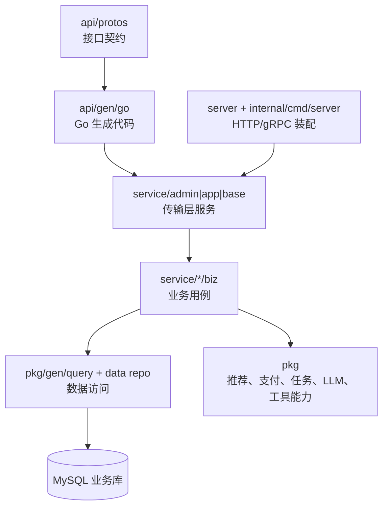
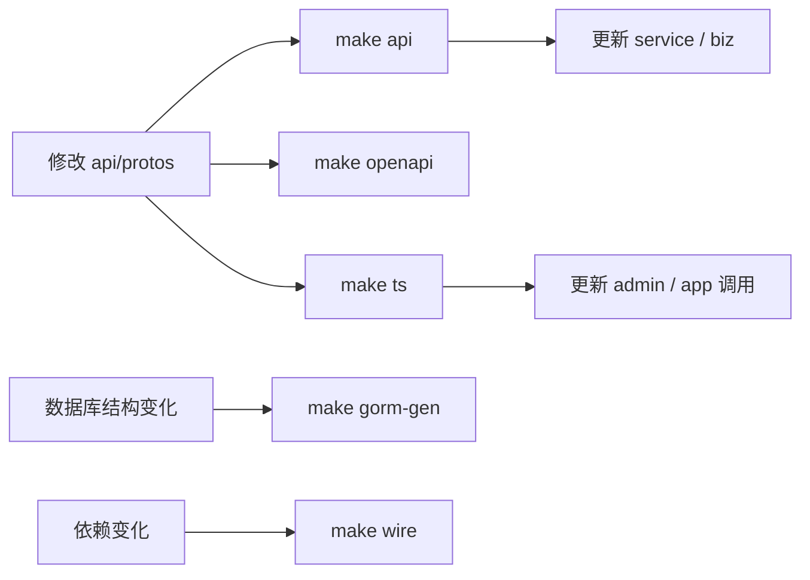

# 后端服务设计

## 文档目标

本文档说明 `backend` 模块的分层结构、接口生成链路、业务域组织、定时任务与静态资源托管方式，便于后续开发时快速判断改动范围。

## 分层结构

## 目录职责

| 目录 | 职责 |
| --- | --- |
| `api/protos` | admin、app、base、common、conf 的 proto 契约。 |
| `api/gen/go` | 根据 proto 生成的 Go 代码，禁止手工维护。 |
| `configs` | 服务端口、数据库、认证、OSS、推荐、支付、大模型等配置。 |
| `internal/cmd/server` | 启动入口、Wire 入口、内嵌 OpenAPI 资源。 |
| `pkg` | 公共能力，包括生成模型、推荐客户端、任务、队列、支付、日志中间件等。 |
| `server` | HTTP / gRPC Server 装配、中间件、静态资源挂载。 |
| `service/admin` | 管理后台业务接口与用例。 |
| `service/app` | 商城端业务接口与用例。 |
| `service/base` | 登录、基础用户等共用基础能力。 |
| `data` | 本地 OSS、日志、前端构建产物和运行期文件。 |

## 接口请求链路

1. 前端通过 `/api/v1/admin`、`/api/v1/app` 或基础登录接口访问后端。
2. HTTP 路由由 proto 中的 `google.api.http` 映射生成。
3. `service` 层负责参数接收、日志与统一错误包装，不承载复杂业务判断。
4. `biz` 层负责业务状态校验、事务编排、事件派发、第三方调用与错误分类。
5. 数据访问优先走 gorm/gen 查询对象和仓储封装，保持查询条件可复用、可测试。

## 主要业务域

| 业务域 | 管理端 | 商城端 | 说明 |
| --- | --- | --- | --- |
| 系统管理 | 用户、角色、部门、菜单、字典、配置、日志、任务 | 登录与基础用户 | 支撑权限、字典和基础配置。 |
| 商品 | 分类、商品、属性、规格、SKU | 分类、详情、搜索、热门 | 商品信息同时服务交易、推荐和统计。 |
| 订单 | 订单列表、退款、发货、物流、支付单、退款单 | 确认单、下单、支付、取消、退款、收货、删除 | 详见 [订单数据流转设计](订单数据流转设计.md)。 |
| 推荐 | 推荐请求、事件、Gorse 调试、编排、配置 | 推荐商品、匿名主体、事件上报 | 详见 [推荐系统设计](推荐系统设计.md)。 |
| 评价 | 评论、讨论、标签、AI 摘要审核 | 评论列表、写评价、互动、AI 摘要 | 详见 [评价与审核数据流转设计](评价与审核数据流转设计.md)。 |
| 统计报表 | 工作台、订单分析、商品分析、用户分析、月报 | 行为事件与交易事实来源 | 详见 [统计数据流转设计](统计数据流转设计.md)。 |

## 生成链路

常规生成顺序：

- 生成产物不手工改写。
- 涉及接口权限、菜单或初始化数据时，同步维护 `sql/default-data.sql`。
- 涉及数据库模型时，先确认当前开发库连接，再生成 `pkg/gen`。

## 定时任务

后端任务主要集中在 `backend/pkg/job/task`：

| 任务 | 作用 |
| --- | --- |
| `OrderStatDay` | 按日重算订单支付、退款、取消、用户数等指标。 |
| `GoodsStatDay` | 按日重算商品浏览、收藏、加购、下单、支付等指标。 |
| `TradeBill` | 下载微信支付成功 / 退款账单，与本地支付、退款记录比对。 |
| `RecommendSync` | 同步用户、商品主数据到 Gorse，并清理远端冗余数据。 |

## 静态资源托管

- 本地 OSS 根目录默认是 `backend/data`。
- `/shop/*` 用于访问上传资源。
- `backend/data/admin` 和 `backend/data/app` 中存在 `index.html` 时，后端会注册对应 SPA 路由。
- 管理后台和商城 H5 的生产构建可由后端统一托管，降低本地联调复杂度。

## 配置关注点

- 数据库连接与自动迁移在 `configs/data.yaml`。
- 推荐、支付、大模型等本地业务配置在 `configs/configs_local.yaml`。
- 认证、JWT、权限在 `configs/auth.yaml`。
- HTTP / gRPC 端口、Swagger、CORS、pprof 等在 `configs/server.yaml`。

## 验证建议

文档变更只需做 Markdown 与链接校验；后端代码或契约变更至少执行 `go test ./...`，并根据改动范围补充生成命令。
