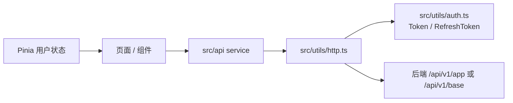
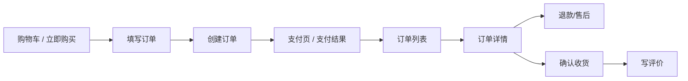

# 商城端设计

## 文档目标

本文档说明 `frontend/app` 商城端的页面结构、接口调用、登录态、订单 / 推荐 / 评价链路和多端兼容关注点。

## 模块定位

商城端面向用户，覆盖 H5 与微信小程序运行场景，主要提供：

- 首页、分类、搜索、商品详情、热门推荐等浏览链路。
- 购物车、确认单、下单、支付、退款、收货、订单列表与订单详情。
- 收货地址、收藏、个人信息、门店认证等会员能力。
- 商品评价展示、写评价、讨论、点赞点踩与 AI 摘要展示。
- 推荐匿名主体、推荐请求和用户行为事件上报。

## 页面结构

```text
src
├── pages              # 首页、分类、购物车、我的、登录、商品、热门、搜索、WebView
├── pagesMember        # 设置、个人信息、地址、收藏、门店认证
├── pagesOrder         # 填写订单、订单详情、支付结果、订单列表、退款、我的评价、写评价
├── api                # app / base 业务 service
├── rpc                # proto 生成类型与客户端
├── stores             # Pinia 全局状态
├── utils              # 请求、鉴权、路由、格式化
└── pages.json         # 主包、分包、tabBar、easycom 配置
```

## 请求与登录态



- 页面不要直接手写 `uni.request`，统一通过 `src/api` service。
- Token、刷新 token 与过期时间统一走 `src/utils/auth.ts`。
- 需要登录态的操作先检查用户状态，不满足时跳转登录。
- 登录成功后需要绑定推荐匿名主体，保证匿名行为可以归并到登录用户。

## 核心业务链路

| 链路 | 入口页面 | 后端能力 | 设计文档 |
| --- | --- | --- | --- |
| 浏览与推荐 | 首页、商品详情、购物车、我的、订单详情、支付成功页 | 推荐商品、推荐事件、匿名主体 | [推荐数据流转设计](推荐数据流转设计.md) |
| 交易订单 | 购物车、填写订单、订单详情、支付结果、订单列表 | 确认单、下单、支付、退款、收货、删除 | [订单数据流转设计](订单数据流转设计.md) |
| 商品评价 | 商品详情、评价列表、写评价、我的评价 | 评价展示、提交、讨论、互动、AI 摘要 | [评价与审核数据流转设计](评价与审核数据流转设计.md) |

## 订单端侧流程



商城端只负责发起动作和展示结果，订单状态流转以后端校验为准，避免端侧绕过状态约束。

## 推荐端侧流程

- 首次访问时获取或复用匿名推荐主体，并通过请求头 `X-Recommend-Anonymous-Id` 透传。
- 页面请求推荐商品时传入场景、上下文商品 / 订单等信息。
- 推荐结果曝光、点击、浏览、收藏、加购等行为要上报推荐事件。
- 下单和支付事件由后端在真实业务落库成功后补充上报，端侧不直接伪造交易事实。

## 多端兼容

- 页面默认优先保证微信小程序端可用，同时兼顾 H5。
- 支付、分享、预览图片、路由、存储等平台敏感能力需要使用条件编译明确处理。
- H5 开发端口默认 `5002`，构建产物输出到 `backend/data/app`，生产公共路径为 `/app/`。
- 微信小程序开发构建输出到 `frontend/app/dist/dev/mp-weixin`，需用微信开发者工具导入。

## 维护建议

- 新增页面同步维护 `src/pages.json`。
- 新增接口先补 `src/api` service，再在页面或 store 中使用。
- 修改协议类型由后端生成 `src/rpc`，不要手写生成类型。
- 涉及页面代码变更时执行 `pnpm lint` 与 `pnpm tsc` 或等效范围检查。
