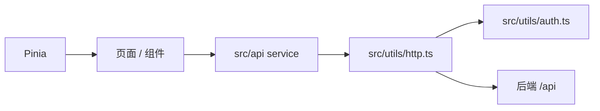

# 商城端设计

## 文档定位

`frontend/app` 是基于 uni-app 的商城端，当前主要服务 H5 与微信小程序，也保留其他平台构建脚本。页面、接口和状态遵循主包/分包、service、Pinia 和条件编译的边界。

## 页面与目录

```text
src
├── pages                  # 首页、分类、购物车、我的、登录、商品、搜索、店铺等主包
├── pagesMember            # 地址、收藏、资料、设置、门店认证、AI 助手分包
├── pagesOrder             # 确认单、订单、支付、售后、评价分包
├── api
│   ├── base               # base.v1
│   ├── system/app         # system.app.v1
│   └── shop/app           # shop.app.v1
├── rpc                    # 后端 make ts 生成的类型与客户端
├── stores/modules         # user、address、recommend、setting 等全局状态
├── components             # 通用与商品业务组件
└── pages.json             # 页面、分包、tabBar 与 easycom
```

新增页面必须同步修改 `src/pages.json`。页面私有组件放在页面的 `components` 目录；仅当确有跨页面复用时才提升到 `src/components`。

## 请求、登录与推荐主体



- 页面、组件和 store 不直接调用 `uni.request`；请求、鉴权、刷新 Token 与错误提示由 `src/api`、`src/utils/http.ts` 和 `src/utils/auth.ts` 统一处理。
- 类型优先引用 `src/rpc` 生成结果，不能在业务层复制协议类型。
- 首次推荐请求使用匿名推荐主体并通过请求头透传；登录后由后端绑定匿名主体，保留匿名期行为。

## 交易与门店

购物车、确认单和立即购买由后端按门店分组。同一交易可以包含多个门店的商品：创建阶段写入一个 `order_trade` 与多个 `order_info`；待支付阶段按交易支付或取消，支付后的履约、退款、评价和再次购买按门店子订单处理。商城端只发起并展示操作，状态转换与库存、支付校验始终以后端为准。

商品、门店和订单的详细口径见 [租户与门店体系设计](租户与门店体系设计.md) 与 [订单数据流转设计](订单数据流转设计.md)。

## 推荐、评价与 AI

| 能力 | 前端职责 | 服务端事实来源 |
| --- | --- | --- |
| 推荐 | 请求场景推荐、上报曝光/点击/浏览/收藏/加购等行为。 | Gorse 或本地责任链，交易事件由后端落库后上报。 |
| 评价 | 展示已通过内容、提交评价和讨论、发起互动。 | 订单资格、审核状态、评价聚合与计数由后端控制。 |
| AI 助手 | 在 `pagesMember/ai` 管理会话和流式消息，渲染结构化流程卡片并提交动作。 | 会话、消息、工具、动作版本校验和 SSE 由 `base.v1` AI 服务提供。 |

AI 结构化流程动作带有来源消息、动作 ID 与版本；端侧只能回传当前成功消息中的有效动作，不能将历史页面状态当作交易授权。

## 多端与构建

页面默认先保证微信小程序可用，再兼顾 H5。登录、路由、存储、支付、分享、图片预览等平台差异使用 `#ifdef`/`#ifndef` 条件编译表达，不在业务页面散落运行时平台判断。

- H5 开发默认地址为 `http://localhost:5002`，`pnpm build:h5` 输出到 `backend/data/app`，由后端以 `/app/` 托管。
- 微信小程序使用 `pnpm dev:mp-weixin` 或 `pnpm build:mp-weixin`，再用微信开发者工具导入对应 `dist` 目录。

修改商城端代码时执行：

```bash
cd frontend/app
pnpm lint
pnpm tsc
```
