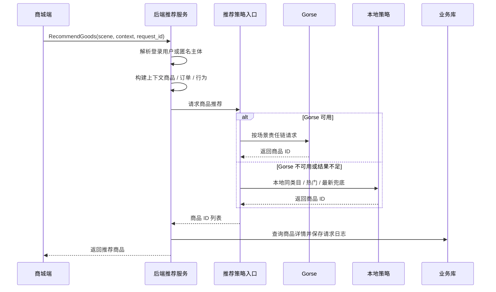
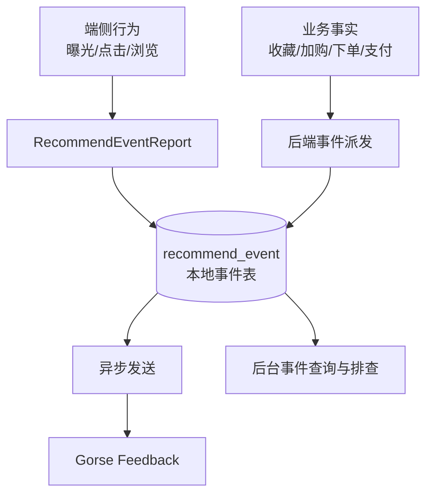

# 推荐数据流转设计

## 文档目标

本文档说明推荐请求、匿名主体、推荐事件、业务事实回写、Gorse 同步和后台排查之间的数据流转关系。

## 核心对象

| 对象 | 说明 |
| --- | --- |
| 匿名推荐主体 | 未登录用户的推荐身份，通过 `X-Recommend-Anonymous-Id` 透传。 |
| 登录用户主体 | 登录后以用户 ID 作为推荐主体，并可绑定匿名主体历史行为。 |
| 推荐请求 | 一次推荐调用的场景、主体、上下文、请求 ID、策略来源等信息。 |
| 推荐请求项 | 一次推荐返回的商品列表、排序、来源、得分或策略信息。 |
| 推荐事件 | 曝光、点击、浏览、收藏、加购、下单、支付等行为和事实。 |
| Gorse 主数据 | 同步到 Gorse 的用户、商品、反馈数据。 |

## 推荐请求流程

## 匿名主体与登录绑定

1. 用户未登录访问商城端时，前端获取匿名推荐主体。
2. 后续推荐请求与行为事件通过 `X-Recommend-Anonymous-Id` 关联到匿名主体。
3. 用户登录后调用绑定接口，将匿名主体与登录用户关联。
4. 后端后续推荐优先使用登录用户主体，同时保留匿名阶段行为对个性化的贡献。

## 事件类型与来源

| 事件 | 主要来源 | 说明 |
| --- | --- | --- |
| `EXPOSURE` | 商城端 | 推荐卡片曝光。 |
| `CLICK` | 商城端 | 点击推荐商品或推荐位。 |
| `VIEW` | 商城端 / 后端商品详情链路 | 商品浏览。 |
| `COLLECT` | 收藏业务 | 收藏成功后写入。 |
| `ADD_CART` | 购物车业务 | 加购成功后写入。 |
| `ORDER_CREATE` | 订单业务 | 订单创建事务成功后写入。 |
| `ORDER_PAY` | 支付业务 | 支付成功或货到付款订单确认后写入。 |

交易事实类事件由后端在真实业务落库成功后派发，保证推荐训练数据与订单事实一致。

## 事件写入流程

- 本地事件表是排查和统计的第一落点。
- 向 Gorse 写入反馈应异步进行，避免推荐服务异常影响主业务。
- 事件中需要保留场景、主体、商品、请求 ID 等信息，便于归因到具体推荐请求。

## 主数据同步

`RecommendSync` 任务负责把业务库主数据同步到 Gorse：

1. 从业务库读取用户和商品。
2. 从 Gorse 读取远端已有 ID。
3. 按批次同步新增或更新数据。
4. 删除 Gorse 中本地已不存在的冗余 ID。
5. 记录同步结果，供后台排查。

## 后台排查链路

管理后台推荐相关页面应支持从以下维度排查：

- 某个用户或匿名主体最近请求了哪些推荐场景。
- 某次请求返回了哪些商品，商品来源是 Gorse 还是本地兜底。
- 推荐结果是否发生曝光、点击、加购、下单或支付转化。
- Gorse 主数据同步是否成功，用户 / 商品是否存在于远端。
- Gorse 反馈事件是否写入成功，是否存在失败重试。

## 数据质量要求

- 推荐请求和事件需要尽量带上 `request_id`，否则后续转化归因会断链。
- 商品 ID、用户 ID、匿名主体 ID 要保持稳定，不能在端侧临时生成不可追踪 ID。
- 支付、下单等关键事件不依赖端侧上报，以后端事实为准。
- Gorse 返回为空时必须有本地兜底，并记录兜底来源，便于运营理解推荐效果波动。
