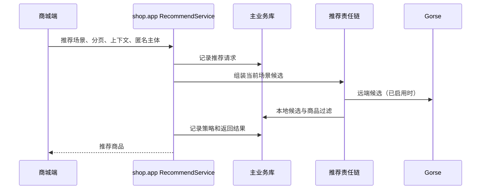
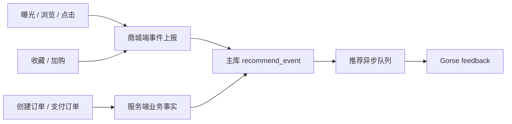

# 推荐数据流转设计

## 文档定位

本文档说明推荐请求、匿名主体、事件、主数据和 Gorse 同步之间的事实链。推荐算法与候选策略见 [推荐系统设计](推荐系统设计.md)。

## 请求链路

商城端通过 `shop.app.v1.RecommendService` 请求匿名主体、绑定匿名主体、获取推荐商品和上报事件。请求结构携带场景和上下文；后端识别登录用户或匿名主体，统一写入推荐请求记录后再执行责任链。

## 匿名主体与登录绑定

首次访问商城端时，客户端获取或复用匿名推荐主体，并在推荐请求中通过约定请求头透传。用户登录后调用绑定接口，由后端将匿名阶段的行为归并到当前用户。端侧不能用用户 ID 冒充匿名主体，也不能在登录后丢弃尚未同步的匿名行为。

## 事件链路

曝光、浏览、点击、收藏和加购等交互行为由商城端在发生时上报。创建订单与支付订单等交易事实必须由后端在业务写入成功后生成，端侧不伪造。事件先保存到主业务库，再由队列消费者发送至 Gorse，保证远端短暂不可用不会阻断下单、支付或前台交互。

## 同步与补偿

`service/shop/recommend/recommend_sync_task.go` 的 `RecommendSync` 对账同步用户和商品主数据。用户、商品变更也会通过 `service/shop/queue/recommend.go` 投递增量同步。Gorse 同步接收器会处理批量写入、更新、删除和陈旧远端对象清理；同步失败应由任务或队列重试，而不是通过前端重复请求补偿。

推荐查询的远端候选永远不是直接展示结果。后端会在业务库中确认商品存在、有效、符合当前场景后再返回，并在远端结果不足时继续本地候选链。

## 后台排查

| 排查目标 | 主要位置 |
| --- | --- |
| 请求、场景、策略与结果 | 管理后台推荐请求页面及 `shop.admin.v1.RecommendRequestService`。 |
| 远端用户、商品、反馈、任务和推荐结果 | Gorse 管理页面及 `shop.admin.v1.RecommendGorseService`。 |
| 同步和事件消费 | `service/shop/recommend/gorse`、`service/shop/queue`。 |

排查时应先确认主业务库中的请求/事件是否存在，再确认队列消费和 Gorse 数据状态。只看 Gorse 的结果不能判断客户端是否上报、订单是否成功或商品是否仍可售。

## 数据质量要求

- 推荐事件必须有可识别的事件类型、发生时间和主体。
- 商品同步和查询都要过滤失效、删除或不可售商品。
- 端侧事件尽量携带当前场景和上下文商品，避免把曝光、点击归因到错误推荐位。
- Gorse 重置或冷启动后，保留主库请求/事件并允许本地推荐继续服务。
