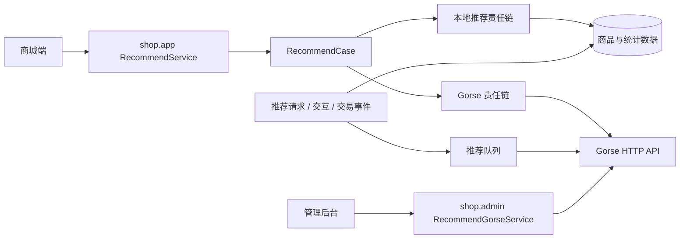

# 推荐系统设计

## 文档定位

推荐能力由商城服务端统一编排，Gorse 是可选的远端推荐引擎，本地推荐是稳定性兜底。商城端负责请求场景和上报交互行为；真实交易行为、主数据同步和结果过滤由后端负责。

## 架构

远端推荐客户端位于 `service/shop/recommend/gorse`，本地推荐位于 `service/shop/recommend/local`。Gorse 未配置、不可用、返回无效商品或候选不足时，服务端继续执行本地策略，保证推荐位不会因为远端冷启动或故障而直接失效。

## 场景和候选

当前责任链按商城场景组织，包括首页、商品详情、购物车、个人中心、订单详情和支付成功等。候选可以来自登录用户推荐、会话推荐、相似商品、命名推荐器和最新商品；服务端在获得原始 ID 后再过滤不可售、无效或不符合当前查询条件的商品。

Gorse 配置维护协同过滤、相似商品、相似用户、近期热门、稳定热门、最新商品和回退推荐器。具体模型参数和推荐器名称以 `gorse/config/config.toml` 为准，不能把后台展示名称当作固定对外协议。

## 主数据和事件

| 数据 | 来源 | 处理方式 |
| --- | --- | --- |
| 用户 | 系统用户、商城用户和匿名推荐主体。 | 用户变更投递异步同步；登录后绑定匿名主体。 |
| 商品 | 商品、分类、可售状态等商城主数据。 | 商品变更投递异步同步；结果返回前由业务库再次校验。 |
| 请求 | 场景、主体、上下文、策略和返回结果。 | 落主业务库，供后台追踪和排查。 |
| 事件 | 曝光、浏览、点击、收藏、加购、创建订单、支付订单等。 | 交互由端侧上报；交易事实由服务端落库后补充并异步同步。 |

远端使用的读反馈为 `EXPOSURE`、`VIEW`，正反馈包含 `CLICK`、`COLLECT`、`ADD_CART`、`ORDER_CREATE`、`ORDER_PAY`。事件权重、保留时间和热门窗口以 Gorse 配置为准。

## 运营与排查

管理后台的 Gorse 页面位于 `frontend/admin/src/views/shop/admin/recommend/gorse`，后端代理服务位于 `service/shop/admin/recommend_gorse_service.go`。当前页面覆盖概览、时间序列、任务、用户、商品、相似内容、反馈、推荐结果、高级调试、编排和配置等能力；它通过后端使用 Gorse API Key 访问 Gorse，不直接把凭据交给浏览器。

`RecommendSync` 任务负责用户和商品的全量对账同步。推荐请求和事件留在主业务库，因此远端重置、训练延迟和故障仍可通过后台记录追踪。

## 配置与验证

Gorse 的容器、端口和数据卷在 `gorse/docker-compose.yml`，推荐算法与存储配置在 `gorse/config/config.toml`。后端本地配置使用 `configs/configs_local.yaml` 的 `shop.recommend.entry_point` 和 `api_key`，其中入口应指向 Gorse HTTP 端口。

修改推荐代码时，需要同时验证远端已启用、远端不可用、本地候选为空、匿名主体、登录后绑定以及交易事件回写等场景。详细请求链路见 [推荐数据流转设计](推荐数据流转设计.md)。
