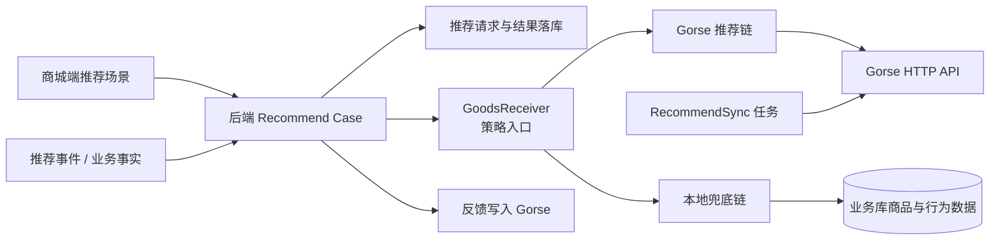

# 推荐系统设计

## 文档目标

本文档说明项目推荐体系的整体设计，包括场景、策略来源、Gorse 集成、本地兜底、后台管理能力和后续演进方向。具体事件与请求落库过程见 [推荐数据流转设计](推荐数据流转设计.md)。

## 推荐能力定位

当前项目同时支持两类推荐能力：

| 类型 | 定位 | 适用场景 |
| --- | --- | --- |
| 人工运营推荐 | 由运营手工维护固定内容或坑位 | 首页热门、专题位、运营活动 |
| 算法推荐 | 后端根据用户、商品、上下文、行为事件请求 Gorse 或本地策略 | 首页、商品详情、购物车、个人中心、订单详情、支付成功页 |

两者可以并存：运营推荐强调确定性和人工编排，算法推荐强调个性化和上下文相关性。

## 推荐架构



## 推荐场景

| 场景 | 说明 | 典型上下文 |
| --- | --- | --- |
| `HOME` | 首页推荐 | 用户或匿名主体近期行为。 |
| `GOODS_DETAIL` | 商品详情推荐 | 当前商品、同类目、相邻商品。 |
| `CART` | 购物车推荐 | 购物车商品、用户会话、热门商品。 |
| `PROFILE` | 个人中心推荐 | 用户历史行为、会话推荐、热门商品。 |
| `ORDER_DETAIL` | 订单详情推荐 | 订单商品、相似商品、支付热榜。 |
| `ORDER_PAID` | 支付成功推荐 | 刚支付订单、会话推荐、关联商品。 |

## Gorse 推荐链

当 Gorse 链路启用时，后端优先请求 Gorse；不同场景使用不同责任链。当前典型策略如下：

| 场景 | 推荐链摘要 |
| --- | --- |
| 首页 | 个性化推荐 -> 相似用户 -> 会话推荐 -> 30 天热门 -> 最新商品 |
| 商品详情 | 相邻商品 -> 商品关联 -> 会话推荐 -> 30 天热门 -> 最新商品 |
| 购物车 | 登录态会话推荐或 7 天热门 -> 30 天热门 -> 最新商品 |
| 个人中心 | 个性化 / 相似用户 / 会话推荐 -> 7 天热门 -> 30 天热门 -> 最新商品 |
| 订单详情 | 商品关联 -> 相邻商品 -> 会话推荐 -> 支付热榜 -> 30 天热门 -> 最新商品 |
| 支付成功 | 会话推荐 -> 商品关联 -> 支付热榜 -> 30 天热门 -> 最新商品 |

## 本地兜底链

Gorse 未启用、不可用或返回不足时，后端使用本地策略补齐：

- 上下文同类目商品。
- 7 天 / 30 天热门商品。
- 全量可售商品探索。
- 根据场景和来源设置权重，保证列表可用。

本地兜底的目标不是替代算法效果，而是保证关键页面不出现空推荐。

## 后台管理能力

管理后台推荐模块建议按两类能力组织：

```text
推荐管理
├── 热门推荐                 # 人工运营推荐
└── Gorse 推荐服务
    ├── 运行总览             # 连通性、命中率、兜底率、异常率
    ├── 场景策略             # 场景启用、责任链、兜底规则
    ├── 数据同步             # 用户 / 商品同步、补同步、清理
    ├── 反馈事件             # 曝光、点击、浏览、收藏、加购、下单、支付
    ├── 推荐调试             # 指定主体、商品、订单做链路调试
    ├── 版本发布             # 策略草稿、发布、回滚
    └── 告警中心             # 同步失败、接口异常、兜底率异常
```

一期更适合优先做“可观测”和“可调试”：先让后台能看见 Gorse 是否可用、请求是否命中、事件是否写入、同步是否成功；策略在线编排可在后续逐步从硬编码抽离。

## 数据同步

- 用户、商品主数据通过 `RecommendSync` 任务同步到 Gorse。
- 同步任务会读取本地已有数据与 Gorse 远端 ID，批量同步并删除远端冗余记录。
- 收藏、加购、浏览、下单、支付等反馈事件会作为推荐训练和排序的重要输入。

## 稳定性设计

- 推荐请求先记录本地请求和结果，便于排查“某次请求为什么返回这些商品”。
- 推荐事件先落主业务库，再异步派发到推荐系统，避免 Gorse 短暂不可用影响主交易流程。
- Gorse 链路与本地链路保持同一商品返回模型，前端不感知策略来源差异。
- 关键交易事实以下单、支付成功等后端真实事件为准，不依赖端侧自行上报。

## 后续演进

- 将当前代码中的场景责任链后台可读化，先提供查看与调试。
- 逐步支持策略草稿、发布和回滚。
- 增加场景级命中率、兜底率、转化率和实验对比。
- 引入告警阈值，监控推荐服务不可用、同步失败、事件堆积和异常兜底率。
