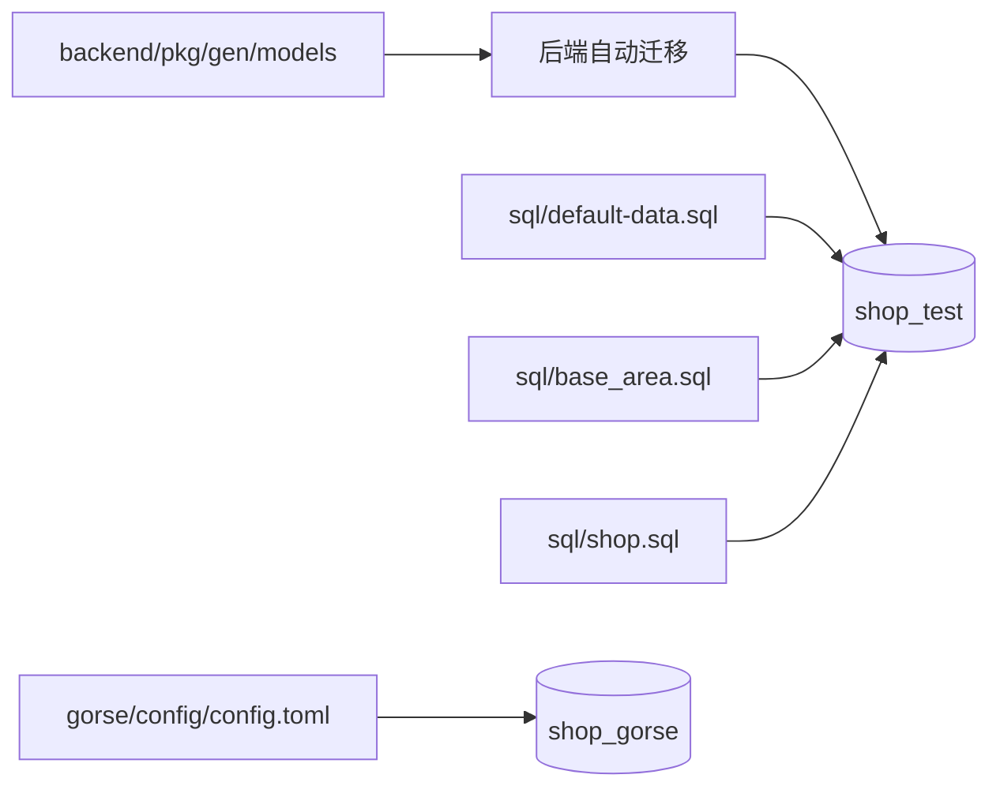

# 数据库与初始化数据设计

## 文档定位

本文档说明本地开发环境的建表、初始数据和权限数据来源。它只描述当前仓库的全新环境流程；生产或存量环境不能把完整初始化脚本当作迁移脚本使用。

## 数据库职责

| 数据库 | 用途 | 配置来源 |
| --- | --- | --- |
| `shop_test` | 用户、租户、商品、订单、评价、推荐事件、统计、菜单和权限等主业务数据。 | `backend/configs/data.yaml`、`data_local.yaml`。 |
| `shop_gorse` | Gorse 的用户、商品、反馈、训练和缓存数据。 | `gorse/config/config.toml`。 |



本地后端默认开启自动迁移，按当前模型创建或更新表结构。表结构变化后，需要使用当前开发库执行 `make gorm-gen` 更新 `pkg/gen`。共享和生产环境必须先评估迁移风险，再决定是否开启自动迁移。

## SQL 文件

| 文件 | 当前用途 |
| --- | --- |
| `sql/default-data.sql` | 默认租户、组织、账号、固定角色、菜单、字典、配置与功能初始化数据。 |
| `sql/base_area.sql` | 省、市、区等地区基础数据。 |
| `sql/shop.sql` | 商品、分类、轮播、商城服务和默认门店等演示数据。 |

仓库当前没有 `sql/casbin_rule.sql`。`base_api` 与 `casbin_rule` 不是通过独立 SQL 文件初始化：后端启动时会清理并从内置 OpenAPI、菜单和角色关系重新生成接口元数据和租户化 Casbin 策略。

## 全新环境初始化

1. 创建 `shop_test` 数据库。
2. 启动后端，让当前 GORM 模型完成自动迁移，再停止服务。
3. 在仓库根目录导入 `default-data.sql` 与 `base_area.sql`。
4. 需要演示商品时导入 `shop.sql`。
5. 重启后端，等待启动流程重建 `base_api`、角色菜单副本和 `casbin_rule`。

```bash
mysql -uroot -p shop_test < sql/default-data.sql
mysql -uroot -p shop_test < sql/base_area.sql
mysql -uroot -p shop_test < sql/shop.sql
```

第三条只在需要演示商品、分类、轮播和商城服务时执行。默认后台账号来自 `default-data.sql`；默认租户编码为 `0000`，`tenant` 是内置租户管理员角色编码，不是登录账号。

## 权限与租户数据

`default-data.sql` 提供默认租户、固定角色、菜单及其 API 关联。启动服务时：

1. 重置 `base_api` 和 `casbin_rule` 的数据及自增 ID。
2. 根据当前 OpenAPI 同步接口元数据。
3. 将默认租户的 `tenant` 角色菜单同步到普通租户副本。
4. 根据角色、菜单、接口与真实 HTTP Method 重建租户化 Casbin 策略。

因此，修改 Proto HTTP 路径、菜单、按钮或角色模板时，应一起检查 OpenAPI 生成、`default-data.sql` 和启动后的权限重建结果。不要手工维护与当前协议脱节的 Casbin 初始化 SQL。

## 存量环境边界

完整初始化脚本可能重置默认数据，不适合直接导入已有业务库。存量升级至少需要：备份、分阶段结构变更、租户/门店归属回填、统计重算、接口元数据与权限策略重建，以及跨租户数据抽样验证。具体租户和门店口径见 [租户与门店体系设计](租户与门店体系设计.md)。

## 推荐库

Gorse 使用独立的 `shop_gorse`。本地 Docker Compose 通过宿主机 MySQL 连接该库，后端推荐客户端通过 `configs/configs_local.yaml` 中的 `shop.recommend.entry_point` 和 `api_key` 调用 Gorse HTTP API。该服务不是主业务库的唯一数据来源：推荐请求和事件仍会落在主业务库，Gorse 不可用时后端会走本地推荐兜底。
