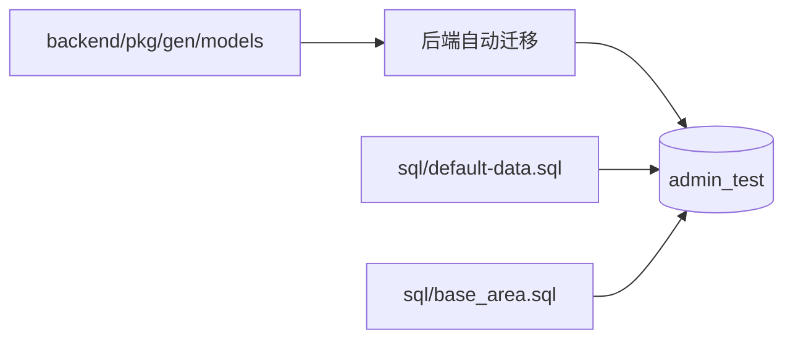

# 数据库与初始化数据设计

## 文档定位

本文档说明本地开发环境的建表、初始数据和权限数据来源。初始化脚本可重复执行，但只适合开发环境，不能替代生产或存量环境迁移。

## 数据库职责

| 数据库 | 用途 | 配置来源 |
| --- | --- | --- |
| `admin_test` | 用户、租户、组织、菜单、配置、任务和权限等系统数据。 | `backend/configs/data.yaml`、`data_local.yaml`。 |



本地后端默认开启自动迁移，按当前模型创建或更新表结构。表结构变化后，需要使用当前开发库执行 `make gorm-gen` 更新 `pkg/gen`。共享和生产环境必须先评估迁移风险，再决定是否开启自动迁移。

## SQL 文件

| 文件 | 当前用途 |
| --- | --- |
| `sql/default-data.sql` | 默认租户、组织、账号、固定角色、菜单、字典、配置与功能初始化数据；使用 `INSERT IGNORE`，可重复导入。 |
| `sql/base_area.sql` | 省、市、区等地区基础数据；使用 `INSERT IGNORE`，可重复导入。 |

仓库当前没有独立的权限 SQL 文件。`base_api` 与 `casbin_rule` 不是通过独立脚本初始化：后端启动时会从内置 OpenAPI、菜单和角色关系重新生成接口元数据和租户化策略。

## 全新环境初始化

1. 创建 `admin_test` 数据库。
2. 启动后端，让当前 GORM 模型完成自动迁移，再停止服务。
3. 在仓库根目录导入 `default-data.sql` 与 `base_area.sql`；脚本只补充缺失记录，不清空业务数据。
4. 重启后端，等待启动流程重建 `base_api`、角色菜单副本和 `casbin_rule`。

```bash
mysql -uroot -p admin_test < sql/default-data.sql
mysql -uroot -p admin_test < sql/base_area.sql
```

默认后台账号来自 `default-data.sql`；默认租户编码为 `0000`，`tenant` 是内置租户管理员角色编码，不是登录账号。

## 权限与租户数据

`default-data.sql` 提供默认租户、固定角色、菜单及其 API 关联。启动服务时：

1. 重置 `base_api` 和 `casbin_rule` 的数据及自增 ID。
2. 根据当前 OpenAPI 同步接口元数据。
3. 将默认租户的 `tenant` 角色菜单同步到普通租户副本。
4. 根据角色、菜单、接口与真实 HTTP Method 重建租户化 Casbin 策略。

修改 Proto HTTP 路径、菜单、按钮或角色模板时，应一起检查 OpenAPI 生成、`default-data.sql` 和启动后的权限重建结果。不要手工维护与当前协议脱节的权限初始化 SQL。

## 存量环境边界

初始化脚本不会清空已有表，所有初始化记录都由 `INSERT IGNORE` 处理；已存在的同主键记录保持不变。它仍不是结构迁移工具，存量升级至少需要备份、分阶段结构变更、权限重建和数据抽样验证。
