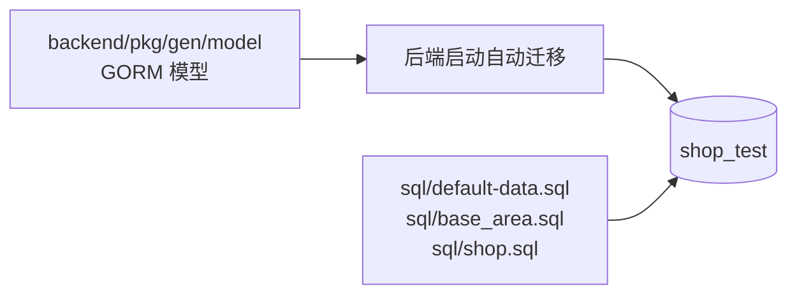
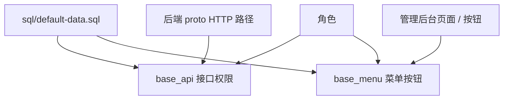

# 数据库与初始化数据设计

## 文档目标

本文档说明项目本地数据库、自动建表、初始化脚本、权限菜单数据和推荐库的职责边界，便于开发和联调环境保持一致。

## 数据库划分

| 数据库 | 默认用途 | 维护位置 |
| --- | --- | --- |
| `shop_test` | 主业务库，存储用户、商品、订单、评价、推荐事件、统计结果、权限菜单等业务数据 | `backend/configs/data.yaml` 与 `sql/*.sql` |
| `shop_gorse` | Gorse 推荐服务数据存储和缓存存储 | `gorse/config/config.toml` |

## 主业务库建表来源

- 本地开发默认在后端启动时按模型自动迁移建表。
- 表结构变化后应先确认当前开发库连接，再生成或更新 gorm/gen 相关代码。
- 共享或生产环境应谨慎开启自动迁移，必要时通过明确的 SQL 变更脚本执行。

## SQL 脚本职责

| 文件 | 职责 |
| --- | --- |
| `sql/default-data.sql` | 后台账号、角色、菜单、接口权限、字典、基础配置和功能初始化数据。 |
| `sql/base_area.sql` | 省市区等地区基础数据。 |
| `sql/shop.sql` | 演示商品、分类、轮播、商城服务等演示数据。 |
| `sql/casbin_rule.sql` | 当前为空文件，权限和菜单初始化主要在 `default-data.sql`。 |

## 初始化顺序

1. 创建主业务库：`CREATE DATABASE shop_test CHARACTER SET utf8mb4 COLLATE utf8mb4_unicode_ci;`
2. 启动后端，让自动迁移创建当前模型表结构。
3. 导入基础数据：`sql/default-data.sql`。
4. 导入地区数据：`sql/base_area.sql`。
5. 如需演示数据，再导入：`sql/shop.sql`。
6. 如需推荐联调，创建 `shop_gorse` 并启动 `gorse` 服务。

## 权限与菜单数据

管理后台的菜单、按钮权限和接口权限需要和代码同步维护：

新增后台功能时需要同时检查：

- 菜单是否可见、路由路径是否正确。
- 页面按钮是否存在对应权限点。
- 后端接口路径是否写入接口权限数据。
- 角色是否绑定菜单和接口权限。

## 关键数据域

| 数据域 | 代表表 / 记录 | 说明 |
| --- | --- | --- |
| 系统管理 | 用户、角色、部门、菜单、接口、字典、配置、日志、任务 | 后台登录、权限和运营基础数据。 |
| 商品 | 商品、分类、属性、规格、SKU、轮播、热门、商城服务 | 支撑浏览、交易、推荐、统计。 |
| 订单 | 订单主表、订单商品、地址快照、支付单、退款单、取消记录、物流记录 | 详见 [订单数据流转设计](订单数据流转设计.md)。 |
| 推荐 | 推荐匿名主体、推荐请求、请求结果、推荐事件 | 详见 [推荐数据流转设计](推荐数据流转设计.md)。 |
| 统计 | 订单日统计、商品日统计、交易账单、月报相关查询结果 | 详见 [统计数据流转设计](统计数据流转设计.md)。 |
| 评价 | 评价、讨论、标签、AI 摘要、互动记录 | 详见 [评价与审核数据流转设计](评价与审核数据流转设计.md)。 |

## 推荐库初始化

Gorse 使用独立数据库，默认配置在 `gorse/config/config.toml`：

- `data_store` 指向 `shop_gorse`。
- `cache_store` 指向 `shop_gorse`。
- 后端 `configs/configs_local.yaml` 中的 `shop.recommend.entryPoint` 指向 Gorse HTTP API。

推荐库的数据主要由 Gorse 自身维护，后端通过同步任务写入用户、商品和反馈事件。

## 维护建议

- 新增业务涉及表结构、菜单、接口权限或演示数据时，优先更新 `sql/default-data.sql`。
- 不要只在本地数据库手动补数据而遗漏初始化脚本。
- 删除或调整菜单、接口路径时，需要同步检查管理后台路由和后端 proto HTTP 映射。
- 统计口径变化时，既要更新统计任务，也要更新后台分析页面说明。
