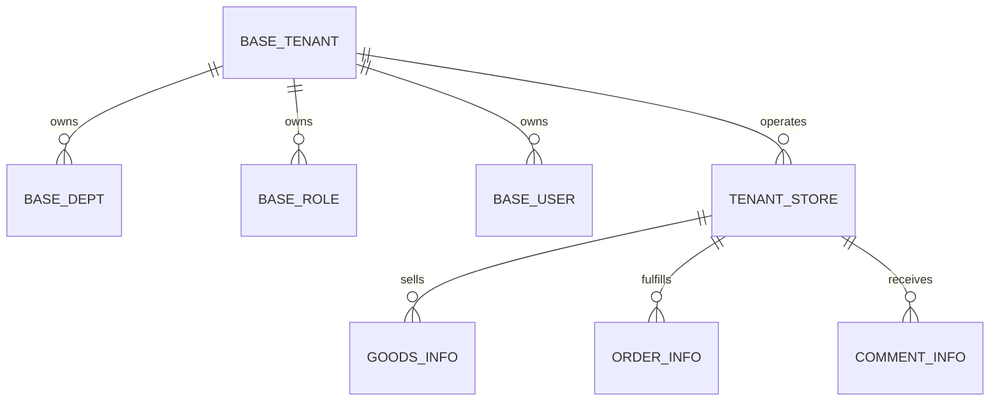
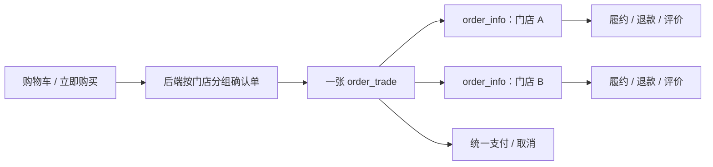

# 租户与门店体系设计

## 文档定位

项目以租户隔离组织后台经营数据，以门店承载商城可见的经营主体。租户、组织和权限属于系统域；门店、商品、订单、评价和统计属于商城域。本文描述当前代码的边界，不替代上线前的存量数据迁移方案。

## 领域关系

| 概念 | 当前含义 |
| --- | --- |
| 默认租户 | 编码为 `0000` 的平台上下文，受保护，不能通过租户管理接口修改、禁用或删除。 |
| 普通租户 | 独立的后台组织和经营边界。创建时生成默认部门、`tenant` 管理员角色副本和 `admin` 管理员账号。 |
| 门店 | 租户在商城中的经营主体。商品、子订单和评价保存租户/门店归属。 |
| 交易 | `order_trade` 聚合一次支付和取消；`order_info` 对应门店子订单，负责履约与退款。 |

## 租户创建和权限

`service/system/admin/biz/base_tenant.go` 负责租户创建、更新、删除和状态。普通租户编码由服务端从数字编码中分配，范围为 `1000` 至 `9999`，客户端提交的编码不会覆盖已保存值。创建事务会：

1. 创建租户及默认部门。
2. 复制默认租户的 `tenant` 角色模板。
3. 创建用户名为 `admin` 的租户管理员。
4. 按租户、角色、菜单和 API 元数据建立 Casbin 策略。

`tenant` 是内置租户管理员角色。默认租户的模板变更会同步到普通租户副本并重建策略；受保护的 `super`、普通租户自己的 `tenant` 以及其他租户的 `tenant` 不允许被常规角色管理操作修改。用户、角色和租户列表使用服务端的 `is_protected` 标记展示操作保护，服务端仍会对绕过前端的请求进行校验。

## 租户隔离

认证中间件位于 `backend/pkg/middleware/auth.go`。业务用例从认证信息读取租户上下文：普通租户查询和写入必须收敛到自身 `tenant_id`；默认租户作为平台上下文可以使用租户和门店筛选处理全局数据。客户端传入的租户或门店 ID 不能替代服务端的授权判断。

系统组织表直接保存租户归属。商城主数据中，门店、商品、门店子订单和评价保存租户/门店字段；购物车、收藏、推荐事件等通过商品、订单或评价主表推导经营归属。后台任务和异步消费不继承请求认证信息，必须显式从业务记录确定租户和门店。

## 门店与商品

`service/shop/admin/biz/tenant_store.go` 管理门店选项、树、资料、状态和审核；`service/shop/app/biz/tenant_store.go` 提供商城端可见门店信息。商品写入时以已校验门店的租户归属为准，不信任客户端提交的租户字段。

门店资料有待审核、通过和拒绝等业务状态。门店审核和资料变化会影响关联商品可售性；商城端只能消费满足当前业务条件的门店和商品。平台与普通租户的可见范围由后端鉴权和查询条件共同限定。

## 多门店交易

订单创建由 `service/shop/app/biz/order_info.go` 处理。前端接收门店分组、交易信息和子订单信息，不负责自行推导跨门店的金额、履约或状态。支付和取消面向交易；退款、发货、收货、评价和再次购买面向门店子订单。

## 初始化与策略重建

`sql/default-data.sql` 提供默认租户、固定角色、账号和菜单。后端启动会从 OpenAPI 重建 `base_api`，同步默认租户的 `tenant` 菜单模板，并根据真实 HTTP Method 重建 `casbin_rule`。仓库当前没有独立 `sql/casbin_rule.sql`；详情见 [数据库与初始化数据设计](数据库与初始化数据设计.md)。

## 统计与删除边界

商品和订单日统计分别在 `service/shop/admin/biz/goods_stat_day_task.go`、`order_stat_day_task.go` 中按当前租户/门店口径聚合。租户删除前会检查门店、商品、订单和评价等经营数据；仍有关联数据时禁止删除，避免失去数据归属。

## 主要实现位置

| 能力 | 位置 |
| --- | --- |
| 租户协议与用例 | `api/proto/system/admin/v1/base_tenant.proto`、`service/system/admin/biz/base_tenant.go` |
| 角色与 Casbin | `service/system/admin/biz/base_role.go`、`service/system/admin/biz/casbin_rule.go` |
| 门店协议与用例 | `api/proto/shop/admin/v1/tenant_store.proto`、`api/proto/shop/app/v1/tenant_store.proto`、`service/shop/admin/biz/tenant_store.go` |
| 登录和认证 | `api/proto/base/v1/login.proto`、`service/base/biz/login.go`、`pkg/middleware/auth.go` |
| 多门店订单 | `service/shop/app/biz/order_info.go`、`service/shop/app/biz/order_trade.go` |
| 管理后台 | `frontend/admin/src/views/system/admin/base/tenant`、`frontend/admin/src/views/shop/admin/shop/store` |
| 商城端门店 | `frontend/app/src/pages/store/store.vue`、`frontend/app/src/api/shop/app/tenant_store.ts` |
