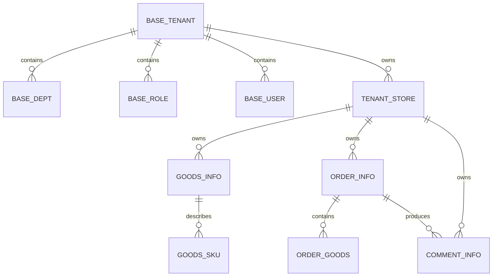
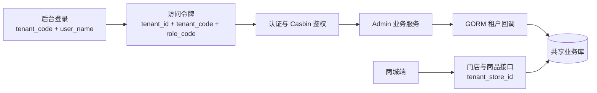
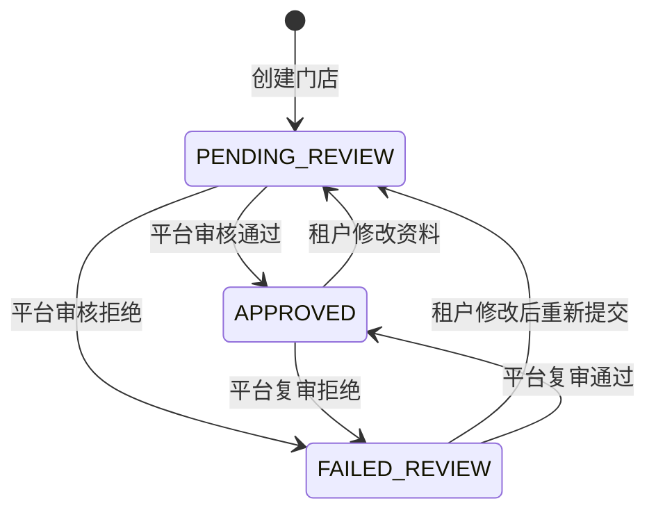

# 租户与门店体系设计

## 文档目标

本文档定义商城租户与门店体系的领域边界、数据模型、租户上下文、权限模型、核心流程、迁移策略和验收标准，用于指导后续开发、联调和维护。

本文以当前仓库实现为基线：已落地行为按现状描述，尚未满足的设计约束在“安全性与运行风险”和“后续演进”中明确标记，不再把目标方案与当前行为混写。

“初始化与迁移设计”及“测试与验收”属于上线执行要求，不表示仓库已经提供生产迁移脚本或已经完成全部验收。

| 项目 | 设计结论 |
| --- | --- |
| 商城形态 | 单商城、多租户、多门店 |
| 数据部署 | 共享数据库、共享表结构、按行隔离 |
| 租户主键 | `base_tenant.id` |
| 租户登录标识 | `base_tenant.code` |
| 默认平台上下文 | `id = 1`、`code = 0000` |
| 门店实体 | `tenant_store`，一个租户可以维护多个门店 |
| 订单边界 | 一张订单只能归属一个租户门店，当前不自动拆分跨门店商品 |
| 统计粒度 | 商品、订单日统计按租户汇总，暂不按门店生成日统计表 |

## 背景

系统需要在保留单商城统一体验的前提下，让多个经营主体分别维护自己的组织权限、门店、商品、订单和评价数据。商城类目、运营配置、推荐、平台支付账单等能力仍由平台统一维护。

租户体系不能简单等同于“给所有表增加 `tenant_id`”。设计需要同时解决以下问题：

- 后台账号如何通过租户编码登录，并在 Token 中携带稳定的租户上下文。
- 普通租户如何自动隔离查询、更新和删除，平台管理员如何保留全局视角。
- 经营主体与实际门店如何分层，商品、订单、评价如何同时保留租户和门店归属。
- 哪些明细表通过主表推导归属，哪些平台能力不进入租户隔离。
- Casbin 如何在角色编码可能重复的情况下区分不同租户权限。
- 存量数据、初始化 SQL 和统计结果如何平滑迁移。

## 设计目标

- 建立 `租户 -> 门店 -> 商品/订单/评价` 的两级经营模型。
- 使用登录租户上下文完成后台接口授权和数据库行级隔离。
- 允许不同租户使用相同用户名和角色编码，并通过复合唯一约束保证租户内唯一。
- 让普通租户只能维护本租户数据，默认租户下的平台角色可以按权限查看全局数据。
- 保留平台公共配置、用户私有数据、推荐和支付账单的现有职责边界。
- 让租户创建、门店审核、商品绑定、下单和租户删除形成可验证的业务闭环。
- 兼容未传租户编码的历史登录入口，并为存量数据提供默认租户承接方案。

## 非目标与边界

本设计不包含以下能力：

- 不采用独立数据库、独立 Schema 或按租户分库分表。
- 不把每个租户建设为拥有独立域名、商城配置、类目、推荐模型和支付账户的独立商城。
- 不把 `user_store` 转换为商家租户或租户门店。
- 不给所有业务明细表重复增加 `tenant_id` 或 `tenant_store_id`。
- 当前不支持一次提交跨门店商品后自动拆分为多张订单。
- 当前不生成门店级 `goods_stat_day`、`order_stat_day` 统计结果。
- `pay_bill` 仍是平台对账数据，不建设租户独立账单和结算体系。

## 术语与领域模型

| 术语 | 数据实体 | 含义 |
| --- | --- | --- |
| 平台 | 默认租户上下文 `0000` | 维护全商城公共能力和跨租户管理能力。 |
| 租户 | `base_tenant` | 商家或经营主体，是后台组织权限和经营数据的一级隔离边界。 |
| 租户门店 | `tenant_store` | 租户对外经营的门店，一个租户可以有多个门店。 |
| 商城用户 | 默认租户下的用户账号 | 消费者身份，不作为商家租户成员参与经营数据隔离。 |
| 用户门店资格 | `user_store` | 用户提交的门店认证资料，审核结果用于会员或优惠资格，不是租户门店。 |
| 默认租户 | `id = 1`、`code = 0000` | 兼容历史数据和平台管理视角的系统内置租户。 |

`base_tenant`、`tenant_store` 与 `user_store` 必须保持概念隔离：

- `base_tenant` 解决经营主体、后台账号和数据隔离问题。
- `tenant_store` 解决门店资料、门店审核、商品归属和商城门店展示问题。
- `user_store` 解决消费者提交门店资料并获得资格的问题，审核通过后切换用户角色，但不会创建租户或租户门店。

## 总体设计

### 核心关系



### 请求链路



### 关键设计决策

| 决策 | 说明 |
| --- | --- |
| 两级经营模型 | 租户表示经营主体，门店表示实际经营入口，不能再把两者当作同一概念。 |
| 默认租户承载平台视角 | `tenant_code = 0000` 时数据库回调不自动追加租户条件，跨租户能力由 Casbin 菜单与接口权限控制。 |
| 普通租户行级隔离 | GORM 回调自动限制查询、更新和删除；创建仅在 `TenantID = 0` 时补齐租户，仍需业务层防止非零值越权。 |
| 主表保存归属 | 商品、订单、评价主表保存租户和门店，明细表通过主表关联推导，减少冗余和不一致。 |
| 单门店订单 | 当前一张订单只保存一个 `tenant_store_id`，确认单和创建订单都拒绝跨门店商品。 |
| 租户级统计 | 日统计表保存 `tenant_id`，平台视角汇总全部租户，普通租户只读取本租户结果。 |
| 平台公共能力不租户化 | 商城配置、推荐、支付账单、购物车、收藏等继续按原业务边界维护。 |

## 租户上下文与数据隔离

### 上下文来源

后台登录请求包含 `tenant_code`。后端在未传值时回退到默认租户编码 `0000`，随后按以下顺序建立上下文：

1. 按 `tenant_code` 查询 `base_tenant` 并校验租户状态。
2. 按 `tenant_id + user_name` 查询后台用户。
3. 校验用户、角色和部门均为启用状态。
4. 将 `user_id`、`role_id`、`role_code`、`tenant_id`、`tenant_code`、`dept_id` 等声明写入访问令牌。
5. 请求进入认证中间件后，从 Token 恢复用户信息并构造 Casbin 鉴权声明。
6. 数据访问层从请求上下文读取租户信息，执行行级隔离。

管理后台登录页要求显式输入租户编码。商城端用户仍在默认租户上下文登录，当前页面请求固定传入 `tenant_code = 0000`；商城用户不是普通商家租户的后台成员。

### GORM 隔离规则

项目依赖 `github.com/liujitcn/kratos-kit/database/gorm` 的租户回调，实际规则如下：

| 场景 | 普通租户 | 默认租户 `0000` |
| --- | --- | --- |
| 查询 | 对包含 `tenant_id` 的主表自动追加 `tenant_id = 当前租户`。 | 不自动追加租户条件。 |
| 更新 | 自动追加当前租户条件，避免更新其他租户记录。 | 不自动追加租户条件。 |
| 删除 | 自动追加当前租户条件，避免删除其他租户记录。 | 不自动追加租户条件。 |
| 创建 | 当模型的 `TenantID` 为 `0` 时自动写入当前租户 ID。 | 不自动填充，由平台业务显式指定归属。 |
| JOIN | 对已注册且包含 `tenant_id` 的关联表追加租户条件。 | 不追加租户条件。 |

该机制只处理注册模型和带认证上下文的 GORM 请求，因此还需要遵守以下约束：

- 普通租户请求不能信任客户端直接提交的 `tenant_id`，业务层必须从登录上下文或已校验门店推导。
- 商品写入必须通过 `tenant_store_id` 查询门店，并以门店的 `tenant_id` 覆盖商品租户归属。
- 用户、角色和部门写入必须校验关联对象属于同一租户。
- 后台任务、启动任务、队列消费和 `context.Background()` 没有普通租户上下文，必须在查询和写入时显式处理租户维度。
- 原生 SQL 或绕过注册模型的查询不会自动获得上述保护，必须自行添加租户条件。

当前商品写入和用户关联校验已经按上述原则处理，但角色创建和无父级部门创建仍可能保留客户端传入的非零 `tenant_id`。在业务层统一覆盖为当前租户之前，不能把 GORM 创建回调视为完整的跨租户写入保护。

### 平台视角

`tenant_code = 0000` 表示平台数据上下文，而不是某个普通商家。默认租户请求不会被 GORM 自动限制，因此平台页面可以使用显式 `tenant_id`、`tenant_store_id` 或租户门店树筛选跨租户数据。

平台视角是否可访问某个接口主要由 Casbin 权限配置决定，不是 GORM 回调中的角色硬编码。设计上只应向默认租户下的 `super`、`admin` 等平台管理角色授予跨租户管理接口；默认租户下的其他角色不能获得租户管理、门店审核或平台公共管理权限。

## 权限设计

### Casbin 策略模型

Casbin 使用租户编码和角色编码共同标识权限主体：

| 字段 | 含义 | 示例 |
| --- | --- | --- |
| `ptype` | 策略类型 | `p` |
| `v0` | 租户编码 | `1000` |
| `v1` | 角色编码 | `tenant` |
| `v2` | Kratos operation | `/admin.v1.GoodsInfoService/PageGoodsInfos` |
| `v3` | HTTP Method | `GET` |
| `v4` | 项目或资源域占位 | `*` |
| `v5` | 保留字段 | 空字符串 |

示例策略：

```text
p, 1000, tenant, /admin.v1.GoodsInfoService/PageGoodsInfos, GET, *
```

鉴权中间件从 Token 读取 `tenant_code` 和 `role_code`，从服务端传输上下文读取 operation 和真实 HTTP Method，再与策略匹配。非 HTTP 场景没有请求方式时回退为 `ANY`，常规初始化策略仍使用真实 Method。

历史策略如果缺少租户、operation、Method 或 `v4` 占位，在启动重建内存策略时会被跳过，必须通过角色权限重建写回新格式。

### 内置角色

| 角色 | 定位 | 约束 |
| --- | --- | --- |
| `super` | 平台超级管理员 | 位于默认租户，启动时按全部 `base_api` 逐条生成内存策略，不使用单条通配规则。 |
| `admin` | 平台管理员 | 通过初始化菜单获得租户管理、门店审核和平台运营能力。 |
| `tenant` | 租户管理员模板与普通租户管理员 | 默认租户中的 `tenant` 是菜单模板；模板变更后同步所有普通租户副本并重建策略。普通租户副本不能单独修改、禁用、删除或调整菜单。 |
| `user` | 正式商城用户 | 主要用于商城端会员能力。 |
| `guest` | 游客或未完成资格审核的商城用户 | 仅保留有限的商城端能力。 |

普通租户的 `tenant` 菜单包含工作台、商品分析、订单分析、商品报表、订单报表、组织权限、门店、商品、评价和订单等经营能力，不包含租户管理、门店审核、菜单/API 管理、系统配置、任务、推荐运营和支付账单等平台能力。

当前用户、角色、部门和门店菜单仍关联了 `BaseTenantService/OptionBaseTenants`，因此普通租户可以读取全部启用租户的下拉选项，但不能据此获得租户 CRUD 权限。该跨租户信息暴露不是目标能力，后续应从普通租户策略移除或由接口只返回当前租户。

## 数据模型设计

### 租户与门店

#### `base_tenant`

| 字段 | 说明 |
| --- | --- |
| `id` | 租户主键。 |
| `code` | 登录和 Casbin 使用的租户编码，唯一。 |
| `name` | 租户名称。 |
| `contact_name` | 联系人。 |
| `contact_phone` | 联系电话，同时参与新租户管理员初始密码生成。 |
| `status` | 启用或禁用状态。 |
| `remark` | 备注。 |

`code` 使用唯一索引 `unique_base_tenant`。默认初始化记录为：

```text
id = 1
code = 0000
name = 默认租户
status = 1
```

#### `tenant_store`

`tenant_store` 保存租户对外展示和经营的门店资料，关键字段包括：

- `tenant_id`：所属租户。
- `name`、`logo`、`cover`、`intro`、`notice`：门店展示资料。
- `business_license`：营业执照文件列表。
- `status`：待审核、审核失败、审核通过。
- `remark`：审核备注。

租户创建时不会自动创建门店。租户管理员需要单独提交门店资料，审核通过后才能绑定商品并在商城端展示。

### 直接保存租户或门店归属的表

| 数据域 | 表 | `tenant_id` | `tenant_store_id` | 说明 |
| --- | --- | --- | --- | --- |
| 组织权限 | `base_dept`、`base_role`、`base_user` | 是 | 否 | 租户后台组织与账号边界。 |
| 门店 | `tenant_store` | 是 | 不适用（`id` 为门店主键） | 一个租户可维护多个门店。 |
| 商品 | `goods_info` | 是 | 是 | 通过已审核门店推导租户归属。 |
| 订单 | `order_info` | 是 | 是 | 从订单商品所属门店确定，一单一门店。 |
| 评价 | `comment_info` | 是 | 是 | 从订单和商品快照继承归属。 |
| 商品统计 | `goods_stat_day` | 是 | 否 | 按租户和商品聚合。 |
| 订单统计 | `order_stat_day` | 是 | 否 | 按租户、支付方式和渠道聚合。 |

`tenant_id > 0` 是上述经营模型的设计不变量。`goods_stat_day` 和 `order_stat_day` 的模型字段明确使用 `NOT NULL DEFAULT 1`；其他表的默认值和约束以当前模型及数据库迁移结果为准，不能笼统假定全部默认值均为 `1`。当前部分平台写入和组织创建入口仍需补强，数据验收必须检查是否产生 `tenant_id = 0` 或跨租户归属。

### 通过主表推导归属的数据

| 主表 | 派生或明细表 | 推导方式 |
| --- | --- | --- |
| `goods_info` | `goods_prop`、`goods_sku`、`goods_spec` | 通过 `goods_id` 获取租户和门店。 |
| `order_info` | `order_address`、`order_cancel`、`order_goods`、`order_logistics`、`order_payment`、`order_refund` | 通过 `order_id` 获取租户和门店。 |
| `comment_info` | `comment_discussion`、`comment_reaction`、`comment_review`、`comment_summary`、`comment_tag` | 通过评价、订单或商品关联获取租户和门店。 |

支付、退款、物流等记录虽然不重复保存租户字段，但仍属于具体订单的履约数据；需要租户口径时必须关联 `order_info`，不能将其理解为脱离租户边界的平台数据。

### 平台共享与用户私有数据

以下数据不直接进入商家租户隔离：

| 类型 | 表或能力 | 原因 |
| --- | --- | --- |
| 全商城类目 | `goods_category` | 类目由平台统一维护，所有门店复用。 |
| 商城运营配置 | `shop_banner`、`shop_hot`、`shop_hot_goods`、`shop_hot_item`、`shop_service` | 属于全商城展示和运营配置。 |
| 用户私有数据 | `user_cart`、`user_collect`、`user_address` | 以商城用户为边界，不以商家租户为边界。 |
| 用户门店资格 | `user_store` | 用于用户资格审核，不代表经营租户。 |
| 推荐 | `recommend_event`、`recommend_request`、`recommend_request_item` | 推荐能力服务整个商城；统计任务需要时再通过商品解析租户。 |
| 支付账单 | `pay_bill` | 平台支付渠道对账数据，不开放给普通租户维护。 |
| 系统公共数据 | 菜单、API、字典、配置、任务等 | 由平台统一维护，通过角色菜单决定可见能力。 |

### 索引与唯一约束

| 表 | 约束 |
| --- | --- |
| `base_tenant` | `code` 唯一。 |
| `base_role` | `tenant_id + code` 唯一，同一租户内角色编码唯一。 |
| `base_user` | `tenant_id + user_name` 唯一，同一租户内账号唯一。 |
| `goods_info` | 分别为 `tenant_id`、`tenant_store_id` 建立查询索引。 |
| `order_info` | 分别为 `tenant_id`、`tenant_store_id` 建立查询索引，订单号继续全局唯一。 |
| `comment_info` | 分别为 `tenant_id`、`tenant_store_id` 建立查询索引。 |
| `goods_stat_day` | `tenant_id + stat_date + goods_id` 唯一。 |
| `order_stat_day` | `tenant_id + stat_date + pay_type + pay_channel` 唯一。 |

## 核心业务流程

### 租户创建与初始化

创建租户在同一数据库事务中完成：

1. 从有效和软删除租户记录的数字编码中查找最大值。
2. 从 `1000` 开始生成下一个编码，最大为 `9999`，客户端不能指定编码。
3. 创建 `base_tenant`；未指定状态时默认启用。
4. 创建租户默认部门。
5. 复制默认租户的 `tenant` 角色模板，形成当前租户的内置管理员角色。
6. 创建用户名为 `admin` 的租户管理员账号。
7. 初始密码按 `admin@联系电话后四位` 生成；联系电话不足四位时左补 `0`，随后加密入库。
8. 根据复制后的角色菜单生成当前 `tenant_code + tenant` 的 Casbin 策略。

租户创建不会自动创建 `tenant_store`。新租户登录后需要提交门店资料并完成平台审核，才能进入商品经营流程。

租户编码创建后不可修改。更新租户时后端始终保留数据库中的原始编码，忽略客户端提交的 `code`。

### 租户状态与删除

- 禁用租户后不允许继续签发新的后台登录 Token。
- 默认租户 `0000` 是平台基础上下文，不能删除，状态切换接口不能将其禁用。
- 删除普通租户前必须确认不存在 `tenant_store`、`goods_info`、`order_info`、`comment_info` 数据。
- 无经营数据的租户删除时，在事务中清理其用户、角色、部门和数据库 Casbin 策略，再删除租户记录。
- 数据库事务提交后先异步派发推荐系统用户清理任务，再同步重建内存权限策略；若策略重建失败，租户删除已经提交，重试删除操作需要负责修复内存策略。
- 删除后的四位租户编码不复用，避免旧日志、Token 或外部引用与新租户混淆。

### 门店创建、审核与商品联动



门店流程遵循以下规则：

- 租户创建或修改门店后，状态统一进入待审核，审核备注清空。
- 只有默认租户平台上下文可以执行门店审核，具体角色仍由 Casbin 控制。
- 平台可以把门店复审为通过或拒绝；租户修改资料后仍必须重新进入待审核。
- 审核拒绝必须填写原因。
- 门店资料修改后，原来处于上架状态的关联商品转为“门店禁用”状态。
- 门店审核拒绝时，上架商品转为“门店禁用”；审核通过时，仅把因门店状态被禁用的商品恢复上架。
- 只有审核通过的门店可以出现在商品绑定选项和商城门店详情中。
- 门店下存在商品时不能删除，避免商品失去门店归属。

门店创建的目标边界是“普通租户提交、平台审核”。当前平台页面和 `admin` 角色仍开放新增门店，但 `TenantStoreForm` 没有 `tenant_id`，默认租户上下文也不会自动填充，平台直接创建会产生无租户归属数据；在接口补齐显式租户选择前应关闭平台新增入口。

### 商品归属

商品创建和更新必须选择 `tenant_store_id`。后端读取门店后执行以下校验：

1. 门店必须存在且处于审核通过状态。
2. 普通租户只能查询到本租户门店，不能绑定其他租户门店。
3. 商品的 `tenant_id` 必须使用门店的 `tenant_id`，不能使用客户端提交值。
4. 商品属性、规格和 SKU 不重复保存租户或门店字段，统一通过商品主表推导。

商城端商品列表可以按 `tenant_store_id` 筛选，商品详情返回门店名称和门店 Logo，并提供门店首页入口。

### 购物车与单门店下单

购物车继续按用户维护，`user_cart` 不保存租户和门店字段。同一用户可以把不同门店的商品加入购物车，但当前订单协议只支持一单一门店：

1. 确认单根据购物车或立即购买商品回查 `goods_info`。
2. 所有商品必须已绑定门店。
3. 所有商品的 `tenant_store_id` 必须一致，否则返回“同一订单只能购买同一门店商品”。
4. 创建订单时重复执行同样校验，防止绕过确认单直接提交。
5. `order_info.tenant_id` 和 `order_info.tenant_store_id` 从首个商品归属写入。
6. 订单商品、地址、支付、退款、物流等记录通过订单主表继承归属。
7. 创建成功后返回单个 `order_id`，并按 `user_id + goods_id + sku_code` 删除已下单购物车项。

当前没有 `order_ids` 或多订单响应，也不会自动拆分跨门店商品。前端应限制一次结算只选择同一门店商品，并正确展示后端校验错误。

### 订单、评价与统计

- 后台订单列表、详情、分析和工作台指标通过 `order_info.tenant_id` 隔离，并可按 `tenant_store_id` 进一步筛选。
- 评价创建时从订单和商品快照写入 `comment_info.tenant_id`、`tenant_store_id`，普通租户只能处理本租户评价。
- 评价讨论、审核记录和互动明细通过评价主表推导归属。
- `pay_bill` 仍是平台账单，普通租户菜单不展示支付账单和账单异常入口。
- `goods_stat_day` 按 `tenant_id + stat_date + goods_id` 聚合浏览、收藏、加购、下单和支付指标。
- `order_stat_day` 按 `tenant_id + stat_date + pay_type + pay_channel` 聚合订单指标。
- 推荐事件、收藏和购物车本身不保存租户；商品统计任务通过 `goods_info` 批量解析租户。
- 默认租户查询统计时不追加租户条件，可汇总全部租户；普通租户自动读取本租户统计。

## 接口与模块设计

### 后端服务

| 服务 | 主要职责 |
| --- | --- |
| `base.v1.LoginService` | 接收 `tenant_code`，建立租户登录上下文并签发 Token。 |
| `admin.v1.BaseTenantService` | 租户选项、分页、详情、创建、更新、删除和状态管理。 |
| `admin.v1.TenantStoreService` | 门店选项、租户门店树、分页、详情、创建、更新、删除和审核。 |
| `admin.v1.BaseUserService` | 按租户管理后台用户，并校验角色、部门同租户。 |
| `admin.v1.BaseRoleService` | 按租户管理角色，维护 `tenant` 模板同步和 Casbin 策略。 |
| `admin.v1.BaseDeptService` | 按租户管理部门树，并校验父子部门同租户。 |
| 商品、订单、评价 Admin 服务 | 支持租户与门店筛选，普通租户由上下文自动收敛。 |
| `app.v1.TenantStoreService` | 查询审核通过的门店首页资料。 |
| `app.v1.GoodsInfoService` | 按 `tenant_store_id` 浏览商品并返回门店信息。 |
| `app.v1.OrderInfoService` | 执行确认单和创建订单，订单归属约束见“购物车与单门店下单”。 |

生成的 Go、HTTP、gRPC、MCP 和 TypeScript RPC 文件必须通过项目生成命令维护，不手工修改。

### 管理端

管理端按登录租户上下文展示不同操作面：

- 登录页要求输入租户编码。
- `views/base/tenant` 提供租户管理，仅平台角色可访问。
- `views/shop/store` 提供租户门店维护和平台审核。
- 用户、角色、部门页面在平台视角展示租户筛选，普通租户只维护自身组织数据。
- 商品、订单、评价列表使用租户门店树筛选：平台视角展示“租户 -> 门店”两级节点，普通租户只展示本租户门店。
- 商品编辑必须选择审核通过的门店。
- 工作台、商品分析、订单分析、商品报表和订单报表对普通租户开放，查询结果由租户上下文隔离。
- 支付账单、推荐运营、菜单/API 管理、系统配置和任务等仍是平台能力。
- 门店新增应由普通租户发起；平台保留全局查看和审核，当前平台新增按钮需要在实现补强前收敛。

### 商城端

商城端以门店而不是租户编码作为用户可见的经营入口：

- 商城用户登录继续使用默认租户编码 `0000`。
- 门店首页通过 `app.v1.TenantStoreService` 按门店 ID 查询。
- 商品列表和搜索使用 `tenant_store_id` 过滤；`0` 表示不限定门店。
- 商品详情展示门店名称和 Logo，并可跳转门店首页。
- 购物车仍返回用户商品列表，当前协议未返回门店分组结构。
- 订单交互遵循“购物车与单门店下单”章节定义的后端约束。

## 初始化与迁移设计

### 初始化数据

`sql/default-data.sql` 负责初始化：

- 默认租户 `id = 1`、`code = 0000`。
- 默认组织、用户和固定角色：`super(1)`、`tenant(2)`、`admin(3)`、`user(4)`、`guest(5)`。
- 租户管理、租户门店、分析和报表相关菜单与按钮权限。
- `tenant_store_status`、商品“门店禁用”等字典数据。

`goods_stat_day`、`order_stat_day` 的租户字段和复合唯一索引来自当前 GORM 模型与自动迁移定义，当前 `sql/default-data.sql` 不包含这两张表的 `ALTER TABLE` 升级段。存量环境必须使用独立迁移脚本更新结构，不能依赖完整初始化脚本完成升级。

`sql/shop.sql` 用于演示数据，当前会创建默认租户下审核通过的“默认门店”，并将演示商品绑定到该门店。新租户不会自动执行这一步。

`sql/casbin_rule.sql` 根据 `base_role.menus`、`base_menu.api` 和 `base_api` 生成租户化策略。由于 `default-data.sql` 会清空 `base_api`，而 `base_api` 由后端启动时根据内置 OpenAPI 同步，初始化顺序必须保证生成策略前 `base_api` 已重新写入。

推荐初始化顺序：

1. 启动后端完成自动迁移建表。
2. 停止后端并导入 `sql/default-data.sql`。
3. 重新启动后端，让内置 OpenAPI 同步到 `base_api`。
4. 导入 `sql/casbin_rule.sql`，或通过后台角色权限重建生成策略。
5. 重建内存 Casbin 策略或再次重启后端。
6. 按需导入 `sql/base_area.sql` 和 `sql/shop.sql`。

当前 `backend/README.md` 和《数据库与初始化数据设计》仍保留“导入 `default-data.sql` 后立即导入 `casbin_rule.sql`”的旧顺序，会在 `base_api` 为空时生成空策略。它们同步修订前，初始化执行应以本节的 `base_api` 依赖顺序为准。

### 存量数据迁移

存量环境不能直接导入会清空业务表的完整初始化脚本。当前仓库尚未提供可直接用于生产升级的独立迁移脚本，发布前必须补充、评审并演练脚本，按以下阶段执行：

1. 备份租户、组织权限、门店、商品、订单、评价、统计和 Casbin 数据，暂停业务写入与日统计任务。
2. 先增加租户和门店字段，暂不依赖尚未完成回填的数据建立最终唯一约束。
3. 创建默认租户和一个审核通过的默认 `tenant_store`，把既有组织与经营主表回填到默认租户和门店。
4. 根据商品和订单事实为既有订单、评价补齐 `tenant_id`、`tenant_store_id`。
5. 校验不存在 `tenant_id = 0`、经营主表 `tenant_store_id = 0`、租户与门店不一致或重复统计维度。
6. 校验通过后再收紧非空约束，并建立 `base_role`、`base_user` 和两张日统计表的最终复合唯一索引。
7. 使用新版 `GoodsStatDay`、`OrderStatDay` 任务按历史日期重算统计，不能直接把旧平台汇总结果视为租户明细。
8. 重新同步 `base_api`，重建所有角色的租户化 Casbin 策略，替换缺少 `v4` 的旧规则。
9. 完成跨租户隔离、登录、门店、下单和统计抽样验收后，再恢复业务写入和定时任务。

### 兼容策略

- 后端登录接口未传 `tenant_code` 时回退到 `0000`，兼容旧客户端。
- 管理后台新登录页仍要求显式输入租户编码，避免用户误入平台上下文。
- 默认租户承接历史后台账号、商城用户和旧业务数据。
- 明细表不补租户字段，避免大范围迁移；查询租户口径时必须关联对应主表。
- 旧 Casbin 规则在启动时跳过，完成角色权限重建后再恢复正常授权。

### 回滚策略

租户字段一旦承载新数据，不应直接删除列或恢复旧唯一索引。发生发布问题时优先采用功能回滚：

- 暂停新租户和新门店创建。
- 保留表结构与已写入的租户、门店归属数据。
- 将业务入口临时限制为默认租户和默认门店。
- 恢复与当前租户化 Casbin 模型一致的策略备份并重建内存策略；如果同时回滚到旧鉴权模型，代码、模型配置和策略数据必须整体回滚。
- 统计任务停止写入后按日期重新计算，不直接覆盖无法确认口径的结果。

如需结构回滚，必须先备份租户、门店、经营主表和 Casbin 数据，并确认不存在非默认租户数据。

## 安全性与运行风险

| 风险 | 当前设计 | 控制要求 |
| --- | --- | --- |
| 默认租户绕过自动过滤 | `tenant_code = 0000` 不追加 `tenant_id`。 | 严格限制平台接口的 Casbin 菜单和策略，不向默认租户普通角色授予跨租户能力。 |
| 租户下拉信息暴露 | 普通租户菜单关联了 `OptionBaseTenants` 时，可以调用接口读取启用租户选项。 | 从普通租户策略移除无用的跨租户选项权限，或让接口在普通租户上下文只返回当前租户。 |
| 客户端伪造租户 ID | 创建回调只在 `TenantID = 0` 时自动填充；角色和根部门创建仍可能保留客户端非零值。 | 普通租户写入统一从认证上下文覆盖 `tenant_id`，平台写入显式校验目标租户。 |
| 平台创建无归属门店 | 平台页面开放新增门店，但表单没有 `tenant_id`，默认租户上下文不会自动填充。 | 关闭平台新增入口，或给平台表单增加目标租户并在后端强校验。 |
| 后台任务缺少认证上下文 | 定时任务和后台协程不会自动进入普通租户范围。 | 所有统计、队列和启动任务显式按租户分组或从业务主表读取租户。 |
| 租户禁用后的存量会话 | 当前禁用明确阻止新登录，但不会自动撤销所有已签发 Token。 | 后续补充租户禁用时的 Token 清理或每次请求租户状态校验。 |
| 租户禁用后的商城展示 | 门店展示和在途订单未以租户状态作为统一开关。 | 明确运营规则；需要整体停业时联动门店、商品和商城查询。 |
| 初始密码可推导 | 密码由账号和联系电话后四位生成。 | 凭据通过安全渠道交付，并补充首次登录强制改密能力。 |
| 跨门店购物车 | 购物车允许混合门店，结算时才拒绝。 | 前端按门店限制选择或提前提示，后端保留最终一致性校验。 |
| 租户编码并发生成 | 并发创建可能命中唯一索引冲突。 | 保留唯一索引；必要时增加重试或编码分配锁。 |
| 统计只有租户粒度 | 无法直接生成门店级历史报表。 | 门店报表需求落地前扩展统计维度并设计历史重算方案。 |

## 测试与验收

### 功能验收

- 同一用户名可以分别存在于两个租户，但同一租户内不能重复。
- 普通租户不能查询、更新或删除其他租户的组织、门店、商品、订单和评价。
- 默认租户平台角色可以按租户和门店筛选全局数据。
- 普通租户不能访问租户管理、门店审核、支付账单和平台公共配置接口。
- 修改默认租户的 `tenant` 角色模板后，普通租户副本菜单和 Casbin 策略同步更新。
- 创建租户后自动生成默认部门、`tenant` 角色和 `admin` 账号，但不自动生成门店。
- 待审核或审核失败门店不能绑定商品，也不能在商城端查询详情。
- 门店审核状态变化能正确联动商品“上架”和“门店禁用”状态。
- 跨门店商品在确认单和创建订单两个入口都会被拒绝。
- 订单和评价同时保存正确的 `tenant_id`、`tenant_store_id`，相关明细可通过主表推导归属。
- 租户存在门店、商品、订单或评价时不能删除。
- 租户级商品、订单统计结果互不串租户，默认租户可以汇总全部结果。

### 数据验收

- 不存在经营主表 `tenant_id = 0`。
- 不存在商品、订单、评价的 `tenant_store_id = 0`。
- `tenant_store.tenant_id` 与商品、订单、评价保存的 `tenant_id` 一致。
- `base_role`、`base_user` 复合唯一索引生效。
- 两张日统计表的租户复合唯一索引生效，历史日期重算后无重复数据。
- Casbin 策略均包含 `v0` 至 `v4`，operation 和 HTTP Method 与 `base_api` 一致。

### 工程验证

租户相关代码、协议或初始化数据变化后，至少执行：

```bash
cd backend
PATH="$(go env GOPATH)/bin:$PATH" make wire
go test ./...

cd ../frontend/admin
COREPACK_ENABLE_DOWNLOAD_PROMPT=0 corepack pnpm@9.15.9 lint:oxlint

cd ../app
COREPACK_ENABLE_DOWNLOAD_PROMPT=0 corepack pnpm@9.15.9 lint
COREPACK_ENABLE_DOWNLOAD_PROMPT=0 corepack pnpm@9.15.9 tsc

cd ../..
git diff --check
```

涉及租户隔离回调、并发写入或共享查询时，应补充跨租户集成测试；只验证单租户正常流程不能证明隔离有效。

## 实现位置

| 能力 | 主要位置 |
| --- | --- |
| 租户协议与业务 | `backend/api/protos/admin/v1/base_tenant.proto`、`backend/service/admin/biz/base_tenant.go` |
| 门店协议与业务 | `backend/api/protos/admin/v1/tenant_store.proto`、`backend/api/protos/app/v1/tenant_store.proto`、`backend/service/admin/biz/tenant_store.go` |
| 登录与 Token | `backend/api/protos/base/v1/login.proto`、`backend/service/base/biz/login.go` |
| Casbin 鉴权 | `backend/pkg/middleware/auth.go`、`backend/pkg/biz/casbin_rule.go`、`backend/service/admin/biz/casbin_rule.go` |
| 数据模型 | `backend/pkg/gen/models/base_tenant.gen.go`、`tenant_store.gen.go`、`goods_info.gen.go`、`order_info.gen.go`、`comment_info.gen.go` |
| 管理端 | `frontend/admin/src/views/base/tenant`、`frontend/admin/src/views/shop/store`、`frontend/admin/src/utils/tenant.ts` |
| 商城端门店 | `frontend/app/src/pages/store/store.vue`、`frontend/app/src/api/app/tenant_store.ts` |
| 初始化数据 | `sql/default-data.sql`、`sql/casbin_rule.sql`、`sql/shop.sql` |
| 统计任务 | `backend/pkg/job/task/goods_stat_day.go`、`backend/pkg/job/task/order_stat_day.go` |

相关专题文档：

- [数据库与初始化数据设计](数据库与初始化数据设计.md)（当前初始化顺序待同步，以本文为准）
- [订单数据流转设计](订单数据流转设计.md)
- [统计数据流转设计](统计数据流转设计.md)
- [管理后台设计](管理后台设计.md)
- [商城端设计](商城端设计.md)

## 后续演进

- 跨门店结算：按门店拆单，并同步设计 `order_ids`、支付聚合、优惠分摊和失败补偿。
- 门店级统计：为统计事实增加 `tenant_store_id`，提供门店分析和历史重算能力。
- 租户停业：禁用租户时撤销 Token，并联动门店展示、商品状态和在途订单处理规则。
- 平台权限硬化：在高风险租户管理和门店审核业务方法中补充平台角色校验，降低仅依赖 Casbin 配置的风险。
- 写入隔离硬化：角色、根部门和门店创建统一从认证上下文或平台显式目标租户确定归属，拒绝客户端越权租户 ID。
- 凭据安全：新租户管理员首次登录强制修改初始密码。
- 可观测性：日志和审计事件统一记录 `tenant_id`、`tenant_code`、`tenant_store_id`，支持跨租户问题定位。
