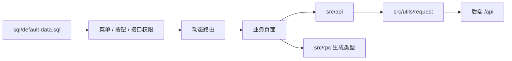

# 管理后台设计

## 文档定位

`frontend/admin` 是当前唯一前端入口，负责平台系统管理。它使用 Vue 3、Vite、TypeScript、Element Plus 和 Pinia，开发期通过 Vite 代理访问后端，生产构建部署到 `backend/data/admin` 并由后端以 `/admin/` 托管。

## 页面与 API 分域

```text
src
├── api
│   ├── base                  # base.v1 公共能力
│   └── system/admin          # system.admin.v1 系统管理
├── views
│   ├── base                  # 登录、AI 助手
│   ├── system/admin          # 用户、角色、菜单、租户、配置、任务、代码生成
│   ├── code/gen              # 代码生成页面辅助目录
│   └── migration/pending     # 动态菜单组件缺失时的降级页
├── rpc                       # 后端 make ts 生成的 TypeScript 代码
└── components                # ProTable、ProForm、FormDialog 等通用组件
```

页面请求优先通过 `src/api` 的服务封装；业务类型优先从 `src/rpc/system/admin/v1` 或公共生成类型导入。`src/rpc` 是生成产物，协议变更必须回到后端 `api/proto` 和 `make ts` 处理。

## 页面组织与权限



系统管理页面使用 `system.admin.v1`。新增后台页面时，需要一起检查路由组件路径、菜单和按钮数据、接口元数据及角色权限模板。动态路由不能解析组件时，统一进入 `views/migration/pending`，避免静默白屏。

后台按租户上下文展示数据：默认租户可使用租户筛选查看全局数据，普通租户只能访问自身组织。用户、角色、租户等受保护对象以服务端返回的 `is_protected` 标记和接口错误为准，前端不自行推断权限边界。

## 通用页面模式

列表页以 `ProTable + FormDialog + ProForm` 为默认组合：

- 列、顶部动作和行内动作优先通过 `ProTable` 配置表达。
- 图片列和状态列使用已有 `cellType`，不在业务页面重复实现相同模板。
- 表格请求、弹窗状态、表单重置、提交、删除和状态切换保持独立方法。
- 复杂详情、代码生成和 AI 页面可以保留页面级编排，但不得将业务流程下沉到通用组件。

样式复用 `src/styles/common.scss`、`src/styles/element-dark.scss` 和全局主题变量，并兼容亮色、暗黑、灰色和色弱模式。

## 重点能力

| 页面域 | 当前职责 | 关联文档 |
| --- | --- | --- |
| 系统管理 | 用户、角色、部门、菜单、字典、配置、任务、日志、租户、API、代码生成。 | [后端服务设计](后端服务设计.md) |
| AI 助手 | 会话、流式消息、附件、工具过程、重试、再生成和分支会话。 | [AI 助手设计](AI助手设计.md) |

## 构建与验证

开发服务器默认监听 `8848`，代理 `/api` 与 `/events` 到 `http://localhost:7001`。生产构建的公共路径为 `/admin/`，输出为 `backend/data/admin`。

修改后台代码时，至少执行：

```bash
cd frontend/admin
pnpm lint:oxlint
```

涉及类型或构建时再执行 `pnpm type:check` 或对应构建命令。文档修改只需检查链接和路径引用。
