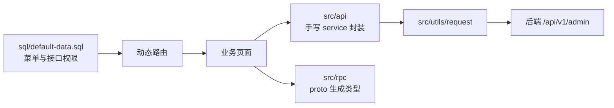
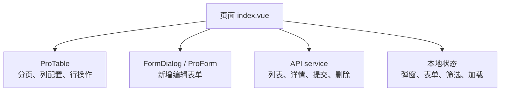

# 管理后台设计

## 文档目标

本文档说明 `frontend/admin` 管理后台的模块定位、页面组织、接口调用、权限菜单、主题样式和与后端的协作方式。

## 模块定位

管理后台面向运营、客服、管理员和技术人员，负责：

- 维护系统基础数据、用户、角色、部门、菜单、字典与配置。
- 管理商品、订单、评价、支付账单、门店与商城运营内容。
- 查看工作台、订单 / 商品 / 用户分析和月度报表。
- 管理推荐请求、推荐事件、Gorse 服务调试与推荐策略相关页面。

## 页面组织

```text
src/views
├── base          # 系统管理
├── dashboard     # 工作台与分析页
├── goods         # 商品管理
├── shop          # 轮播、服务、热门推荐
├── order         # 订单管理
├── comment       # 评价、讨论、AI 摘要审核
├── report        # 商品 / 订单月报
├── pay           # 交易账单
├── recommend     # 推荐请求、事件、Gorse 管理与调试
└── user          # 门店管理
```

## 页面与接口关系



- 页面优先使用 `src/api` 中的业务 service 发起请求。
- 业务模型类型优先引用 `src/rpc` 生成结果。
- 新增菜单、按钮或接口权限时，需要同步维护后端接口权限和 SQL 初始化数据。

## 权限与菜单

- 菜单、按钮、接口权限主要来自 `sql/default-data.sql`。
- 管理后台根据登录用户权限加载动态路由和页面操作权限。
- 新增后台页面时，应同时检查：路由文件、菜单初始化、按钮权限、后端 `base_api` 权限路径。

## 通用页面模式

后台列表页优先保持统一结构：



- 列表页优先复用 `ProTable + FormDialog + ProForm`。
- 图片列、状态列、操作列优先使用组件已有配置能力。
- 复杂详情页、分析页和调试页可以保留页面内编排，但数据加载、状态切换、提交动作需要分层清晰。

## 主题与样式

- 业务页样式优先复用 `src/styles/common.scss` 与 `src/styles/element-dark.scss`。
- 新增卡片、指标块、标签块、筛选区时，应兼容亮色、暗黑、灰色和色弱模式。
- 页面级颜色不要大量写死，必要时沉淀为全局主题变量。

## 重点业务页面

| 页面域 | 说明 | 关联文档 |
| --- | --- | --- |
| 工作台与分析 | 展示订单、商品、用户、待办、风险指标 | [统计数据流转设计](统计数据流转设计.md) |
| 订单管理 | 查询订单、处理退款、发货、查看物流与单据 | [订单数据流转设计](订单数据流转设计.md) |
| 推荐管理 | 查看推荐请求、事件、Gorse 运行和调试能力 | [推荐系统设计](推荐系统设计.md)、[推荐数据流转设计](推荐数据流转设计.md) |
| 评价管理 | 审核评价、讨论、维护标签和 AI 摘要 | [评价与审核数据流转设计](评价与审核数据流转设计.md) |

## 构建与托管

- 开发期默认端口为 `8848`，代理 `/api` 与 `/shop` 到后端。
- 生产构建公共路径为 `/admin/`。
- 构建产物输出到 `backend/data/admin`，后端启动后可通过 `/admin` 访问。

## 维护建议

- 修改接口契约后，由后端执行 `make ts` 生成 `src/rpc`，不要在前端手工补等价类型。
- 新增页面时同步补齐 README 或专题文档链接。
- 涉及页面代码变更时按模块规则执行 ESLint 和类型检查。
