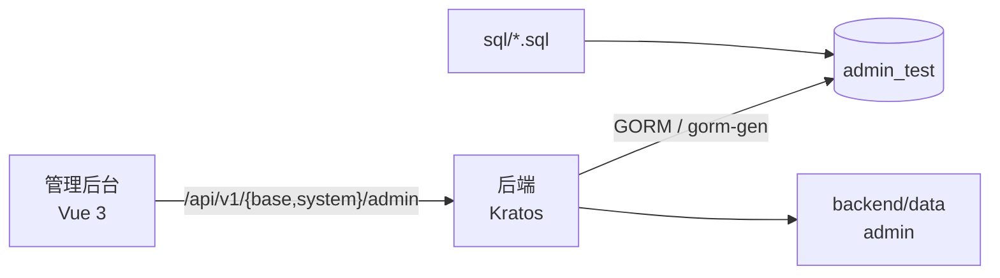

# 系统总体设计

## 文档定位

本文档描述当前管理系统的运行边界、模块关系与契约生成链路。安装、启动和环境变量以各模块 README 为准；基础 AI、权限和租户细节由对应专题文档维护。

## 模块边界

| 模块 | 技术与职责 | 主要产物 |
| --- | --- | --- |
| `backend` | Go、Kratos、GORM；提供 HTTP、gRPC、SSE、MCP、定时任务和静态资源托管。 | OpenAPI、Go/TypeScript RPC 代码、服务端二进制。 |
| `frontend/admin` | Vue 3、Vite、Element Plus、Pinia；提供系统管理后台。 | `/admin/` 静态站点。 |
| `sql` | MySQL 初始化和权限数据。 | 默认租户、菜单、角色、地区和系统配置数据。 |
| `docs` | 当前实现和工程规则的说明。 | 仓库级与模块级设计文档。 |

## 运行关系



管理后台开发期通过本地代理访问后端，生产构建写入 `backend/data/admin`，后端按目录名注册 `/admin/` 路由。上传文件使用后端配置的对象存储或本地数据目录。

## 业务域与接口契约

接口协议统一放在 `backend/api/proto`，目录与包名保持一致：

| 域 | 协议包 | 后端服务 | 前端 API |
| --- | --- | --- | --- |
| 公共基础能力 | `base.v1`、`common.v1` | `service/base` | `src/api/base` |
| 系统后台 | `system.admin.v1` | `service/system/admin` | `src/api/system/admin` |
| 通用端接口 | `system.app.v1` | `service/system/app` | `frontend/app` 基础壳子使用的兼容接口 |

`api/gen/go`、OpenAPI 和管理端 `src/rpc` 都是生成产物。接口修改的检查顺序为：Proto 契约、生成产物、后端实现、前端调用、菜单/API 权限初始化数据。

## 本地运行顺序

1. 创建 `admin_test` 数据库。
2. 启动后端，让当前 GORM 模型完成自动迁移，再停止服务。
3. 在仓库根目录导入 `default-data.sql` 与 `base_area.sql`。
4. 重启后端，等待启动流程重建 `base_api`、角色菜单副本和 `casbin_rule`。
5. 启动管理后台。

```bash
mysql -uroot -p admin_test < sql/default-data.sql
mysql -uroot -p admin_test < sql/base_area.sql
```

默认 HTTP 地址为 `http://localhost:7001`，管理后台为 `http://localhost:8848`。具体命令见根目录和模块 README。

## 领域文档

| 领域 | 文档 |
| --- | --- |
| 后端与后台 | [后端服务设计](后端服务设计.md)、[管理后台设计](管理后台设计.md) |
| 模块边界 | [模块设计方案](模块设计方案.md)、[接口域目录设计](Proto目录拆分设计.md) |
| AI 能力 | [AI 助手设计](AI助手设计.md) |

## 设计原则

- 服务端负责协议、权限、状态转换和数据一致性，前端负责交互与展示。
- 生成文件不手工维护，避免协议、Go、OpenAPI 与 TypeScript 类型分叉。
- 初始化数据只服务全新环境；存量环境的结构和数据变更需要独立、可审计的迁移方案。
