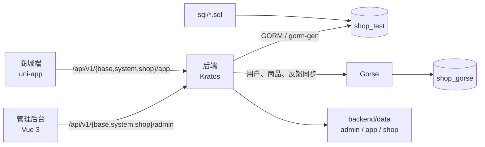

# 系统总体设计

## 文档定位

本文档描述当前 `shop` 仓库的运行边界、模块关系与契约生成链路。模块的安装、启动和环境变量以各模块 README 为准；订单、推荐、统计、审核、AI 与租户的业务细节由对应专题文档维护。

## 模块边界

| 模块 | 技术与职责 | 主要产物 |
| --- | --- | --- |
| `backend` | Go、Kratos、GORM；提供 HTTP、gRPC、SSE、MCP、定时任务和静态资源托管。 | OpenAPI、Go/TypeScript RPC 代码、服务端二进制。 |
| `frontend/admin` | Vue 3、Vite、Element Plus、Pinia；提供系统管理与商城运营后台。 | `/admin/` 静态站点。 |
| `frontend/app` | uni-app、Vue 3、Pinia；提供 H5、微信小程序等商城端。 | `/app/` H5 站点与各平台构建目录。 |
| `gorse` | Docker Compose 管理的 Gorse 服务。 | 推荐训练数据、缓存和 HTTP/gRPC 推荐 API。 |
| `sql` | MySQL 初始化和演示数据。 | 默认租户、菜单、角色、地区和演示商品数据。 |
| `docs` | 当前实现和领域规则的说明。 | 仓库级与模块级设计文档。 |

## 运行关系

管理后台和商城端在开发期通过本地代理访问后端；生产构建分别写入 `backend/data/admin`、`backend/data/app`，后端按目录名注册 SPA 路由。上传文件位于 `backend/data/shop` 并由 `/shop/*` 提供访问。

## 业务域与接口契约

接口协议统一放在 `backend/api/proto`，目录与包名保持一致：

| 域 | 协议包 | 后端服务 | 前端 API |
| --- | --- | --- | --- |
| 公共基础能力 | `base.v1`、`common.v1` | `service/base` | `src/api/base` |
| 系统后台 | `system.admin.v1` | `service/system/admin` | `src/api/system/admin` |
| 系统商城端 | `system.app.v1` | `service/system/app` | `src/api/system/app` |
| 商城后台 | `shop.admin.v1` | `service/shop/admin` | `src/api/shop/admin` |
| 商城端 | `shop.app.v1` | `service/shop/app` | `src/api/shop/app` |

`api/gen/go`、OpenAPI 和两个前端的 `src/rpc` 都是生成产物。接口修改的检查顺序为：Proto 契约、生成产物、后端实现、前端调用、菜单/API 权限初始化数据。

## 本地运行顺序

1. 创建 `shop_test`，首次启动后端完成自动迁移后停止服务。
2. 导入 `sql/default-data.sql` 和 `sql/base_area.sql`；需要演示数据时再导入 `sql/shop.sql`。
3. 重启后端。启动过程会根据内置 OpenAPI 重建 `base_api`，再同步角色菜单和租户化 Casbin 策略。
4. 启动管理后台和商城端；需要推荐联调时启动 `gorse`。

默认 HTTP 地址为 `http://localhost:7001`，管理后台为 `http://localhost:8848`，商城 H5 为 `http://localhost:5002`。具体命令见根目录和模块 README。

## 领域文档

| 领域 | 文档 |
| --- | --- |
| 后端、后台、商城端 | [后端服务设计](后端服务设计.md)、[管理后台设计](管理后台设计.md)、[商城端设计](商城端设计.md) |
| 租户与数据初始化 | [租户与门店体系设计](租户与门店体系设计.md)、[数据库与初始化数据设计](数据库与初始化数据设计.md) |
| 交易、推荐、统计 | [订单数据流转设计](订单数据流转设计.md)、[推荐系统设计](推荐系统设计.md)、[推荐数据流转设计](推荐数据流转设计.md)、[统计数据流转设计](统计数据流转设计.md) |
| 内容与智能能力 | [评价与审核数据流转设计](评价与审核数据流转设计.md)、[AI 助手设计](AI助手设计.md) |

## 设计原则

- 服务端负责协议、权限、状态转换和数据一致性，前端负责交互与展示。
- 推荐服务是可选的远端增强；Gorse 不可用或结果不足时，后端继续使用本地推荐策略。
- 生成文件不手工维护，避免协议、Go、OpenAPI 与 TypeScript 类型分叉。
- 初始化数据只服务全新环境；存量环境的结构和数据变更需要独立、可审计的迁移方案。
