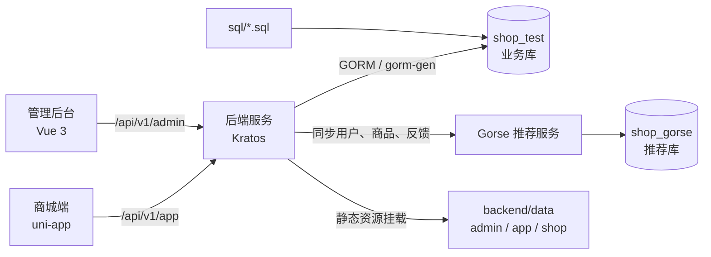

# 系统总体设计

## 文档目标

本文档从仓库级视角说明 `shop` 项目的模块边界、运行关系、核心契约和跨模块协作方式。模块内命令、配置和实现细节以各模块 `README.md` 与对应专题设计文档为准。

## 模块划分

| 模块 | 技术栈 / 职责 | 主要输出 |
| --- | --- | --- |
| 后端服务 | Go + Kratos + gRPC/HTTP + GORM | 管理端接口、商城端接口、基础服务、定时任务、OpenAPI、静态资源托管 |
| 管理后台 | Vue 3 + Vite + TypeScript + Element Plus + Pinia | 系统管理、商品、订单、评价、报表、支付、推荐运营和调试页面 |
| 商城端 | uni-app + Vue 3 + TypeScript + Pinia | H5、微信小程序等用户侧购物、订单、评价、推荐链路 |
| Gorse 推荐 | Gorse + Docker Compose | 本地算法推荐服务、用户 / 商品 / 反馈数据存储与推荐 API |
| SQL 初始化 | MySQL 脚本 | 菜单、权限、账号、基础字典、地区、演示数据 |
| 设计文档 | Markdown | 模块设计、数据流转、统计口径与运维说明 |

## 总体架构

## 运行入口

1. 先创建并初始化业务库，启动后端服务。
2. 管理后台和商城端在开发期通过代理访问后端 `/api` 与 `/shop`。
3. 前端生产构建产物输出到 `backend/data/admin` 与 `backend/data/app`，由后端统一托管。
4. 推荐联调时单独启动 `gorse` 目录下的 Docker Compose，并在后端本地配置中指向 Gorse HTTP API。

## 契约与生成链路

- 接口契约统一维护在 `backend/api/protos`。
- Go 接口代码、OpenAPI、前端 RPC 类型均由后端生成命令产出。
- 生成产物包括 `backend/api/gen/go`、`backend/internal/cmd/server/assets/openapi.yaml`、`frontend/admin/src/rpc`、`frontend/app/src/rpc`。
- 修改接口时应按“proto -> Go / OpenAPI / TS 生成 -> 后端实现 -> 前端调用 -> SQL 权限数据”的顺序检查。

## 核心业务域

| 业务域 | 说明 | 设计文档 |
| --- | --- | --- |
| 订单 | 确认单、下单、支付、退款、发货、收货、删除、订单状态流转 | [订单数据流转设计](订单数据流转设计.md) |
| 推荐 | 匿名主体、推荐请求、推荐事件、Gorse / 本地兜底、同步任务 | [推荐系统设计](推荐系统设计.md)、[推荐数据流转设计](推荐数据流转设计.md) |
| 统计 | 日统计任务、交易账单、工作台、订单 / 商品 / 用户分析与月报 | [统计数据流转设计](统计数据流转设计.md) |
| 评价 | 商品评价、讨论、审核、AI 摘要、点赞点踩、前台展示 | [评价与审核数据流转设计](评价与审核数据流转设计.md) |
| 初始化数据 | 数据库、菜单权限、基础字典、演示数据、推荐库 | [数据库与初始化数据设计](数据库与初始化数据设计.md) |

## 设计原则

- 模块边界清晰：后端负责契约和业务闭环，前端负责页面体验，SQL 负责可重复初始化，Gorse 只承接推荐服务运行配置。
- 关键数据可追溯：订单、推荐请求、推荐事件、统计口径、评价审核都应保留可回查的数据记录。
- 线上能力有兜底：推荐链路支持 Gorse 与本地策略切换，支付和退款通过本地单据与微信账单校验降低状态漂移风险。
- 文档轻量同步：模块 README 保留入口和命令，详细设计统一沉淀在根目录 `docs` 下。
