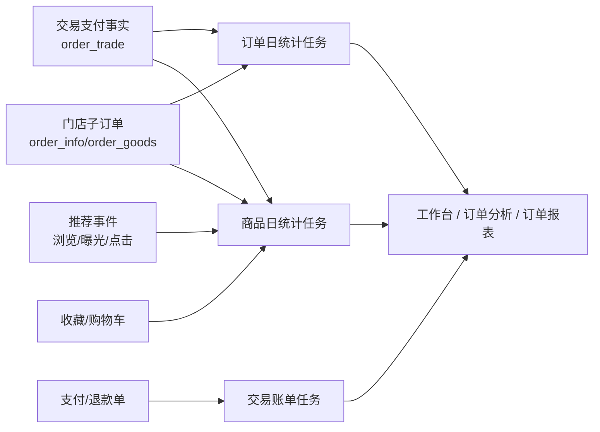

# 统计数据流转设计

## 文档目标

本文档说明交易、门店子订单、商品、用户、推荐事件和支付账单如何进入后台工作台、分析页和报表，并明确平台与普通租户使用同一套统计口径。

## 统计链路总览

## 数据范围与筛选

- 统计统一以门店子订单为经营口径，不为默认租户和普通租户维护两套统计表或两套指标定义。
- 默认租户编码 `0000` 不追加租户条件，可查询全部数据，并使用租户/门店树缩小范围。
- 普通租户由数据库租户回调自动隔离，只能查询自身租户数据，并使用门店下拉缩小范围。
- 交易支付方式、支付渠道和支付状态来自 `order_trade`；门店、履约和退款状态来自 `order_info`。

## 订单日统计

`OrderStatDay` 按统计日期重算门店订单指标：

1. 物理清理目标日期旧统计结果，保证任务可重复执行。
2. 读取当天创建的 `order_info` 和关联 `order_trade`。
3. 按租户、门店、支付方式和支付渠道聚合。
4. 只有交易处于已支付、货到付款、部分退款或全额退款状态时，才累计支付订单数、金额、用户数和商品件数。
5. 退款金额来自当天成功的 `order_refund`，同一门店子订单当天多次部分退款只计一次退款订单数。
6. 已取消数量和金额按门店子订单累计。

`order_stat_day` 只保存租户/门店明细，不写平台汇总行；默认租户查询时动态汇总当前筛选范围。

## 商品日统计

| 指标 | 来源 |
| --- | --- |
| 浏览数 | 推荐事件中的 `VIEW`。 |
| 收藏数 | 用户收藏数据。 |
| 加购数 | 购物车数据。 |
| 下单数 | `order_info` 与 `order_goods`。 |
| 支付件数 / 支付金额 | `order_goods`，并通过所属 `order_trade.status` 判断支付事实。 |

商品统计按租户、门店和商品保存，不额外写平台汇总行。聚合字段通过整数化表达式读取，避免 MySQL `SUM` 的高精度十进制结果扫描到 Go `int64` 时失败。

## 工作台、分析与报表

| 页面 / 服务 | 订单口径 | 数据来源 |
| --- | --- | --- |
| 工作台 | 门店子订单数；支付金额只统计已形成支付事实的交易 | `order_info` 关联 `order_trade`。 |
| 订单分析 | 门店子订单汇总、趋势和履约状态分布 | `order_info` 关联 `order_trade`。 |
| 订单日报 / 月报 | 门店支付、退款、用户和商品件数 | `order_stat_day`。 |
| 商品分析 / 报表 | 商品行为、下单和支付指标 | `goods_stat_day` 与商品明细。 |

同一笔多门店交易会产生多张门店子订单，因此经营侧“订单数”按门店子订单计数；支付操作仍只针对一张 `order_trade`。

## 交易账单比对

`TradeBill` 下载渠道支付和退款账单，保存原始记录，并分别与 `order_payment`、`order_refund` 比对金额和状态。支付单按交易记录，退款单同时保留交易与门店子订单归属。支付账单属于平台能力，不向普通租户开放。

## 与推荐和 AI 的关系

- 推荐创建事件按商品快照发送；交易首次支付成功后遍历全部门店子订单商品发送一次支付事件。
- 推荐请求可分别携带 `trade_id` 和 `order_id`，支付成功场景用交易聚合商品，订单详情场景用当前门店商品。
- AI 助手查询使用后端返回的门店分组；支付、取消动作使用 `trade_id`，履约动作使用 `order_id`。

## 任务运行建议

- 日统计任务支持指定日期重跑；源数据回补后按影响日期重算。
- 交易账单任务保留原始账单和差异状态，便于财务与技术排查。
- 统计口径变化时同步更新后端接口、管理端文案和本文档。
