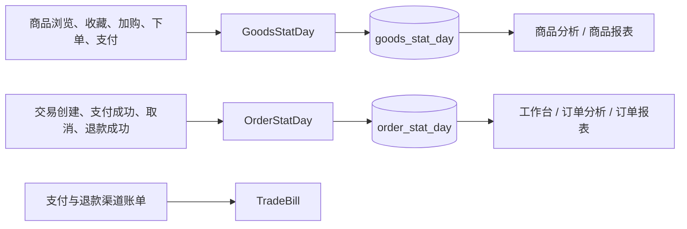

# 统计数据流转设计

## 文档定位

统计能力以业务事实表和日汇总表为基础，面向工作台、商品/订单分析与月报。统计任务位于商城后台服务域，平台和普通租户根据认证上下文使用不同的数据范围。

## 数据链路

`GoodsStatDay` 根据商品行为和交易事实聚合商品指标；`OrderStatDay` 根据子订单和交易状态聚合订单指标。两类任务在 `service/shop/admin/biz` 中实现，汇总数据由后台接口用于趋势、排行、汇总和月报。

## 租户和门店口径

商品和订单日统计都携带经营归属。默认租户作为平台视角可按租户、门店或全部范围查询；普通租户由认证上下文限制为自身数据。订单的支付和取消按交易发生，但运营、履约和门店统计需要回落到门店子订单。

修改商品、订单、支付、退款、门店归属或数据隔离逻辑时，必须评估汇总任务和历史重算。仅新增一个前台字段并不代表统计口径已自动覆盖。

## 工作台、分析和报表

| 能力 | 主要数据来源 |
| --- | --- |
| 工作台 | 订单、商品、用户与待办类聚合查询。 |
| 商品分析 | `goods_stat_day`、商品主数据和推荐/行为事实。 |
| 订单分析 | `order_stat_day`、交易与门店子订单事实。 |
| 商品/订单报表 | 日统计表的按月、按维度聚合结果。 |
| 支付账单 | 渠道账单下载结果与本地支付、退款记录的比对。 |

管理后台页面位于 `frontend/admin/src/views/shop/admin/dashboard`、`report`、`goods`、`order` 与 `pay`。筛选条件以服务端当前允许的租户、门店和时间范围为准，页面不应通过前端聚合突破数据权限。

## 任务与恢复

| 任务 | 位置 | 用途 |
| --- | --- | --- |
| `GoodsStatDay` | `service/shop/admin/biz/goods_stat_day_task.go` | 重算商品日指标。 |
| `OrderStatDay` | `service/shop/admin/biz/order_stat_day_task.go` | 重算订单日指标。 |
| `TradeBill` | `service/shop/admin/biz/trade_bill_task.go` | 下载并比对支付/退款渠道账单。 |

存量库补充租户或门店维度、修复历史事实或调整统计口径后，应按受影响日期重跑日统计任务。不可把旧汇总数据直接复制为新维度结果，也不可依赖页面刷新修复数据。

## 与推荐和 AI 的关系

推荐的本地热门和兜底候选可读取商品统计结果，但推荐请求/事件仍是独立事实链。AI 助手可通过已授权工具查询运营信息，但不会绕过统计范围和权限校验。任何跨域展示都应以各自服务端接口为唯一数据来源。
