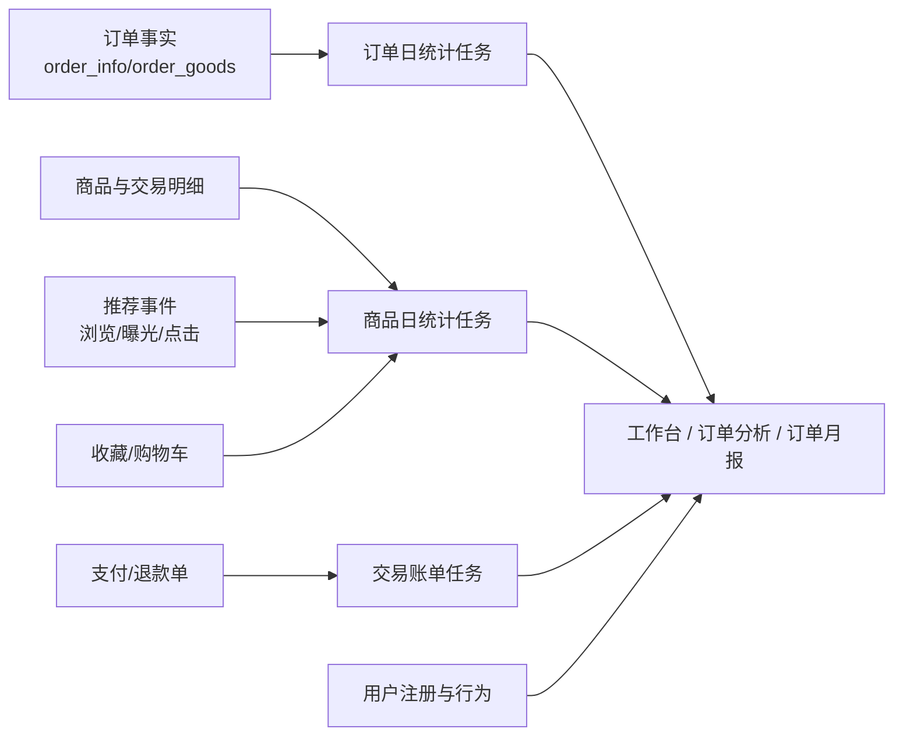

# 统计数据流转设计

## 文档目标

本文档说明订单、商品、用户、推荐事件和支付账单如何进入后台工作台、分析页和报表，明确日统计任务、账单比对和展示口径。

## 统计链路总览

## 订单日统计

`OrderStatDay` 按统计日期重算订单指标：

1. 删除目标日期已有统计结果，保证任务可重复执行。
2. 读取当天创建的订单。
3. 按支付方式、支付渠道等维度聚合。
4. 对已支付状态订单计算支付金额、支付订单数、支付用户数。
5. 对退款、取消等状态计算对应数量和金额。
6. 写入订单日统计结果，供分析页和月报查询。

统计口径要点：

- 支付相关指标使用“已支付类订单状态”判断，而不是只看某一个状态值。
- 支付用户数需要按用户去重。
- 退款和取消指标以订单状态和退款 / 取消记录为依据。

## 商品日统计

`GoodsStatDay` 按统计日期重算商品指标：

| 指标 | 来源 |
| --- | --- |
| 浏览数 | 推荐事件中的 `VIEW`。 |
| 收藏数 | 用户收藏数据。 |
| 加购数 | 购物车数据。 |
| 下单数 | 订单主表与订单商品明细。 |
| 支付件数 / 支付金额 | 已支付订单与订单商品明细。 |

统计处理要点：

- 同一天统计先删除旧结果再重算。
- 同一个订单内同一商品需要去重或按当前实现口径归并，避免重复计数。
- 支付类指标只统计已支付订单。

## 交易账单比对

`TradeBill` 用于降低本地支付状态与微信侧状态不一致的风险：

1. 下载微信支付成功账单和退款账单。
2. 保存原始账单记录到本地。
3. 解析账单 CSV。
4. 与本地 `order_payment`、`order_refund` 比对。
5. 更新对账状态，标记无误差或存在差异。

后台支付账单页面应能查看账单状态、差异记录和处理结果。

## 后台分析页面

| 页面 / 服务 | 展示内容 | 数据来源 |
| --- | --- | --- |
| 工作台 | 核心指标、待办、风险列表 | 订单、商品、用户、库存、退款、任务等聚合查询。 |
| 订单分析 | 汇总、趋势、饼图 | 订单日统计与订单事实。 |
| 商品分析 | 汇总、趋势、饼图、排行 | 商品日统计、推荐事件、订单商品明细。 |
| 用户分析 | 汇总、趋势、排行 | 用户注册、下单和支付行为。 |
| 商品月报 | 月度商品表现 | 商品日统计聚合。 |
| 订单月报 | 月度订单表现 | 订单日统计聚合。 |

## 与推荐数据的关系

- 商品浏览指标依赖推荐事件中的 `VIEW`，因此推荐事件漏报会影响商品分析。
- 推荐请求和推荐事件本身也可用于计算曝光、点击、转化等推荐效果指标。
- 下单和支付事件同时服务推荐训练和交易统计，但统计金额以订单事实为准。

## 任务运行建议

- 日统计任务应支持按指定日期重跑，方便修复历史数据。
- 交易账单任务应保留原始账单和比对状态，便于财务与技术排查。
- 统计口径变化时，应同步更新后台图表说明和本文档，避免运营误解指标。
- 若源数据回补或修复，应按影响日期重跑日统计任务。
