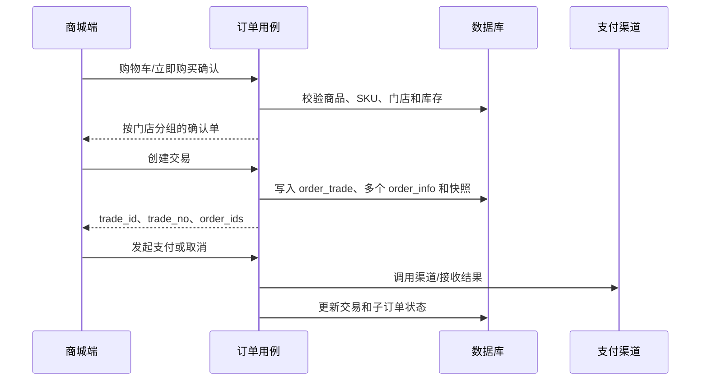

# 订单数据流转设计

## 文档定位

订单领域以交易与门店子订单分层。本文以当前 `service/shop/app`、`service/shop/admin` 和 Proto 契约为准，描述确认单、创建、支付、履约、退款、评价和统计之间的数据责任。

## 核心模型

| 模型 | 职责 |
| --- | --- |
| `order_trade` | 一次结算产生的交易聚合，承载支付和取消。 |
| `order_info` | 每个门店的子订单，承载商品快照、履约、退款、评价和门店归属。 |
| `order_goods` | 子订单中的商品和 SKU 快照。 |
| 支付、退款、物流记录 | 记录渠道交互、退款状态和门店履约过程。 |

一个交易可以只包含一个门店，也可以包含多个门店；两种情况使用同一创建、支付与取消流程。`order_info` 保存 `tenant_id`、`tenant_store_id`，后台和统计以它作为经营归属。

## 创建与支付

确认单、立即购买、再次购买和购物车结算均由后端返回门店分组。创建时后端从商品和门店记录确定租户、门店、配送和商品快照；前端不能自行拼接订单归属。创建成功后会处理本次结算的购物车项。

支付与取消以 `trade_id` 为核心。支付结果以渠道回调或主动查询后的服务端状态为准；商城端支付页只负责轮询和展示，不能把客户端结果视为最终支付事实。

## 履约、退款与评价

支付成功后，子订单独立履约：发货、物流、确认收货、退款和评价均面向 `order_info`。退款链路同时关联交易与子订单，防止多门店交易中把某一门店退款误作用于整笔交易。渠道结果不确定的退款由 `OrderRefundRetry` 任务补查。

评价资格和评价归属由后端订单数据判断；评价、讨论和审核流程见 [评价与审核数据流转设计](评价与审核数据流转设计.md)。

## 管理端与数据口径

| 视角 | 查询范围 |
| --- | --- |
| 平台默认租户 | 可按租户和门店筛选全局子订单、分析和报表。 |
| 普通租户 | 由认证上下文限制为本租户门店的子订单。 |
| 支付账单 | 平台能力，按渠道账单与本地支付/退款记录比对。 |

订单日统计位于 `service/shop/admin/biz/order_stat_day_task.go`，按租户、门店、日期、支付方式和渠道等维度聚合支付、创建、取消和退款事实。修改订单状态或支付通道时，需要同步评估统计重算和账单比对影响。

## 主要实现位置

| 能力 | 位置 |
| --- | --- |
| 商城端订单契约 | `api/proto/shop/app/v1/order_info.proto`、`pay.proto` |
| 后台订单契约 | `api/proto/shop/admin/v1/order_info.proto`、`pay_bill.proto` |
| 商城端订单用例 | `service/shop/app/biz/order_info.go`、`order_trade.go`、`order_payment.go`、`order_refund.go` |
| 后台订单与账单 | `service/shop/admin/biz/order_info.go`、`pay_bill.go`、`trade_bill_task.go` |
| 商城端页面 | `frontend/app/src/pagesOrder` |
| 管理后台页面 | `frontend/admin/src/views/shop/admin/order`、`pay` |
