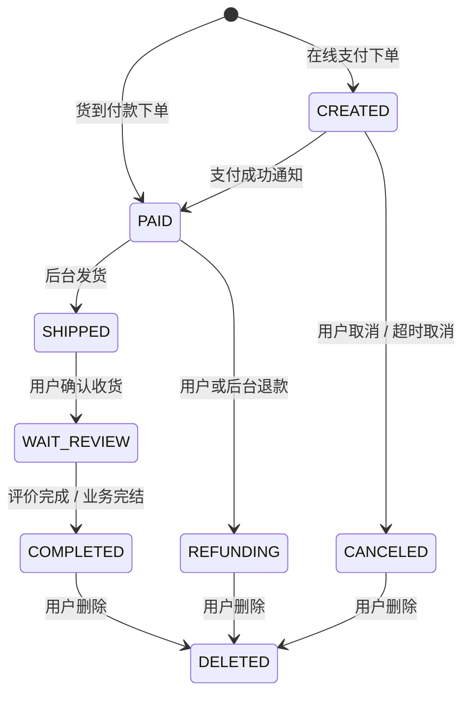
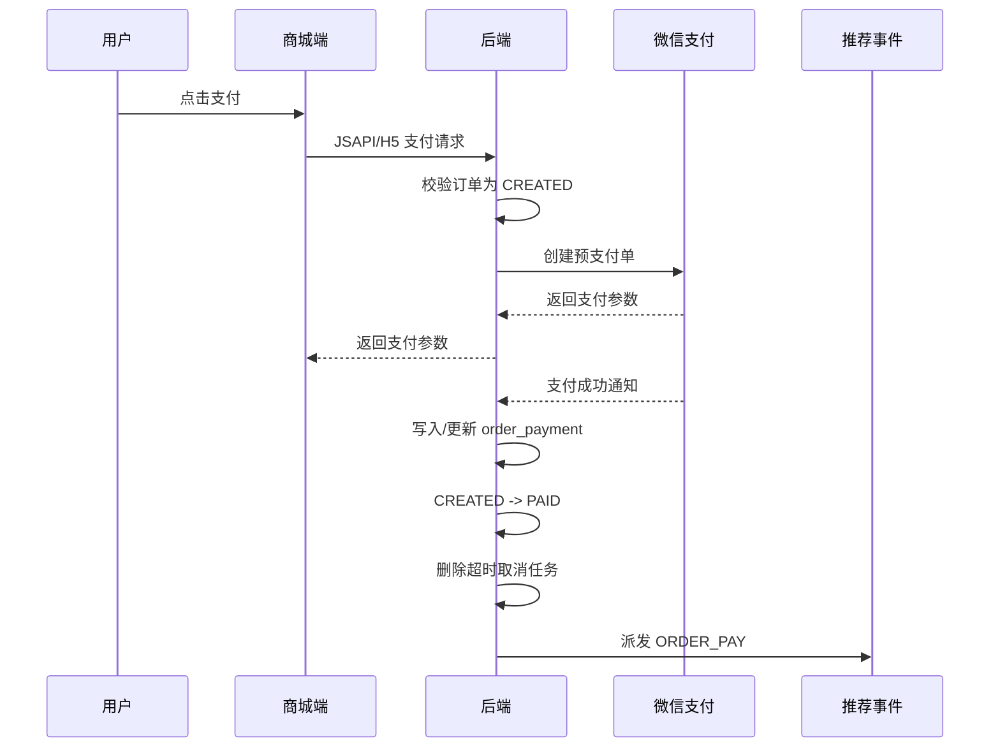

# 订单数据流转设计

## 文档目标

本文档说明商城订单从确认、创建、支付、取消、退款、发货、收货、评价到删除的核心流转，明确状态边界和关键数据落点。

## 参与模块

| 模块 | 责任 |
| --- | --- |
| 商城端 | 发起确认单、下单、支付、取消、退款、收货、删除和评价入口。 |
| 后端 app 服务 | 校验用户身份和订单状态，创建订单、支付、退款、收货等用户侧动作。 |
| 后端 admin 服务 | 查询订单、处理退款、发货、查看物流和支付退款单据。 |
| 支付能力 | 微信预支付、支付通知、退款通知、交易账单。 |
| 推荐与统计 | 下单 / 支付事件回写推荐，订单事实进入日统计和报表。 |

## 订单状态

| 状态 | 业务含义 | 主要进入方式 |
| --- | --- | --- |
| `CREATED` | 待付款 | 在线支付订单创建成功。 |
| `PAID` | 待发货 | 支付成功，或货到付款订单创建成功。 |
| `SHIPPED` | 待收货 | 管理后台发货。 |
| `WAIT_REVIEW` | 待评价 | 用户确认收货。 |
| `COMPLETED` | 已完成 | 评价完成或后续完结动作。 |
| `REFUNDING` | 已退款 / 退款处理中 | 用户或后台发起退款，退款通知成功后更新退款单。 |
| `CANCELED` | 已取消 | 待付款订单取消或超时取消。 |
| `DELETED` | 已删除 | 用户删除已完成、已退款或已取消订单。 |

## 主流程

## 确认单与下单

1. 用户从购物车、立即购买或再次购买进入确认单。
2. 后端读取商品、SKU、库存、价格、收货地址等信息生成确认数据。
3. 用户提交订单时后端生成订单号，写入：
   - 订单主记录。
   - 订单商品快照。
   - 订单地址快照。
4. 同一事务内扣减库存、增加销量，并按来源移除购物车商品。
5. 在线支付订单进入 `CREATED`，货到付款订单直接进入 `PAID`。
6. 下单成功后派发推荐 `ORDER_CREATE` 事件；货到付款订单同时派发 `ORDER_PAY` 事件。
7. 在线支付订单会创建超时取消任务，避免长期占用库存。

## 支付流转

- 支付请求只允许 `CREATED` 状态订单发起。
- 支付通知是订单进入 `PAID` 的可信来源。
- 支付成功会写入支付单，避免重复通知导致重复状态切换。

## 取消与超时取消

- 用户取消仅允许 `CREATED` 状态。
- 微信在线支付订单取消前会先查询远端支付状态，避免把实际已支付订单取消。
- 取消成功后恢复库存和销量，写入取消记录，并将订单置为 `CANCELED`。
- 超时取消复用同一类状态约束和库存恢复逻辑。

## 退款流转

1. 用户侧退款通常只允许 `PAID` 状态。
2. 在线支付订单调用微信退款，货到付款订单补齐本地退款时间和单据。
3. 后端写入退款单，并将订单置为 `REFUNDING`。
4. 退款通知到达后写入或更新退款记录，成功状态用于后续对账和查询。
5. 管理后台也可以在订单详情中处理退款，必须遵循同样的订单状态约束。

## 发货、收货与评价

- 管理后台发货只允许 `PAID` 状态，发货时创建或更新物流记录，并将订单置为 `SHIPPED`。
- 用户确认收货只允许 `SHIPPED` 状态，确认后进入 `WAIT_REVIEW`。
- 待评价订单进入评价链路，评价通过审核后才会在前台展示。
- 评价能力详见 [评价与审核数据流转设计](评价与审核数据流转设计.md)。

## 订单数据落点

| 数据 | 作用 |
| --- | --- |
| 订单主记录 | 订单号、用户、金额、状态、支付方式、配送方式等核心信息。 |
| 订单商品快照 | 保留下单时商品、SKU、价格、数量和图片等快照。 |
| 订单地址快照 | 保留下单时收货人、手机号、地址等信息。 |
| 订单支付单 | 支付渠道、交易号、支付金额、支付时间、对账状态。 |
| 订单退款单 | 退款单号、退款金额、退款原因、微信退款状态和通知结果。 |
| 取消记录 | 取消原因、取消时间，用于客服和统计。 |
| 物流记录 | 快递公司、快递单号、发货时间和物流信息。 |

## 下游影响

- 推荐：下单和支付事件进入推荐事件链路，影响个性化推荐和热门策略。
- 统计：订单日统计、商品日统计、工作台、订单报表均以订单事实为来源。
- 对账：支付单和退款单会被交易账单任务比对，识别本地与微信侧差异。
