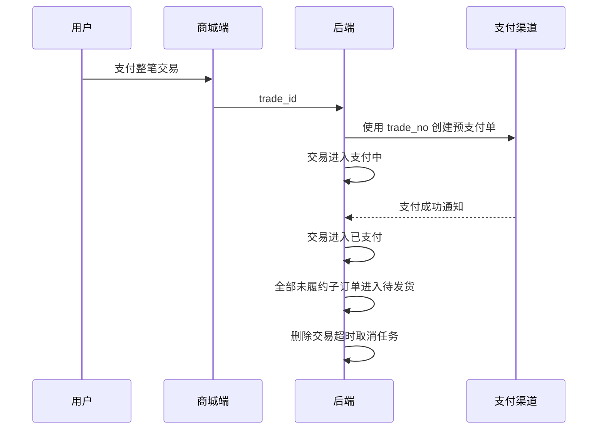

# 订单数据流转设计

## 文档目标

本文档说明商城订单从确认、创建、支付、取消、退款、发货、收货、评价到删除的核心流转，明确交易聚合与门店履约的边界。

## 核心模型

| 模型 | 责任 |
| --- | --- |
| `order_trade` | 聚合一次下单产生的全部门店子订单，负责支付方式、支付渠道、整笔支付、整笔取消和交易退款汇总。 |
| `order_info` | 一家门店对应一张子订单，负责门店金额、配送备注、发货、收货、评价和门店退款。 |
| `order_goods` | 归属 `order_id`，保存门店子订单的商品快照。 |
| `order_address` | 归属 `trade_id`，一笔交易共享一份收货地址快照。 |
| `order_payment`、`order_cancel` | 归属 `trade_id`，记录整笔交易的支付和取消事实。 |
| `order_refund` | 同时记录 `trade_id` 和 `order_id`，按门店子订单退款并向上汇总交易退款状态。 |
| `order_logistics` | 归属 `order_id`，各门店独立发货和查询物流。 |

单门店和多门店使用同一套创建、支付和取消流程，不为单门店建立特殊分支。

## 三套状态

### 交易支付状态

`order_trade.status` 使用 `OrderTradeStatus`：

| 状态 | 业务含义 |
| --- | --- |
| `PENDING_PAYMENT_OTS` | 待支付。 |
| `PAYING_OTS` | 已创建三方预支付单，等待最终支付结果。 |
| `PAID_OTS` | 已支付。 |
| `CASH_ON_DELIVERY_OTS` | 货到付款。 |
| `CLOSED_OTS` | 用户取消或支付超时关闭。 |
| `PARTIAL_REFUND_OTS` | 交易累计成功退款金额小于实付金额。 |
| `FULL_REFUND_OTS` | 交易累计成功退款金额达到实付金额。 |

### 门店履约状态

`order_info.status` 使用 `OrderInfoStatus`：未进入履约、待发货、已发货、待评价、已完成、已取消。

### 门店退款状态

`order_info.refund_status` 使用 `OrderRefundStatus`：无退款、处理中、部分退款、已退款、已关闭/失败。

三套状态均由业务代码显式写入和迁移，不依赖数据库默认值。

## 确认单与创建

1. 购物车、立即购买和再次购买统一把商品提交给后端确认。
2. 后端校验商品、SKU、库存、价格和门店后，直接返回 `order_goods_stores`；前端只渲染门店分组，不自行聚合。
3. 前端按门店提交 `order_store_options`，包含 `tenant_store_id`、配送时间和备注。
4. 创建事务写入一张 `order_trade`、多张 `order_info`、商品快照和地址快照，并逐门店扣减库存。
5. 在线支付交易写入“待支付”，全部子订单写入“未进入履约 + 无退款”；货到付款交易写入“货到付款”，子订单直接进入“待发货”。
6. 创建响应返回 `trade_id`、`trade_no` 和全部 `order_ids`。

## 支付与取消

- 支付和取消都使用 `trade_id`，不能使用任意一张门店子订单 ID 代替。
- 支付回调以交易为幂等边界；重复通知不会重复推进履约或重复发送推荐支付事件。
- 用户取消和超时取消仅允许待支付/支付中交易。后端关闭整笔交易、取消全部未履约子订单并恢复各门店库存。
- 微信订单不存在按本地未支付处理；微信关单返回订单不存在时视为已关闭，避免无效阻塞。

## 移动端查询与展示

- 待支付、支付中和已关闭：按交易返回一条聚合记录，包含全部 `order_goods_stores`，用于整笔支付、取消和查看。
- 已支付及后续履约：按 `order_info` 返回门店子订单，每条只包含当前门店及其商品。
- “全部订单”由后端合并交易聚合记录与门店子订单，排序后统一分页；前端不跨页分组。
- 售后申请列表使用后端“可申请退款”筛选，前端不自行拼接多组履约和退款状态。
- 已关闭交易可整体软删除；已完成、已取消或已退款的门店子订单可单独软删除。

## 退款、发货、收货与评价

- 退款、发货、收货、评价和再次购买都使用 `order_id`，只影响当前门店子订单。
- 用户退款只允许待发货门店订单；无退款、部分退款、退款关闭/失败状态可申请剩余可退金额，处理中或已退款状态不能重复申请。
- 每次退款先更新当前子订单退款状态，再按全部成功退款记录汇总 `order_trade.status`。
- 后台发货只允许待发货子订单，且所属交易必须为已支付、货到付款或部分退款。
- 用户确认收货后进入待评价；评价完成后进入已完成，其他门店状态不随之变化。

## 管理端数据范围

- 默认租户可查看全部门店子订单，并通过租户/门店树筛选。
- 普通租户由后端租户回调强制隔离，只能查看自身租户数据，并通过门店下拉筛选。
- 订单详情、退款和发货都先查询当前可见的 `order_info`，再读取交易、地址、支付、退款和物流关联数据。

## 下游影响

- 推荐：创建事件按商品明细发送；交易首次支付成功后展开全部门店商品发送一次支付事件。
- AI 助手：查询结果使用 `order_goods_stores`；支付/取消使用 `trade_id`，收货、退款等履约动作使用 `order_id`。
- 统计：默认租户无筛选时按 `order_trade` 统计整笔交易，选择租户/门店后及普通租户按 `order_info` 统计门店子订单；在线支付、货到付款、取消和退款分别按支付成功、交易创建、取消创建和退款成功时间归属统计日期。
- 对账：`order_payment` 和 `order_refund` 继续由交易账单任务与渠道账单比对。
