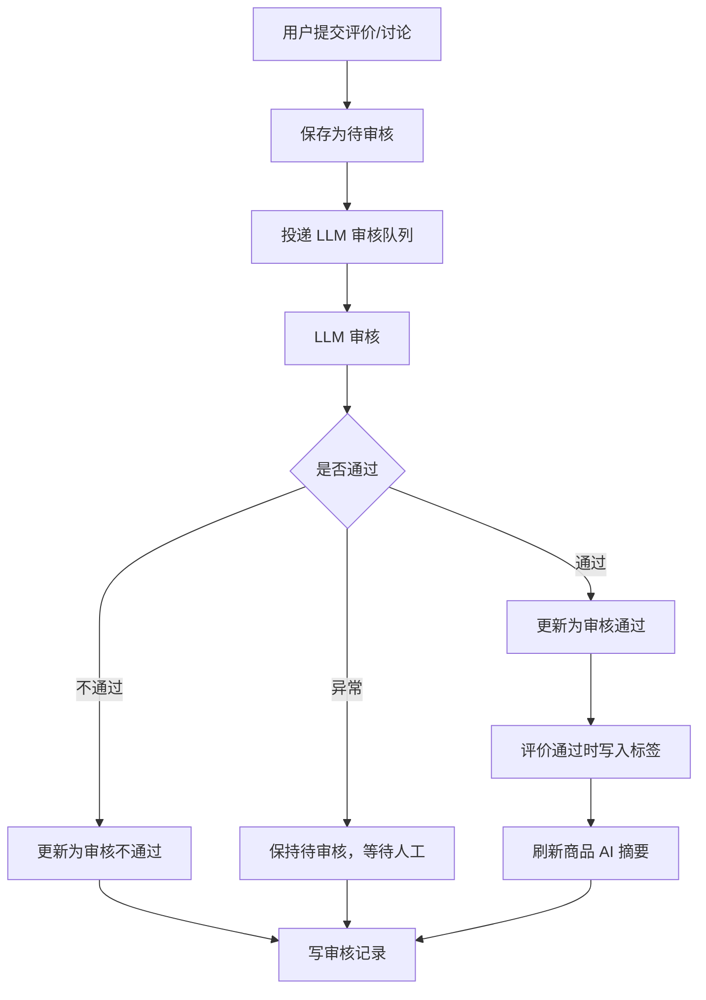
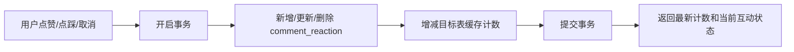

# 评价与审核数据流转设计

## 文档目标

本文档说明商品评价、讨论、标签、AI 摘要、审核记录和互动计数的最新数据流转方案。当前方案以“先保存待审核、再异步 LLM 审核、异常转人工”为主线，减少审核表冗余字段，并把前台高频展示计数落到主表缓存。

## 能力边界

| 模块 | 责任 |
| --- | --- |
| 商城端 | 展示已审核评价、评价标签、AI 摘要；提交评价、讨论；点赞、点踩。 |
| 后端 App 服务 | 保存评价 / 讨论为待审核；投递 LLM 审核队列；提供前台查询和互动接口。 |
| LLM / AI 能力 | 审核评价 / 讨论，返回通过、不通过或异常；通过时返回标签名称；刷新商品评价 AI 摘要。 |
| 管理后台 | 查看评价详情、讨论列表、审核记录；人工设置评价 / 讨论通过或不通过。 |
| 数据库 | 保存主表状态、统一审核记录、标签、AI 摘要和互动明细，并维护展示计数缓存。 |

## 主表审核状态

`comment_info.status` 与 `comment_discussion.status` 是业务主状态：

| 值 | 枚举 | 含义 | 前台可见性 |
| --- | --- | --- | --- |
| `1` | `PENDING_REVIEW_CS` | 待审核 | 不公开展示，等待 AI 或人工处理。 |
| `2` | `APPROVED_CS` | 审核通过 | 可公开展示。 |
| `3` | `REJECTED_CS` | 审核不通过 | 不公开展示。 |

前台商品评价列表、评价讨论列表只查询 `APPROVED_CS`；“我的评价”可展示用户自己的待审核、通过和不通过评价。

## 审核记录表

统一使用 `comment_review` 记录 AI 审核和人工审核过程，不再拆分评价审核表与讨论审核表。

| 字段 | 说明 |
| --- | --- |
| `target_type` | 审核目标类型：`1` 评价，`2` 讨论。 |
| `target_id` | 目标记录 ID。 |
| `type` | 审核类型：`1` AI 审核，`2` 人工审核。 |
| `status` | 本次审核结果：`1` 通过，`2` 不通过，`3` 异常；不再写“待处理”。 |
| `tags` | 本次 AI 审核提取出的标签名称数组；人工审核默认为空数组。 |
| `operator_id` | 操作人 ID；AI 审核固定为 `0`。 |
| `operator_name` | 操作人名称或 AI 模型名。 |
| `reason` | 原因说明、异常信息或人工备注。 |

`reason` 合并了承载不通过原因、异常信息和人工备注的职责，因此不再单独设计 `risk_reason`、`error_message`、`remark` 字段。

## LLM 审核流程

### 评价审核

1. 用户提交评价后，`comment_info.status = 1`。
2. 后端投递 `COMMENT_AUDIT` 队列。
3. LLM 通过：
   - 清洗模型返回的标签名称；
   - 按商品维度 upsert `comment_tag`；
   - 回写 `comment_info.tag_id`；
   - 更新 `comment_info.status = 2`；
   - 写入 `comment_review`；
   - 投递 `COMMENT_AI_REFRESH` 刷新商品评价 AI 摘要。
4. LLM 不通过：更新 `comment_info.status = 3`，写入 `comment_review.reason`。
5. LLM 异常或未配置：主表保持 `status = 1`，写入异常审核记录，等待人工处理。

> 最新方案不再使用 `highlight_words`。前端正文高亮能力保留为兼容展示结构，但当前 LLM 只返回标签名称。

### 讨论审核

1. 用户提交讨论后，`comment_discussion.status = 1`，并增加父评价 `pending_discussion_count`。
2. LLM 通过：更新讨论为 `status = 2`，父评价 `pending_discussion_count - 1`、`discussion_count + 1`，写审核记录，并刷新商品评价 AI 摘要。
3. LLM 不通过：更新讨论为 `status = 3`，父评价 `pending_discussion_count - 1`，写审核记录。
4. LLM 异常或未配置：讨论保持待审核，只写异常审核记录。

## 人工审核流程

管理后台只允许人工设置“通过”或“不通过”，不主动写“待审核”。

- 评价人工通过：更新 `comment_info.status = 2`，写 `comment_review(type=2,status=1)`，刷新商品 AI 摘要。
- 评价人工不通过：更新 `comment_info.status = 3`，写 `comment_review(type=2,status=2)`；如果原状态为通过，则扣减已命中标签提及次数并清空 `tag_id`，再刷新商品 AI 摘要。
- 讨论人工通过 / 不通过：更新 `comment_discussion.status`，同步调整父评价讨论计数，写审核记录；通过时刷新商品 AI 摘要。

## 标签与 AI 摘要

- `comment_tag` 只保存标签，不保存高亮词。
- LLM 通过评价后返回标签名；后端按 `goods_id + name` 查找或新增标签，并增加 `mention_count`。
- `comment_info.tag_id` 保存命中的标签 ID 数组，用于前台标签筛选和后台详情展示。
- `comment_ai` 按商品和场景保存摘要：
  - `OVERVIEW`：商品详情评价概览卡片；
  - `LIST`：评价列表页摘要。
- AI 摘要刷新失败不影响评价审核主流程，前台可降级展示历史摘要或普通评价列表。

## 互动与计数缓存

`comment_reaction` 仍是点赞 / 点踩明细的 source of truth；主表计数字段用于列表和卡片展示，避免每次列表查询实时聚合。

| 表 | 缓存字段 | 说明 |
| --- | --- | --- |
| `comment_info` | `like_count` / `dislike_count` | 评价点赞 / 点踩展示数。 |
| `comment_info` | `discussion_count` | 审核通过讨论数。 |
| `comment_info` | `pending_discussion_count` | 待审核讨论数。 |
| `comment_discussion` | `like_count` | 讨论点赞展示数。 |
| `comment_ai` | `like_count` / `dislike_count` | AI 摘要点赞 / 点踩展示数。 |

点赞、取消点赞、点赞切换点踩等操作必须在同一事务内同时更新 `comment_reaction` 和对应目标表缓存字段：

为避免异常扣减导致负数，缓存计数递减时需要增加大于 0 条件。若缓存偶发漂移，可通过 `comment_reaction` 和 `comment_discussion` 重新汇总修正。

## 数据质量要求

- 前台公开查询必须过滤待审核和不通过内容。
- AI 异常不改变主表状态，只记录异常，避免误拒绝正常内容。
- 审核记录只记录流程结果，不冗余主表快照字段。
- 标签新增与提及次数更新必须与评价审核通过在同一事务内完成。
- 互动明细和缓存计数必须同事务更新，取消互动时缓存数量同步减少。
