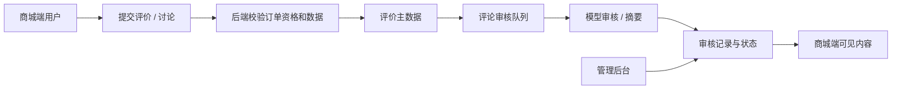

# 评价与审核数据流转设计

## 文档定位

评价能力覆盖订单评价、讨论、互动、标签、摘要和审核。商城端负责提交与展示，后端负责订单资格、审核状态、可见性、计数和异步 AI 审核；管理后台负责审核与运营处理。

## 领域对象

| 对象 | 当前职责 |
| --- | --- |
| `comment_info` | 商品评价主记录，关联订单、商品、租户和门店。 |
| 讨论与互动记录 | 评价下的讨论、点赞/点踩等派生内容。 |
| 审核记录 | 记录评价或讨论的审核目标、结果、原因和补偿状态。 |
| 标签与摘要 | 从已通过评价中提取的展示性聚合内容。 |

评价和门店子订单共用租户/门店归属。讨论、互动、标签和摘要通过评价主记录确定经营边界，不额外信任客户端传入的租户或门店。

## 提交、审核与展示

商城端评价、讨论和互动能力位于 `service/shop/app/biz/comment*.go`。提交后端先验证订单、商品和状态，再持久化业务记录并投递审核队列。自动审核不能正常完成时，由 `CommentAuditRetry` 任务按补偿条件重新处理；人工审核仍可在后台介入。

前台只能展示满足当前可见性规则的内容。审核未完成、拒绝、删除或不符合状态的内容不应通过接口或本地缓存重新暴露。管理后台的审核操作也必须受租户、门店和菜单权限限制。

## LLM 边界

模型配置使用 `backend/configs/ai.yaml` 与 `ai_local.yaml`。评价审核与摘要使用结构化模型调用：模型输出必须被解析为当前业务结构，审核原因、命中内容或图片序号不足时按异常处理并等待复核。该链路不使用 AI 助手的联网搜索或多轮工具循环。

图片审核由服务端读取本地 `/shop/*` 资源作为多模态字节输入；前端仅提交文件关联信息，不能把客户端 URL 当作可信审核内容。

## 标签、摘要与计数

标签和评价摘要只消费符合条件的评价数据。点赞/点踩、讨论数和评价统计需要从事实记录或受控缓存更新，避免前端对同一操作重复累加。删除、审核状态变化或补偿重试后，应通过服务端重新计算或更新相关展示数据。

## 主要实现位置

| 能力 | 位置 |
| --- | --- |
| 商城端评价契约 | `api/proto/shop/app/v1/comment.proto` |
| 后台评价契约 | `api/proto/shop/admin/v1/comment_info.proto` |
| 商城端用例 | `service/shop/app/biz/comment.go`、`comment_review.go`、`comment_summary.go`、`comment_audit_retry_task.go` |
| 后台用例 | `service/shop/admin/biz/comment_info.go`、`comment_review.go`、`comment_summary.go` |
| 商城端页面 | `frontend/app/src/pagesOrder/comment`、商品详情评价区域 |
| 管理后台页面 | `frontend/admin/src/views/shop/admin/comment` |

## 验证重点

- 非订单购买者、重复评价或不属于当前商品/订单的请求必须被后端拒绝。
- 普通租户不能查看或处理其他租户的评价与审核内容。
- 自动审核失败、人工审核、删除和重试后，商城端可见性及相关计数保持一致。
- 图片、文本和讨论审核都不能依赖客户端声称的结果。
