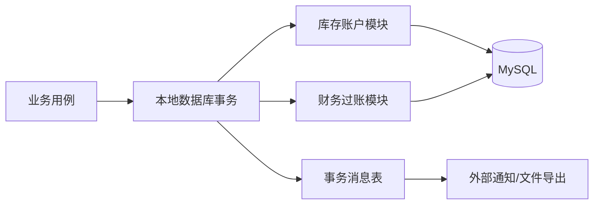
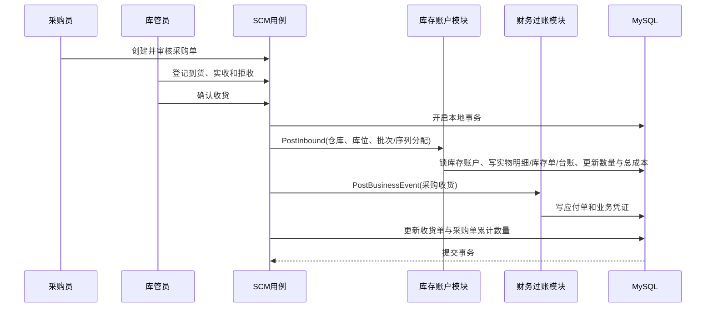
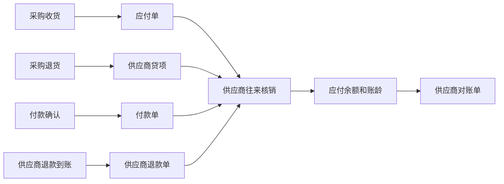

# 进销存财务系统设计

## 1. 文档定位

### 1.1 建设目标

在现有商城订单、支付、退款和门店商品能力之上，补齐采购、销售履约、多仓库存、批次与序列号追溯、资金往来、平台商户结算和凭证导出能力，形成适合当前项目的多门店、多仓库进销存经营闭环。

本设计优先保证以下结果：

1. 库存数量、库存成本和业务单据可以相互复核。
2. 下单、发货、退款、退货等不同业务动作不会混用库存语义。
3. 采购入库、采购退货、销售出库和销售退货均能形成可追溯台账。
4. 供应商应付、付款和核销能够闭环。
5. 平台代收、商户佣金、商户打款及结算后退款能够闭环。
6. 业务事实能够按稳定规则生成凭证并导出给外部财务软件。
7. 新能力延续当前租户、门店、角色、Proto、GORM Gen、Wire 和前端生成链路。
8. 仓库、库位、批次、序列号、库存状态和调拨在途可以相互核对并完整追溯。
9. 收付款、预收预付、账户转账和资金流水可以与业务单据及往来余额复核。
10. 功能范围对齐成熟进销存的核心能力，但实施按风险和依赖分阶段推进。

### 1.2 非目标

明确不建设以下能力：

- 不建设高级 WMS 的波次、RF 手持作业、自动化立库、路径优化和承运商计费。
- 不建设完整制造体系，包括生产计划、工单、工序、产能、MRP、委外加工和制造成本中心；仅支持库存层面的简单组装与拆卸。
- 不建设完整总账、固定资产、期末损益结转、试算平衡、法定资产负债表和利润表。
- 不建设税务申报、进销项税认证、勾选抵扣和税控开票；采购、销售发票仅做业务登记和关联。
- 不建设完整 B2B 客户信用、授信额度和合同价格体系。
- 不把内部业务凭证作为法定会计账簿，外部财务软件仍是最终会计系统。

### 1.3 当前系统事实

本设计基于当前商城的真实数据结构和流程：

- `goods_sku` 已包含 `tenant_id`、`tenant_store_id` 和 `inventory`，当前库存事实实际绑定租户、门店和 SKU，尚不能表达共享仓、中心仓、库位和调拨在途。
- `goods_info.inventory` 与 `goods_sku.inventory` 同时存在，前者是商品级聚合缓存，不应继续作为独立库存事实。
- `order_trade` 聚合买家的一次支付，可能包含多个租户、多个门店的 `order_info`。
- `order_info` 是租户门店级履约单，是销售、结算和租户财务归属的基础事实。
- `order_payment` 保存单笔渠道支付事实；`pay_bill` 保存渠道日账单下载和对账摘要，二者职责不同。
- 当前下单即扣减 `goods_info.inventory` 和 `goods_sku.inventory`，发货是后续独立履约动作。
- 当前 `base_user` 只有一个 `role_id`，同一账号不能直接绑定多个角色。
- 当前商城端已经支持货到付款，订单创建、付款页和履约状态均需纳入应收、收款及库存流程设计。

### 1.4 金蝶高级版对标结论

本设计参考 2026-07-21 登录态“云进销存高级版体验账套”和金蝶官方产品资料，完整证据与产品事实见[《金蝶云进销存进阶版对标调研》](./金蝶云进销存进阶版对标调研.md)。本项目采纳的是成熟进销存的业务能力，不照搬其页面、命名或内部实现。

| 对标能力 | 本项目结论 |
| --- | --- |
| 多仓库、调拨、盘点、其他出入库、成本调整 | 纳入核心库存域，调拨采用“调出、在途、调入”两阶段模型。 |
| 批次、保质期、序列号及追踪报表 | 纳入核心模型，按商品配置启用，不强制所有商品增加作业复杂度。 |
| 组装、拆卸及模板 | 纳入进阶仓储阶段，只处理库存转换，不延伸为生产制造。 |
| 智能补货、以销定购、采购历史价和订单跟踪 | 基于安全库存、销量、在途和采购未交量形成建议，由人工确认生成单据。 |
| 账户、收付款、核销、转账、现金银行报表 | 增加资金账户与不可变资金流水，并与现有支付和往来事实衔接。 |
| 发票登记、结账/反结账、操作日志 | 增加轻量发票登记、业务期间和高风险操作审计，不建设税务及完整总账。 |
| 扫码开单、智能录单、自助报表 | 保留扩展边界，待核心数据稳定后实施，不作为库存模型上线前置条件。 |

## 2. 总体决策

| 决策项 | 结论 |
| --- | --- |
| 库存空间模型 | 门店是经营与履约组织，仓库是库存与成本账户，二者通过服务关系关联。库位是仓库内可选启用的物理位置。 |
| 库存权威模型 | `stock_account` 保存“租户 + 仓库 + SKU”的现存、预占和移动加权成本；`stock_quant` 保存“仓库 + 库位 + SKU + 批次 + 库存状态”的实物明细；`goods_sku.inventory` 和 `goods_info.inventory` 只保留为可重建的可售量缓存。 |
| 数量口径 | 区分现存量、预占量、可售量和在途量。`可售量 = 合格现存量 - 预占量 - 冻结量`；在途量不计入源仓或目标仓现存量，单独核对。 |
| 库存状态 | 至少支持待检、合格、不良、冻结；只有合格且未冻结库存默认可售。状态转换必须留痕，不能通过改数量绕过。 |
| 销售扣减时点 | 下单只做库存预占；发货才形成物理出库、库存台账和销售成本。取消订单只释放预占。 |
| 履约分配 | 下单预占到仓库和 SKU；库位、批次和序列号可在拣货或发货前分配。支持部分发货、拆单发货、改仓和取消剩余量。 |
| 调拨 | 采用调拨出库、在途、调拨入库三段事实。支持部分调出、部分收货、短少/破损差异和退回，已调出单据不得直接删除。 |
| 批次与效期 | 批次商品记录生产日期、失效日期和供应商批号；出库默认 FEFO，近效期预警和过期禁止销售均可配置。 |
| 序列号 | 序列号商品实行一物一码，入库、预占、调拨、出库、退货、报损全过程记录当前位置和状态。 |
| 退款与退货 | 退款只处理资金；退货只处理实物。只有实际收货验收后才生成销售退货入库。 |
| 成本法 | 使用永续盘存下的移动加权成本，核算范围为“租户 + 仓库 + SKU”。批次和序列号用于追溯，不默认成为独立成本账户。库存总成本是权威值，单位成本仅用于展示和单据分摊。 |
| 调拨成本 | 同一账簿主体内调拨不确认损益；调出成本进入在途，调入按同一成本进入目标仓，差异另行审核处理。 |
| 采购退货成本 | 库存按退货时当前移动平均成本减少；供应商贷项按原采购价确认，差额进入采购价差。 |
| 负库存 | 默认禁止仓库现存量、可售量和批次/序列号数量为负。应急负库存必须按租户与仓库显式开启、单独授权并在结账前清零和补算成本。 |
| 多单位 | 库存和成本统一按 SKU 基本单位记账；采购、销售、包装单位通过固定换算率转换，并在单据明细冻结单位和换算率快照。 |
| 财务定位 | 建设应付、应收、核销、商户结算和凭证导出桥接，不建设完整总账。 |
| 资金账户 | 现金、银行、第三方支付待结算和平台结算账户统一建档；确认收付款、退款、其他收支和账户转账时写不可变资金流水。 |
| 预收预付 | 收付款可以先形成预收或预付余额，后续再与应收应付核销，不强制先有业务欠款。 |
| 发票登记 | 采购、销售发票只登记号码、日期、价税金额、附件和业务关联，不承担税务认证或申报。 |
| 业务期间 | 库存成本、往来、资金和业务凭证共用业务期间。结账前执行完整性检查；反结账需独立权限、原因和审计。 |
| 财务数据源 | 单笔支付以 `order_payment` 为源，渠道日对账以 `pay_bill` 为源，禁止混用。 |
| 会计归属 | 财务单据必须区分业务租户与账簿主体。平台代收和商户结算凭证属于平台账簿，不属于被结算商户账簿。 |
| 供应商账号 | 优先复用 `base_user` 登录、Token 和 Casbin，通过关联表绑定供应商，不再建设第二套密码和认证体系。 |
| 角色模型 | 保持单账号单角色。需要兼任时创建合并权限的自定义角色，不在本期改造为多角色。 |
| 数据一致性 | 同数据库内的订单、库存、往来和凭证事实使用本地事务同步提交；外部通知和文件导出使用事务外任务。 |
| 上线方式 | 分阶段上线，先稳定采购、库存和应付，再上线供应商协同、商户结算和凭证导出。 |

## 3. 统一业务术语

| 术语 | 标准定义 |
| --- | --- |
| 业务租户 | 经营商品、采购货物或履约订单的租户。字段通常为 `tenant_id`。 |
| 账簿主体 | 某条财务凭证归属的会计主体。字段为 `accounting_entity_id`，值关联租户。 |
| 门店 | 经营、销售和履约组织，对应 `tenant_store_id`；门店可由一个或多个仓库提供库存服务，本身不再作为库存账户。 |
| 可售量 | 仓库合格现存量扣除预占和冻结后还能被新订单占用的数量；`goods_sku.inventory` 只是跨可履约仓汇总缓存。 |
| 预占量 | 已被订单占用、但实物仍在仓库的合格数量，权威值保存在 `stock_account.reserved_num`。 |
| 现存量 | 仓库实际持有的全部库存状态数量，对应 `stock_account.on_hand_num`，不包含调拨在途。 |
| 库存总成本 | 某仓库 SKU 现存量对应的全部成本金额，是移动加权成本的权威值。 |
| 库存预占 | 下单时从可售量转入预占量，不产生物理出入库台账。 |
| 库存过账 | 确认物理入库或出库，写出入库单、库存台账并更新库存余额与成本。 |
| 退款 | 向买家退回资金，不天然代表商品已经退回。 |
| 退货 | 商品实物退回并经验收，不天然代表资金已经退回。 |
| 应付单 | 因采购收货形成的对供应商负债。 |
| 供应商贷项 | 因采购退货、折让等形成的供应商负债减少事实，金额始终为正，通过单据类型表达方向。 |
| 支付分摊 | 将一笔 `order_payment` 按各 `order_info.pay_money` 拆分到租户门店订单。 |
| 商户结算 | 平台将代收货款扣除退款、佣金及调整后支付给三方商户的过程。 |
| 业务凭证 | 根据业务事实生成、用于查询和导出的借贷分录，不替代外部财务软件中的正式记账凭证。 |
| 红冲 | 使用一张方向相反且引用原单的单据抵消已确认事实，禁止直接修改原确认单。 |
| 仓库 | 库存核算和物理作业地点，可为中心仓、门店仓、退货仓或虚拟仓，并可服务一个或多个门店。 |
| 库位 | 仓库内可选启用的最小物理位置，如收货暂存、合格品、不良品和退货区。 |
| 库存状态 | 同一 SKU 实物的质量或业务状态，至少包括待检、合格、不良和冻结。 |
| 库存账户 | “租户 + 仓库 + SKU”的数量与成本权威余额，不包含库位、批次和序列号明细。 |
| 库存实物明细 | 按仓库、库位、SKU、批次和库存状态拆分的数量事实，汇总后必须等于库存账户现存量。 |
| 基本单位 | SKU 库存记账的唯一数量单位；其他采购、销售或包装单位必须换算后过账。 |
| 批次 | 同一 SKU 同一生产或到货批号的追溯单元，可附生产日期、失效日期、供应商批号和质检状态。 |
| 序列号 | 单件商品的唯一追溯标识，任一时点只能处于一个位置和一个生命周期状态。 |
| 在途库存 | 已从源仓调出但尚未被目标仓确认接收的数量和成本，独立于两端仓库现存量。 |
| 调拨差异 | 调出数量与调入数量不一致形成的短少、破损、错收或串批事实，需审核后处理。 |
| 资金账户 | 企业现金、银行、第三方支付或平台结算资金的业务账户。 |
| 资金流水 | 资金账户每次增加或减少的不可变事实，必须引用来源单据并保存变动前后余额。 |
| 业务期间 | 对库存成本、资金往来和业务凭证进行关账控制的自然月或自定义期间。 |

## 4. 业务域与模块接口

### 4.1 业务域职责

| 业务域 | 职责 | 不负责 |
| --- | --- | --- |
| `shop` | 买家下单、支付、订单履约、退款、售后入口 | 采购、库存成本、供应商往来、商户打款 |
| `scm` | 供应商、询价报价、采购、仓库库位、库存预占、批次序列、调拨在途、库存过账、盘点、组装拆卸和补货建议 | 渠道支付、商户资金结算、正式会计总账 |
| `fin` | 应付应收、预收预付、资金账户、付款收款核销、支付分摊、发票登记、期间控制、供应商对账、商户结算、业务凭证导出 | 商品履约、实物验收、渠道支付请求 |
| `system` | 租户、用户、角色、菜单、接口权限和 Casbin | 供应商业务数据、库存和财务事实 |

### 4.2 目录规划

```text
backend/api/proto/scm/common/v1
backend/api/proto/scm/admin/v1
backend/api/proto/scm/supplier/v1
backend/api/proto/fin/common/v1
backend/api/proto/fin/admin/v1

backend/service/scm/admin
backend/service/scm/supplier
backend/service/fin/admin

backend/server/scm/admin
backend/server/scm/supplier
backend/server/fin/admin

frontend/admin/src/views/scm
frontend/admin/src/views/fin
frontend/admin/src/views/supplier
```

供应商协同端优先复用管理后台工程，通过供应商角色加载独立菜单和轻量布局。本期不新增 `frontend/supplier` 顶层工程，避免重复维护登录、主题、请求和构建链路。

### 4.3 库存账户模块

库存账户模块是所有库存数量、位置、追溯状态和成本变化的唯一入口。调用方必须传仓库、SKU、业务来源和幂等键，并按商品管理模式传递库位、批次、库存状态和序列号。模块只暴露业务语义接口：

```text
QueryAvailability 查询指定门店/仓库/SKU 的可售量及可履约仓候选
Reserve           在仓库库存账户创建或增加预占
Allocate          将预占分配到库位、批次和序列号
Release           释放未出库预占及其分配
PostInbound       确认采购、退货、其他或调拨入库
PostOutbound      确认销售、采购退货、其他或调拨出库
PostTransferOut   从源仓转出数量与成本并形成在途
PostTransferIn    从在途接收入目标仓并返回差异
ChangeStockStatus 在数量不变时转换待检、合格、不良或冻结状态
AdjustCost        在数量不变时调整仓库 SKU 库存成本
```

库存过账内部统一完成：

1. 校验来源单据和幂等键。
2. 按仓库 ID、SKU ID 的稳定顺序锁定 `stock_account`，调拨同时锁定在途记录。
3. 校验仓库权限、业务期间、库存状态、可售量、现存量、批次效期和序列号状态。
4. 更新 `stock_quant`，校验库位、批次及序列号明细与账户数量一致。
5. 按仓库 SKU 账户计算变动成本和变动后库存总成本；调拨成本原样转入在途再进入目标仓。
6. 写出入库单、明细、库存台账、追溯事件和单据状态事件。
7. 更新 `stock_account`，再重建或增量更新 `goods_sku.inventory`、`goods_info.inventory` 可售量缓存。
8. 返回后续财务过账需要的精确数量、成本和差异结果。

订单、采购、调拨、盘点、组装拆卸和售后用例不得直接更新库存账户、实物明细、批次、序列号当前位置或商品库存缓存。

### 4.4 财务过账模块

财务过账模块接收已经确认的业务事实，对调用方暴露：

```text
PostBusinessEvent    根据业务事件生成往来和业务凭证
ReverseBusinessEvent 根据原事件生成反向往来和红冲凭证
```

业务事件至少包含：

- `event_type`
- `source_type`
- `source_id`
- `source_no`
- `source_tenant_id`
- `accounting_entity_id`
- `occurred_at`
- 金额和业务维度快照

财务过账通过 `event_type + source_type + source_id + accounting_entity_id` 唯一键保证幂等。库存和财务模块处于同一进程、同一数据库时，调用方传递当前事务上下文，不通过内部 HTTP 或 gRPC 调用。

### 4.5 跨域事务原则



- 采购收货确认：采购收货、库存过账、应付单和业务凭证同事务提交。
- 销售发货：履约状态、库存出库、成本事实和业务凭证同事务提交。
- 支付回调：支付状态、支付事实、订单分摊和资金业务凭证同事务提交。
- 外部财务软件导出、供应商通知等失败时不得回滚已经确认的业务事实，应通过任务重试。

## 5. 角色与权限设计

### 5.1 角色类型

| 角色编码 | 类型 | 说明 |
| --- | --- | --- |
| `super` | 现有内置角色 | 平台最高权限。 |
| `tenant` | 现有租户内置角色 | 租户管理员和租户权限上限模板。 |
| `supplier` | 新增租户内置角色 | 供应商协同账号专用，只允许访问关联供应商数据。按租户创建，不依赖固定角色 ID。 |
| `purchaser` | 新增预置业务角色 | 供应商、询价、报价、采购单和采购退货。租户可修改菜单。 |
| `stock_keeper` | 新增预置业务角色 | 授权仓库内的收货、上架、拣货、发货、盘点和库存查询，默认不能审核自身调整单。租户可修改菜单和仓库数据范围。 |
| `warehouse_manager` | 新增预置业务角色 | 管理授权仓库、调拨、库存状态、报损报溢、成本调整和盘点审核，可查看成本的权限单独授予。 |
| `finance` | 新增预置业务角色 | 应付、付款、核销、结算、凭证和财务报表。租户可修改菜单。 |

当前用户模型为单账号单角色。小团队需要同一账号兼任采购、库管和财务时，应新建一个自定义合并角色，不修改为多角色模型。

### 5.2 供应商协同账号

供应商协同账号继续使用 `base_user`：

1. 在租户下创建或复用“外部供应商”部门。
2. 在该租户下创建 `code=supplier` 的受保护角色。
3. 创建 `base_user` 并绑定该角色。
4. 通过 `supplier_user` 关联表将用户绑定到一个供应商。
5. 登录、Token 刷新、账号停用、密码加密和 Casbin 继续复用现有能力。
6. 供应商接口除租户过滤外，必须从当前用户解析 `supplier_id` 并强制追加数据过滤。

同一供应商服务多个租户时，在各租户下分别创建协同账号，租户之间不共享身份和数据。

### 5.3 角色初始化

- `supplier` 作为受保护的租户角色模板，在创建新租户时复制。
- `purchaser`、`stock_keeper`、`warehouse_manager`、`finance` 作为可编辑的预置业务角色，在创建新租户时复制一次，此后不强制同步菜单。
- 存量租户通过一次性迁移补齐上述角色，若同编码角色已存在则跳过。
- `default-data.sql` 负责默认租户模板、菜单和权限初始化；新租户运行时初始化逻辑负责复制角色，不能只依赖静态 SQL。

### 5.4 功能权限矩阵

| 功能 | super | tenant | purchaser | stock_keeper | warehouse_manager | finance | supplier |
| --- | :-: | :-: | :-: | :-: | :-: | :-: | :-: |
| 供应商档案 | 全部租户 | 本租户 | 本租户 | 查看 | 查看 | 查看 | 自身资料查看 |
| 询价与报价 | 全部租户 | 本租户 | 管理 | 查看 | 查看 | 查看 | 仅受邀询价和自身报价 |
| 采购单 | 全部租户 | 本租户 | 创建、提交 | 查看 | 查看 | 查看 | 自身订单确认 |
| 采购收货 | 全部租户 | 本租户 | 查看 | 授权仓确认 | 授权仓管理 | 查看 | 自身发货查看 |
| 采购退货 | 全部租户 | 本租户 | 创建、提交 | 授权仓出库 | 授权仓审核 | 查看 | 自身退货查看 |
| 库存、批次与序列追溯 | 全部租户 | 本租户 | 查看 | 授权仓作业 | 授权仓管理 | 成本查看 | 无 |
| 调拨与在途 | 全部租户 | 本租户 | 查看 | 调出/调入 | 创建、审核和差异处理 | 查看 | 无 |
| 盘点与库存调整 | 全部租户 | 本租户 | 查看 | 盘点录入 | 创建、审核 | 成本查看 | 无 |
| 应付、付款、退款与核销 | 全部租户 | 本租户 | 查看 | 无 | 查看 | 管理 | 自身对账查看 |
| 资金账户与业务期间 | 全部租户 | 本租户 | 无 | 无 | 无 | 管理 | 无 |
| 供应商对账 | 全部租户 | 本租户 | 查看 | 无 | 查看 | 管理 | 自身对账签认 |
| 商户结算 | 平台管理 | 本商户查看 | 无 | 无 | 无 | 平台财务管理或本商户查看 | 无 |
| 业务凭证 | 全部账簿 | 本账簿 | 无 | 无 | 成本查看 | 管理 | 无 |

采购单审批权限应单独配置。默认由 `tenant` 或具有采购审核按钮权限的角色执行；是否允许制单人自审由租户配置，系统不以角色名称硬编码。

## 6. 功能范围与分期

以下分期是依赖顺序，不是范围裁剪。每个阶段须完成数据迁移、对账和回滚演练后才能进入下一阶段，禁止在仓库库存账户尚未稳定时并行上线批次、序列号和复杂履约。

### 6.1 P0：库存底座与存量切换

- 仓库、门店服务关系、可选库位、商品仓储属性、基本单位与换算率。
- `stock_account`、`stock_quant`、库存单、库存台账、预占及分配模型。
- 将商城下单改为仓库预占，发货改为库存过账；支持部分发货和取消剩余量。
- 建立默认仓并迁移存量数量、未发货订单预占和期初成本。
- 跨仓可用量、仓库库存余额、收发明细和基础对账。

### 6.2 P1：采购、调拨、库存作业与应付

- 供应商、询价报价、采购订单、分批收货、采购退货和采购费用分摊。
- 调拨申请、调出、在途、调入、差异处理和退回调拨。
- 其他出入库、同仓移库、库存状态转换、盘点、报损报溢、成本调整和库存预警。
- 应付、预付、供应商付款退款、核销、采购发票登记和供应商对账。
- 采购、库存、应付、库龄和在途报表。

### 6.3 P2：批次、效期、序列号与进阶仓储

- 批次、生产日期、失效日期、供应商批号、FEFO 分配和近效期/过期控制。
- 序列号入库、预占、调拨、销售、退货、盘点、状态和全链路跟踪。
- 按库位、批次、序列号盘点及库存一致性校验。
- 简单组装拆卸、模板、智能补货建议、以销定购和采购历史价。
- 批次保质期、序列号状态、库龄、呆滞和补货建议报表。

### 6.4 P3：资金、销售协同与经营闭环

- 资金账户、预收预付、收付款、其他收支、账户转账、不可变资金流水和现金银行报表。
- 货到付款应收与收款、销售发票登记、客户对账和销售费用登记。
- 供应商协同账号、询价邀请、报价、发货登记和对账签认。
- 支付分摊、商户结算、佣金、打款、异议及结算后退款调整。

### 6.5 P4：业务期间、凭证与经营分析

- 业务期间、结账检查、结账、反结账和高风险操作审计。
- 科目映射、凭证模板、业务凭证生成、红冲、校验、导出和外部凭证号回填。
- 进销存、资金、往来、毛利和平台商户结算综合报表。
- 核心口径稳定后再增加可配置维度和自助报表，不先建设复杂报表平台。

完整 B2B 赊销应收仍暂缓实施。若后续启用，需先补齐企业客户档案、结算账期、信用额度、授信审批和逾期控制，不直接复用商城个人用户作为完整 B2B 客户模型。

## 7. 数据结构设计

### 7.1 公共字段与约束

#### 7.1.1 可编辑业务单据

草稿、待审核等可编辑业务单据通常包含：

| 字段 | 类型 | 说明 |
| --- | --- | --- |
| `id` | bigint PK | 主键 |
| `tenant_id` | bigint not null | 业务租户 |
| `created_by` / `updated_by` | bigint | 创建人、更新人 |
| `created_at` / `updated_at` | datetime | 创建和更新时间 |
| `deleted_at` | datetime nullable | 仅草稿允许软删除 |

#### 7.1.2 已确认事实表

库存台账、批次/序列号事件、调拨在途、资金流水、核销记录、支付分摊、结算明细和凭证分录是不可变事实：

- 仍需保存主键、业务租户或账簿主体、来源、业务发生时间和系统写入时间。
- 不设置普通业务删除接口。
- 原则上不使用 `deleted_at` 表达撤销。
- 撤销必须新增反向记录，并通过 `reversal_of_id` 引用原记录。
- 必须同时保存 `occurred_at` 业务发生时间和 `created_at` 系统写入时间。

#### 7.1.3 金额与成本

- 对外金额、单据金额和库存总成本使用 `bigint`，单位为分。
- 费率使用万分比整数。
- 库存数量使用 SKU 基本单位的 `bigint`；单据同时保存业务单位、换算分子和换算分母快照，过账前必须整除或按商品允许的最小精度转换。
- `cost_amount` 是库存估值的权威字段。
- `cost_price` 是根据总成本和现存量计算的每件展示成本，单位为分，允许存在舍入。
- 所有成本出库必须直接计算并保存本次 `change_cost_amount`，报表不得用当前 `cost_price × 历史数量` 反算历史成本。

#### 7.1.4 单号与唯一约束

- 单号使用业务前缀加雪花 ID 或日期序列，长度统一预留 `varchar(32)`。
- 默认唯一索引为 `tenant_id + document_no`；平台全局单据可使用全局唯一单号。
- 业务派生事实必须具有来源唯一索引，例如：
  - 库存单：`tenant_id + warehouse_id + biz_type + source_type + source_id`
  - 应付单：`tenant_id + source_type + source_id + document_type`
  - 支付分摊：`order_payment_id + order_info_id`
  - 业务凭证：`accounting_entity_id + event_type + source_type + source_id`

#### 7.1.5 快照字段

已确认业务单据必须保存当时的名称、编码、价格、费率和结算条件快照。后续修改商品、供应商、商户配置或科目名称，不得改变历史单据含义。

### 7.2 主数据

#### 7.2.1 `supplier` 供应商档案

| 字段 | 类型 | 说明 |
| --- | --- | --- |
| `supplier_no` | varchar(32) | 租户内供应商编号 |
| `name` | varchar(100) | 供应商名称 |
| `contact_name` | varchar(50) | 联系人 |
| `contact_phone` | varchar(20) | 联系电话 |
| `address` | varchar(255) | 地址 |
| `settle_type` | tinyint | 现结、账期 |
| `settle_days` | int | 账期天数 |
| `bank_name` | varchar(100) | 开户银行 |
| `bank_account_ciphertext` | varchar(512) | 加密后的银行账号 |
| `bank_account_masked` | varchar(64) | 页面展示掩码 |
| `tax_no` | varchar(50) | 纳税人识别号 |
| `invoice_type` | tinyint | 专票、普票、不开票，仅作业务档案 |
| `status` | tinyint | 合作中、暂停、终止 |
| `remark` | varchar(255) | 备注 |

唯一索引：`tenant_id + supplier_no`。供应商已经产生业务单据后不得物理删除，只允许停用。

#### 7.2.2 `supplier_user` 供应商用户关联

| 字段 | 类型 | 说明 |
| --- | --- | --- |
| `supplier_id` | bigint | 供应商 ID |
| `base_user_id` | bigint | 后台用户 ID |
| `status` | tinyint | 启用、停用 |

唯一索引：`tenant_id + base_user_id`。接口查询必须同时校验用户租户、角色编码和关联供应商。

#### 7.2.3 `merchant_settlement_config` 商户结算配置

| 字段 | 类型 | 说明 |
| --- | --- | --- |
| `merchant_tenant_id` | bigint | 被结算商户租户 ID |
| `settlement_cycle` | tinyint | 日、周、月或自定义周期 |
| `settlement_delay_days` | int | 买家确认收货后进入可结算的延迟天数 |
| `commission_rate` | int | 默认佣金万分比 |
| `commission_refund_policy` | tinyint | 退款时按比例退佣、退款不退佣 |
| `effective_from` / `effective_to` | date | 配置有效期 |
| `status` | tinyint | 启用、停用 |

同一商户同一日期只能命中一条有效配置。结算明细必须保存实际使用的费率快照。

创建三方商户订单时必须按下单时间命中唯一有效配置，并把佣金费率、退款退佣策略和结算延迟天数冻结到 `order_info`。配置缺失时应在下单边界阻止创建，不能等渠道支付成功后再报错。后续支付分摊和结算明细只复制订单快照，配置变更只影响新订单。

#### 7.2.4 `goods_sku` 扩展字段

| 字段 | 类型 | 说明 |
| --- | --- | --- |
| `inventory` | bigint | 现有字段，全部可履约仓合格可售量的聚合缓存 |
| `base_unit_id` | bigint | 库存记账基本单位 |
| `default_supplier_id` | bigint | 默认供应商，可空 |
| `preferred_warehouse_id` | bigint | 首选履约仓，可空 |
| `stock_manage_mode` | tinyint | 普通、批次、序列号；批次与序列号不同时启用 |
| `shelf_life_enabled` | bool | 是否启用生产日期和失效日期管理，仅批次模式可用 |
| `default_shelf_life_days` | int | 默认保质天数，可空 |
| `outbound_strategy` | tinyint | 先进先出、先到期先出、指定批次；普通商品默认先进先出 |
| `expiry_sale_policy` | tinyint | 允许、预警、禁止过期品销售 |
| `purchase_price_ceiling` | bigint | 采购最高限价，0 表示不控制 |
| `sale_price_floor` | bigint | 销售最低限价，0 表示不控制 |

`goods_sku` 不再保存预占量、库存总成本、单位成本或库存版本等权威字段。所有仓库账户汇总为零且不存在未完成业务后，才允许切换库存管理模式；已存在批次或序列号事实时不得直接关闭追溯模式。

```text
inventory >= 0
goods_sku.inventory = SUM(可履约仓 stock_account.available_num)
goods_info.inventory = SUM(有效 goods_sku.inventory)
```

两个 `inventory` 字段均为可重建聚合缓存，不再作为库存事实、成本事实或并发锁。定时对账任务负责发现和修复缓存差异。

#### 7.2.5 `warehouse` 仓库

| 字段 | 类型 | 说明 |
| --- | --- | --- |
| `warehouse_no` | varchar(32) | 租户内仓库编码 |
| `name` | varchar(100) | 仓库名称 |
| `warehouse_type` | tinyint | 中心仓、门店仓、退货仓、虚拟仓 |
| `address` | varchar(255) | 地址 |
| `manager_user_id` | bigint | 默认负责人，可空 |
| `location_enabled` | bool | 是否启用库位作业 |
| `negative_stock_enabled` | bool | 是否允许应急负库存，默认关闭 |
| `status` | tinyint | 启用、停用 |

唯一索引：`tenant_id + warehouse_no`。仓库产生库存事实后不得删除；停用前必须保证现存、预占和在途全部为零，且不存在未完成库存单据。

#### 7.2.6 `warehouse_store` 仓库服务门店关系

| 字段 | 类型 | 说明 |
| --- | --- | --- |
| `warehouse_id` | bigint | 仓库 ID |
| `tenant_store_id` | bigint | 门店 ID |
| `is_default` | bool | 是否为该门店默认履约仓 |
| `priority` | int | 自动选仓优先级，值越小优先级越高 |
| `pickup_enabled` | bool | 是否支持门店自提 |
| `delivery_enabled` | bool | 是否支持配送履约 |
| `status` | tinyint | 启用、停用 |

唯一索引：`warehouse_id + tenant_store_id`。同一门店只能有一个启用的默认仓，但可有多个候选履约仓；共享中心仓可服务多个门店。

#### 7.2.7 `warehouse_location` 库位

| 字段 | 类型 | 说明 |
| --- | --- | --- |
| `warehouse_id` | bigint | 所属仓库 |
| `parent_id` | bigint | 上级库区或库位，可空 |
| `location_no` | varchar(32) | 仓库内编码 |
| `name` | varchar(100) | 名称 |
| `location_type` | tinyint | 收货暂存、合格品、不良品、退货、拣货、普通 |
| `pick_priority` | int | 拣货优先级 |
| `status` | tinyint | 启用、停用 |

唯一索引：`warehouse_id + location_no`。未启用库位管理的仓库自动使用不可删除的默认库位，保证底层实物模型一致而不增加前台操作。

#### 7.2.8 `goods_unit` 与 `goods_unit_conversion` 商品单位

`goods_unit` 保存租户单位档案；`goods_unit_conversion` 按 SKU 保存采购、销售或包装单位到基本单位的固定换算关系：

| 字段 | 类型 | 说明 |
| --- | --- | --- |
| `sku_id` | bigint | SKU ID |
| `unit_id` | bigint | 业务单位 |
| `numerator` / `denominator` | bigint | `业务数量 × numerator ÷ denominator = 基本单位数量` |
| `unit_type` | tinyint | 采购、销售、包装或通用 |
| `is_default` | bool | 对应业务的默认单位 |
| `status` | tinyint | 启用、停用 |

历史单据保存单位、换算率和基本单位数量快照。单位换算已被单据引用后只能停用或新增版本，不得修改历史换算含义。

#### 7.2.9 `goods_barcode` 商品条码

保存租户、SKU、单位、包装层级和条码类型。唯一索引为 `tenant_id + barcode`。序列号不作为普通商品条码重复建档，扫描时先匹配序列号，再匹配商品条码。

#### 7.2.10 `goods_warehouse_policy` 商品仓库策略

按“仓库 + SKU”保存安全库存、最低/最高库存、补货点、默认库位、允许销售、允许采购、允许负库存和默认供应商等覆盖配置。不存在覆盖记录时使用 SKU 与仓库默认规则。唯一索引：`warehouse_id + sku_id`。

### 7.3 采购域

#### 7.3.1 `purchase_inquiry` 询价单

| 字段 | 类型 | 说明 |
| --- | --- | --- |
| `inquiry_no` | varchar(32) | 询价单号 |
| `tenant_store_id` | bigint | 需求归属门店，可空 |
| `warehouse_id` | bigint | 计划收货仓库 |
| `title` | varchar(100) | 询价主题 |
| `deadline` | datetime | 报价截止时间 |
| `status` | tinyint | 草稿、询价中、已截止、已选定、已关闭 |
| `remark` | varchar(255) | 备注 |

不再使用 JSON 保存供应商 ID。

#### 7.3.2 `purchase_inquiry_goods` 询价明细

| 字段 | 类型 | 说明 |
| --- | --- | --- |
| `inquiry_id` | bigint | 询价单 ID |
| `goods_id` / `sku_id` | bigint | 商品和 SKU |
| `sku_code` / `goods_name` / `spec_desc` | varchar | 商品快照 |
| `requested_num` | bigint | 询价数量 |

#### 7.3.3 `purchase_inquiry_supplier` 询价邀请

| 字段 | 类型 | 说明 |
| --- | --- | --- |
| `inquiry_id` | bigint | 询价单 ID |
| `supplier_id` | bigint | 受邀供应商 |
| `invited_at` | datetime | 邀请时间 |
| `viewed_at` | datetime | 首次查看时间 |
| `response_status` | tinyint | 待查看、待报价、已报价、拒绝、过期 |

唯一索引：`inquiry_id + supplier_id`。供应商端以该表作为可见询价的查询入口。

#### 7.3.4 `purchase_quotation` 报价单

| 字段 | 类型 | 说明 |
| --- | --- | --- |
| `quotation_no` | varchar(32) | 报价单号 |
| `inquiry_id` | bigint | 询价单 ID |
| `supplier_id` | bigint | 供应商 ID |
| `revision_no` | int | 报价版本号 |
| `total_money` | bigint | 含税报价总额，单位分 |
| `valid_until` | datetime | 有效期 |
| `source_type` | tinyint | 供应商提交、采购员代录 |
| `status` | tinyint | 草稿、已提交、已选定、未选定、已撤回、已过期 |
| `submitted_at` | datetime | 提交时间 |

唯一索引：`inquiry_id + supplier_id + revision_no`。已提交报价不修改，调整报价新增版本。

#### 7.3.5 `purchase_quotation_goods` 报价明细

| 字段 | 类型 | 说明 |
| --- | --- | --- |
| `quotation_id` | bigint | 报价单 ID |
| `inquiry_goods_id` | bigint | 询价明细 ID |
| `sku_id` | bigint | SKU ID |
| `price` | bigint | 含税报价单价，单位分 |
| `available_num` | bigint | 可供数量 |
| `minimum_order_num` | bigint | 最小起订量 |
| `delivery_days` | int | 承诺交期 |

#### 7.3.6 `purchase_order` 采购单

| 字段 | 类型 | 说明 |
| --- | --- | --- |
| `purchase_no` | varchar(32) | 采购单号 |
| `tenant_store_id` | bigint | 需求归属门店，可空 |
| `warehouse_id` | bigint | 默认收货仓库 |
| `supplier_id` | bigint | 供应商 |
| `source_type` | tinyint | 直接创建、报价转单 |
| `quotation_id` | bigint | 来源报价单，可空 |
| `total_num` | bigint | 采购总数量 |
| `total_money` | bigint | 含税采购总额，单位分 |
| `received_num` | bigint | 已验收入库数量 |
| `returned_num` | bigint | 已采购退货数量 |
| `expect_arrival_at` | datetime | 期望到货时间 |
| `settle_type_snapshot` | tinyint | 结算方式快照 |
| `settle_days_snapshot` | int | 账期快照 |
| `submitted_by` / `submitted_at` | bigint / datetime | 提交人和时间 |
| `approved_by` / `approved_at` | bigint / datetime | 审核人和时间 |
| `status` | tinyint | 草稿、待审核、已下单、部分收货、全部收货、已关闭 |
| `remark` | varchar(255) | 备注 |

#### 7.3.7 `purchase_order_goods` 采购明细

| 字段 | 类型 | 说明 |
| --- | --- | --- |
| `purchase_id` | bigint | 采购单 ID |
| `goods_id` / `sku_id` | bigint | 商品和 SKU |
| `sku_code` / `goods_name` / `spec_desc` | varchar | 快照字段 |
| `price` | bigint | 含税进价，单位分 |
| `unit_id` | bigint | 采购单位 |
| `unit_ratio_numerator` / `unit_ratio_denominator` | bigint | 转基本单位换算率快照 |
| `ordered_num` | bigint | 采购单位数量 |
| `ordered_base_num` | bigint | 基本单位采购数量 |
| `received_num` | bigint | 已验收基本单位数量 |
| `rejected_num` | bigint | 累计拒收基本单位数量 |
| `returned_num` | bigint | 累计退货基本单位数量 |
| `money` | bigint | `price × ordered_num` |

#### 7.3.8 `purchase_delivery` 供应商发货单

| 字段 | 类型 | 说明 |
| --- | --- | --- |
| `delivery_no` | varchar(32) | 发货单号 |
| `purchase_id` | bigint | 采购单 ID |
| `supplier_id` | bigint | 供应商 ID |
| `logistics_company` | varchar(50) | 物流公司 |
| `logistics_no` | varchar(64) | 物流单号 |
| `delivered_at` | datetime | 发货时间 |
| `status` | tinyint | 草稿、已发货、部分收货、全部收货、已关闭 |
| `remark` | varchar(255) | 备注 |

#### 7.3.9 `purchase_delivery_goods` 发货明细

| 字段 | 类型 | 说明 |
| --- | --- | --- |
| `delivery_id` | bigint | 发货单 ID |
| `purchase_goods_id` | bigint | 采购明细 ID |
| `sku_id` | bigint | SKU ID |
| `delivered_num` | bigint | 本次发货数量 |
| `received_num` | bigint | 已验收数量 |
| `rejected_num` | bigint | 已拒收数量 |

#### 7.3.10 `purchase_receipt` 采购收货单

采购收货单表达验收事实，确认后生成采购入库单。

| 字段 | 类型 | 说明 |
| --- | --- | --- |
| `receipt_no` | varchar(32) | 收货单号 |
| `purchase_id` | bigint | 采购单 ID |
| `delivery_id` | bigint | 来源发货单，可空 |
| `tenant_store_id` | bigint | 需求归属门店，可空 |
| `warehouse_id` | bigint | 收货仓库 |
| `supplier_id` | bigint | 供应商 |
| `received_at` | datetime | 实际到货时间 |
| `confirmed_by` / `confirmed_at` | bigint / datetime | 库管确认信息 |
| `stock_bill_id` | bigint | 确认后生成的库存单 ID |
| `status` | tinyint | 草稿、待确认、已确认、已红冲、已关闭 |
| `remark` | varchar(255) | 备注 |

#### 7.3.11 `purchase_receipt_goods` 收货明细

| 字段 | 类型 | 说明 |
| --- | --- | --- |
| `receipt_id` | bigint | 收货单 ID |
| `purchase_goods_id` | bigint | 采购明细 ID |
| `delivery_goods_id` | bigint | 发货明细 ID，可空 |
| `sku_id` | bigint | SKU ID |
| `arrived_num` | bigint | 实际到货数量 |
| `accepted_num` | bigint | 验收入库数量 |
| `rejected_num` | bigint | 拒收数量 |
| `accepted_base_num` | bigint | 验收入库基本单位数量 |
| `rejected_reason` | varchar(255) | 拒收原因 |
| `price` | bigint | 采购单进价快照 |
| `accepted_money` | bigint | 验收入库金额 |

约束：`arrived_num = accepted_num + rejected_num`，累计验收数量不得超过采购数量。

`purchase_receipt_goods_allocation` 按收货明细保存目标库位、库存状态、批次、生产日期、失效日期、供应商批号及序列号清单。普通商品允许只有一条默认分配；批次和序列号商品必须在确认前满足“分配基本单位数量 = accepted_base_num”。

#### 7.3.12 `purchase_return` 采购退货单

| 字段 | 类型 | 说明 |
| --- | --- | --- |
| `return_no` | varchar(32) | 退货单号 |
| `purchase_id` | bigint | 原采购单 ID |
| `warehouse_id` | bigint | 退货出库仓库 |
| `supplier_id` | bigint | 供应商 |
| `reason` | tinyint | 质量、错发、协商等 |
| `total_num` | bigint | 退货数量 |
| `supplier_credit_money` | bigint | 按原采购价确认的供应商贷项 |
| `inventory_cost_money` | bigint | 按当前移动平均成本减少的库存金额 |
| `price_variance_money` | bigint | 两者差额的绝对值 |
| `submitted_by` / `submitted_at` | bigint / datetime | 提交信息 |
| `approved_by` / `approved_at` | bigint / datetime | 审核信息 |
| `stock_bill_id` | bigint | 出库确认后库存单 ID |
| `status` | tinyint | 草稿、待审核、待出库、已出库、已红冲、已关闭 |

#### 7.3.13 `purchase_return_goods` 采购退货明细

| 字段 | 类型 | 说明 |
| --- | --- | --- |
| `return_id` | bigint | 退货单 ID |
| `purchase_receipt_goods_id` | bigint | 原收货明细 ID |
| `sku_id` | bigint | SKU ID |
| `sku_code` | varchar(50) | SKU 快照 |
| `original_price` | bigint | 原采购价 |
| `return_num` | bigint | 退货数量 |
| `supplier_credit_money` | bigint | 供应商贷项金额 |
| `inventory_cost_money` | bigint | 实际库存出库成本 |

累计采购退货数量不得超过该收货明细累计可退数量。

采购退货明细必须分配到可退库位、批次和序列号。确认时校验目标仓库对应追溯单元的未预占合格数量足够；已被销售订单预占的库存不得直接用于采购退货，需要先取消、改仓或调整相关订单并释放预占。

#### 7.3.14 `purchase_expense` 采购费用单

保存运费、装卸、保险、关税外业务费用等采购相关支出及资金/应付来源。`purchase_expense_allocation` 将费用按数量、金额、重量、体积或手工比例分摊到采购收货明细，并冻结规则和结果。配置为“计入库存成本”的费用通过成本调整增加对应仓库 SKU 库存成本；已出库部分进入当期采购费用，不倒改历史出库成本。

#### 7.3.15 `purchase_invoice` 采购发票登记

保存发票号码、发票类型、开票日期、供应商、价款、税额、价税合计、附件和状态。`purchase_invoice_link` 关联采购单、收货单、退货单或应付单并保存本次关联金额。登记用于业务核对，不直接执行税务认证、抵扣或申报。

#### 7.3.16 `purchase_order_change` 采购订单变更

已审核采购单的供应商、价格、数量、交期或收货仓变化必须通过变更单处理。变更单保存原版本、新版本、变更原因、审核和逐字段前后快照；不得把数量降到已收货/已发货以下，不得修改已经形成的收货、库存和应付事实。审核通过后生成新订单版本，未执行部分使用新版本，报表可追踪完整变更链。

### 7.4 库存域

#### 7.4.1 `stock_account` 库存账户

库存账户是仓库 SKU 数量和成本的权威余额，一行只对应一个“租户 + 仓库 + SKU”。

| 字段 | 类型 | 说明 |
| --- | --- | --- |
| `warehouse_id` | bigint | 仓库 ID |
| `goods_id` / `sku_id` | bigint | 商品和 SKU |
| `on_hand_num` | bigint | 仓库全部状态的实物现存量 |
| `qualified_num` | bigint | 质检合格总量，包含业务冻结数量 |
| `reserved_num` | bigint | 已预占合格数量 |
| `frozen_num` | bigint | 被业务冻结且不可售数量 |
| `available_num` | bigint | 可售量缓存，等于 `qualified_num - reserved_num - frozen_num` |
| `cost_amount` | bigint | 仓库现存量对应的库存总成本，单位分 |
| `cost_price` | bigint | 展示用移动平均单位成本，单位分 |
| `cost_status` | tinyint | 成本待确认、已确认 |
| `stock_version` | bigint | 每次预占、释放、过账或状态转换递增 |

唯一索引：`tenant_id + warehouse_id + sku_id`。默认约束：

```text
on_hand_num >= 0
qualified_num >= reserved_num + frozen_num
available_num >= 0
cost_amount >= 0
on_hand_num = 0 时 cost_amount = 0
qualified_num = SUM(stock_quant.on_hand_num WHERE stock_status IN (合格, 冻结))
frozen_num = SUM(stock_quant.on_hand_num WHERE stock_status = 冻结)
```

仅显式启用应急负库存时允许临时突破数量约束，但必须标记成本待确认并进入结账阻断清单。成本待确认账户可以预占和释放，但不得确认需要计算出库成本的动作。

#### 7.4.2 `stock_quant` 库存实物明细

| 字段 | 类型 | 说明 |
| --- | --- | --- |
| `warehouse_id` / `location_id` | bigint | 仓库与库位 |
| `goods_id` / `sku_id` | bigint | 商品与 SKU |
| `batch_id` | bigint | 批次 ID，普通与序列号商品为空 |
| `stock_status` | tinyint | 待检、合格、不良、冻结 |
| `on_hand_num` | bigint | 该维度现存量 |
| `reserved_num` | bigint | 已分配到该实物明细的预占量 |
| `version` | bigint | 并发版本 |

普通和批次商品唯一索引：`warehouse_id + location_id + sku_id + batch_id + stock_status`，空批次使用统一哨兵值避免 MySQL `NULL` 唯一索引失效。序列号商品的 `stock_quant` 数量由在库序列号汇总，不单独手工维护。

每个仓库 SKU 必须满足：`stock_account.on_hand_num = SUM(stock_quant.on_hand_num)`，合格、冻结和已分配预占也必须逐项相等。`stock_quant` 不保存成本，避免同一仓库 SKU 因库位、批次拆分形成多套移动平均成本。

#### 7.4.3 `stock_batch` 批次档案

| 字段 | 类型 | 说明 |
| --- | --- | --- |
| `sku_id` | bigint | SKU ID |
| `batch_no` | varchar(64) | 租户内商品批号 |
| `supplier_batch_no` | varchar(64) | 供应商批号，可空 |
| `production_date` | date | 生产日期，可空 |
| `expiry_date` | date | 失效日期，可空 |
| `quality_status` | tinyint | 待检、合格、不合格 |
| `source_type` / `source_id` | tinyint / bigint | 首次入库来源 |
| `status` | tinyint | 启用、停用 |

唯一索引：`tenant_id + sku_id + batch_no`。启用保质期管理时，确认入库前必须有生产日期或失效日期，并按商品保质天数补齐另一个日期；两者同时存在时必须满足 `expiry_date > production_date`。批次停用不改变历史追踪。

#### 7.4.4 `stock_serial` 与 `stock_serial_event` 序列号

`stock_serial` 保存序列号当前位置和当前状态：

| 字段 | 类型 | 说明 |
| --- | --- | --- |
| `sku_id` | bigint | SKU ID |
| `serial_no` | varchar(128) | 序列号 |
| `batch_id` | bigint | 所属批次，可空 |
| `warehouse_id` / `location_id` | bigint | 当前仓库与库位，在途或已出库时可空 |
| `stock_status` | tinyint | 待检、合格、不良、冻结 |
| `lifecycle_status` | tinyint | 在库、预占、在途、已售、退回、报损、已注销 |
| `source_type` / `source_id` | tinyint / bigint | 当前状态来源 |
| `version` | bigint | 并发版本 |

唯一索引：`tenant_id + sku_id + serial_no`。`stock_serial_event` 逐次记录动作、来源、动作前后仓库/库位/批次/状态和发生时间；当前位置只是事件汇总，追溯报表以事件为依据。序列号数量必须为整数 1，禁止重复入库、跨 SKU 使用或从不合法状态跳转。

#### 7.4.5 `stock_reservation` 库存预占

每个订单商品对应一条预占余额，保存当前累计结果；具体每次预占、出库和释放动作由预占事件表追踪。

| 字段 | 类型 | 说明 |
| --- | --- | --- |
| `tenant_store_id` | bigint | 履约门店 ID |
| `warehouse_id` | bigint | 实际预占仓库 ID |
| `sku_id` | bigint | SKU ID |
| `source_type` | tinyint | 当前为订单商品 |
| `source_id` | bigint | `order_goods.id` |
| `reserved_num` | bigint | 原始预占数量 |
| `committed_num` | bigint | 已发货转出数量 |
| `released_num` | bigint | 已取消释放数量 |
| `remaining_num` | bigint | 尚未出库或释放的数量 |
| `status` | tinyint | 预占中、已结束 |
| `reserved_at` | datetime | 预占时间 |

同一订单商品可因拆仓形成多条预占，唯一索引：`source_type + source_id + warehouse_id`。订单改仓必须先在原仓释放未出库量，再在目标仓创建预占，不允许直接改 `warehouse_id`。

#### 7.4.6 `stock_reservation_allocation` 预占实物分配

| 字段 | 类型 | 说明 |
| --- | --- | --- |
| `reservation_id` | bigint | 预占余额 ID |
| `quant_id` | bigint | 分配的实物明细 |
| `location_id` / `batch_id` | bigint | 库位和批次快照 |
| `serial_id` | bigint | 序列号 ID，非序列号商品为空 |
| `allocated_num` | bigint | 分配数量 |
| `committed_num` / `released_num` | bigint | 已出库、已释放数量 |
| `status` | tinyint | 已分配、部分处理、已结束 |

批次商品按 FEFO、库位拣货优先级和入库时间生成建议分配，允许授权人员调整；序列号商品一件一条分配。分配总量不得超过预占剩余量或目标实物明细可分配量。

#### 7.4.7 `stock_reservation_event` 库存预占事件

| 字段 | 类型 | 说明 |
| --- | --- | --- |
| `reservation_id` | bigint | 预占余额 ID |
| `event_type` | tinyint | 创建预占、转销售出库、释放预占 |
| `source_type` / `source_id` | tinyint / bigint | 本次动作的订单商品、发货或取消退款来源 |
| `change_num` | bigint | 本次处理数量，恒为正 |
| `before_remaining_num` | bigint | 动作前剩余量 |
| `after_remaining_num` | bigint | 动作后剩余量 |
| `occurred_at` | datetime | 业务发生时间 |
| `created_at` | datetime | 系统写入时间 |

唯一索引：`reservation_id + event_type + source_type + source_id`。预占余额、分配、事件、库存账户和实物明细必须在同一事务更新。预占事件只记录占用关系变化，不写入物理库存台账或改变库存总成本。

#### 7.4.8 `stock_bill` 出入库单

| 字段 | 类型 | 说明 |
| --- | --- | --- |
| `bill_no` | varchar(32) | 出入库单号 |
| `warehouse_id` | bigint | 发生物理变化的仓库 ID |
| `tenant_store_id` | bigint | 业务归属门店，可空 |
| `direction` | tinyint | 入库、出库 |
| `biz_type` | tinyint | 期初、采购入库/退货、销售出库/退货、调拨出/入、其他入/出库、盘盈/亏、报溢/损、组装/拆卸 |
| `source_type` | tinyint | 来源单据类型 |
| `source_id` | bigint | 来源单据 ID |
| `source_no` | varchar(32) | 来源单号快照 |
| `reversal_of_id` | bigint | 被红冲库存单 ID，可空 |
| `total_num` | bigint | 总数量，恒为正 |
| `total_cost_money` | bigint | 本次库存成本金额，恒为正 |
| `confirmed_by` / `confirmed_at` | bigint / datetime | 确认信息 |
| `status` | tinyint | 草稿、已确认 |
| `remark` | varchar(255) | 备注 |

已确认库存单不可修改和删除。红冲时创建方向相反的新库存单。

#### 7.4.9 `stock_bill_goods` 出入库明细

| 字段 | 类型 | 说明 |
| --- | --- | --- |
| `bill_id` | bigint | 库存单 ID |
| `source_line_id` | bigint | 来源明细 ID |
| `goods_id` / `sku_id` | bigint | 商品和 SKU |
| `sku_code` / `goods_name` / `spec_desc` | varchar | 快照字段 |
| `num` | bigint | 数量，恒为正 |
| `unit_id` | bigint | 业务单位 |
| `unit_ratio_numerator` / `unit_ratio_denominator` | bigint | 换算率快照 |
| `base_num` | bigint | 过账基本单位数量 |
| `business_price` | bigint | 采购价、销售退货原成本等业务参考单价 |
| `cost_money` | bigint | 本次库存实际变动成本 |
| `unit_cost` | bigint | 展示用成本单价 |

唯一索引：`bill_id + source_line_id + sku_id`。

`stock_bill_goods_allocation` 保存每条库存明细实际过账的库位、批次、库存状态、序列号和基本单位数量。分配合计必须等于明细 `base_num`，它是批次与序列追溯的单据级快照。

#### 7.4.10 `stock_ledger` 库存台账

库存台账只记录物理现存量和成本变化，不记录单纯预占与释放。

| 字段 | 类型 | 说明 |
| --- | --- | --- |
| `warehouse_id` | bigint | 仓库 ID |
| `tenant_store_id` | bigint | 业务归属门店，可空 |
| `goods_id` / `sku_id` | bigint | 商品和 SKU |
| `bill_id` / `bill_goods_id` | bigint | 库存单及明细 ID，纯成本调整时可空 |
| `source_type` / `source_id` | tinyint / bigint | 库存明细或成本调整明细来源 |
| `direction` / `biz_type` | tinyint | 方向和业务类型 |
| `change_num` | bigint | 入库为正、出库为负 |
| `before_on_hand_num` | bigint | 过账前现存量 |
| `after_on_hand_num` | bigint | 过账后现存量 |
| `change_cost_amount` | bigint | 入库为正、出库为负 |
| `before_cost_amount` | bigint | 过账前库存总成本 |
| `after_cost_amount` | bigint | 过账后库存总成本 |
| `occurred_at` | datetime | 业务发生时间 |
| `created_at` | datetime | 系统写入时间 |

唯一索引：`tenant_id + warehouse_id + sku_id + source_type + source_id`。主要查询索引：`tenant_id + warehouse_id + sku_id + occurred_at + id`。成本调整使用 `change_num=0`；库位、批次、库存状态和序列号的变化另由分配快照与追溯事件表达，账户台账始终保持仓库 SKU 粒度。

#### 7.4.11 `stock_check` 盘点单

| 字段 | 类型 | 说明 |
| --- | --- | --- |
| `check_no` | varchar(32) | 盘点单号 |
| `warehouse_id` | bigint | 盘点仓库 ID |
| `scope_type` | tinyint | 全仓、库位、分类、指定 SKU、批次、序列号 |
| `blind_check` | bool | 是否盲盘，盲盘时前端不展示账面数量 |
| `snapshot_at` | datetime | 盘点快照时间 |
| `profit_num` / `loss_num` | bigint | 盘盈、盘亏数量 |
| `submitted_by` / `submitted_at` | bigint / datetime | 提交信息 |
| `approved_by` / `approved_at` | bigint / datetime | 审核信息 |
| `status` | tinyint | 草稿、盘点中、待审核、需复盘、已调整、已关闭 |

#### 7.4.12 `stock_check_goods` 盘点明细

| 字段 | 类型 | 说明 |
| --- | --- | --- |
| `check_id` | bigint | 盘点单 ID |
| `sku_id` / `sku_code` | bigint / varchar | SKU 及快照 |
| `location_id` / `batch_id` / `serial_id` | bigint | 盘点追溯维度，可空 |
| `stock_status` | tinyint | 盘点库存状态 |
| `snapshot_stock_version` | bigint | 创建盘点时库存账户版本 |
| `book_on_hand_num` | bigint | 快照现存量 |
| `real_num` | bigint nullable | 实盘数量，空表示尚未盘点，0 表示实盘为零 |
| `diff_num` | bigint | 实盘与账面差异 |
| `line_status` | tinyint | 未盘、已盘、需复盘、已调整 |

采用乐观盘点：提交时若目标库位、批次、序列号或状态的当前现存量与快照不一致，该明细进入需复盘，不按过期账面数自动调整。预占和释放不改变现存量，不单独触发复盘；实物移动、状态转换和批次/序列变更必须触发复盘。

#### 7.4.13 `stock_adjustment` 报损报溢单

| 字段 | 类型 | 说明 |
| --- | --- | --- |
| `adjustment_no` | varchar(32) | 调整单号 |
| `warehouse_id` | bigint | 调整仓库 ID |
| `adjustment_type` | tinyint | 报损、报溢 |
| `reason` | tinyint | 业务原因 |
| `total_num` | bigint | 总数量 |
| `submitted_by` / `submitted_at` | bigint / datetime | 提交信息 |
| `approved_by` / `approved_at` | bigint / datetime | 审核信息 |
| `stock_bill_id` | bigint | 审核后生成的库存单 |
| `status` | tinyint | 草稿、待审核、已调整、已红冲、已关闭 |

`stock_adjustment_goods` 保存 SKU、库位、批次、库存状态、序列号、数量、原因说明和实际成本金额。数量调整与成本调整分开，报损报溢不得借机覆盖移动平均成本。

#### 7.4.14 `sales_return_receipt` 销售退货验收单

销售退货验收单只表达实物退回，不代替退款单。

| 字段 | 类型 | 说明 |
| --- | --- | --- |
| `return_receipt_no` | varchar(32) | 销售退货验收单号 |
| `tenant_store_id` | bigint | 业务归属门店 |
| `warehouse_id` | bigint | 退货收货仓库 |
| `order_id` | bigint | 原门店订单 ID |
| `order_refund_id` | bigint | 关联退款 ID，可空 |
| `received_at` | datetime | 实物收到时间 |
| `confirmed_by` / `confirmed_at` | bigint / datetime | 验收确认信息 |
| `stock_bill_id` | bigint | 确认后生成的销售退货入库单 |
| `status` | tinyint | 草稿、待确认、已确认、已红冲、已关闭 |
| `remark` | varchar(255) | 备注 |

#### 7.4.15 `sales_return_receipt_goods` 销售退货验收明细

| 字段 | 类型 | 说明 |
| --- | --- | --- |
| `return_receipt_id` | bigint | 销售退货验收单 ID |
| `order_goods_id` | bigint | 原订单商品 ID |
| `original_stock_bill_goods_id` | bigint | 原销售出库明细 ID |
| `sku_id` | bigint | SKU ID |
| `arrived_num` | bigint | 买家寄回数量 |
| `accepted_num` | bigint | 验收入库数量 |
| `rejected_num` | bigint | 拒收入库数量 |
| `rejected_reason` | varchar(255) | 拒收原因 |
| `original_outbound_cost_amount` | bigint | 原销售出库成本上限 |
| `return_cost_amount` | bigint | 本次冲回的实际成本 |

约束：`arrived_num = accepted_num + rejected_num`。同一原销售出库明细的累计验收入库数量和累计冲回成本不得超过原出库数量与成本。批次和序列号商品优先退回原追溯身份；无法确认原批次时进入待检状态，由授权人员处置，不直接成为可售库存。

#### 7.4.16 `stock_transfer` 调拨单

| 字段 | 类型 | 说明 |
| --- | --- | --- |
| `transfer_no` | varchar(32) | 调拨单号 |
| `source_warehouse_id` / `target_warehouse_id` | bigint | 源仓和目标仓，必须不同 |
| `requested_at` | datetime | 申请时间 |
| `expected_arrival_at` | datetime | 预计到达时间，可空 |
| `submitted_by` / `approved_by` | bigint | 提交人与审核人 |
| `dispatched_at` / `completed_at` | datetime | 首次调出和完成时间 |
| `status` | tinyint | 草稿、待审核、待调出、部分调出、在途、部分收货、差异处理中、已完成、已关闭、已红冲 |
| `remark` | varchar(255) | 备注 |

同一调拨单只允许一个源仓和一个目标仓。未发生调出时可以关闭；发生调出后只能通过收货、差异处理、退回调拨或红冲闭环。

#### 7.4.17 `stock_transfer_goods` 与 `stock_transfer_transit` 调拨明细和在途

`stock_transfer_goods` 保存 SKU、申请数量、累计调出、累计调入、累计退回和累计差异数量。`stock_transfer_transit` 按调拨明细、批次、序列号和库存状态保存独立在途事实：

| 字段 | 类型 | 说明 |
| --- | --- | --- |
| `transfer_goods_id` | bigint | 调拨明细 ID |
| `batch_id` / `serial_id` | bigint | 追溯身份，可空 |
| `stock_status` | tinyint | 调出时库存状态 |
| `dispatched_num` | bigint | 累计调出数量 |
| `received_num` | bigint | 目标仓累计接收数量 |
| `returned_num` | bigint | 退回源仓数量 |
| `difference_num` | bigint | 审核确认的短少或破损数量 |
| `remaining_num` | bigint | 当前在途数量 |
| `transit_cost_amount` | bigint | 当前在途库存成本 |

约束：`dispatched_num = received_num + returned_num + difference_num + remaining_num`。调出减少源仓账户并按实际移动平均成本增加在途；调入减少在途并按同一成本增加目标仓账户。部分收货按调出成本比例分摊，最后一次收货承接舍入尾差。

#### 7.4.18 `stock_status_event` 库存状态转换

保存仓库、库位、SKU、批次/序列号、转换前后状态、数量、来源和操作人。状态转换不改变 `stock_account.on_hand_num` 或库存总成本，但会重算合格、冻结和可售数量；序列号商品同时更新生命周期状态事件。

#### 7.4.19 `stock_cost_adjustment` 成本调整单

`stock_cost_adjustment` 保存单号、原因、审核、期间和红冲来源，`stock_cost_adjustment_goods` 按仓库 SKU 保存调整前成本总额、调整金额和调整后成本总额。成本调整不改变现存量；现存量为零时不得通过普通成本调整挂余额。确认后写 `change_num=0` 的库存台账和业务凭证，已结账期间不得回填。

#### 7.4.20 `stock_conversion` 组装拆卸单

组装将多个组件库存出库并把组件实际成本加必要费用转入成品；拆卸将来源商品成本按模板比例分配到多个目标商品。`stock_conversion_template` 保存组件/产出 SKU、基本单位数量和成本分配比例，业务单必须冻结模板版本。仅支持同一租户内的简单库存转换，不处理工单、工序、损耗定额和制造费用归集。

#### 7.4.21 `stock_replenishment_suggestion` 补货建议

按门店、目标仓和 SKU 保存建议来源、建议数量、可售量、在途量、采购未交量、近期销量和安全库存快照。基础建议公式为 `max(0, 目标库存 + 待出库需求 - 可售量 - 调拨在途入 - 采购未交量)`，租户可选择销量周期和目标库存口径。建议可转采购单或调拨单，但自身不预占、不改变库存，转单后通过来源关系避免重复执行。

#### 7.4.22 `stock_other_order` 其他出入库单

保存仓库、入库/出库方向、收支或库存原因、往来对象、部门/项目、审核和状态；`stock_other_order_goods` 保存 SKU、业务单位、基本单位数量、库位、批次、库存状态和序列号分配。确认后生成对应 `stock_bill`，需要资金或费用处理时同步生成其他收支单或业务凭证，不能把采购、销售、调拨和盘点业务伪装成其他出入库。

#### 7.4.23 `stock_location_transfer` 同仓移库单

保存仓库、源库位、目标库位、SKU、批次、库存状态、序列号、数量和审核信息。同仓移库只更新 `stock_quant` 与序列号当前位置，不改变仓库库存账户数量和成本，也不生成财务凭证；必须写移库事件并参与盘点并发检查。源、目标库位必须属于同一仓库且不同。

### 7.5 财务域

#### 7.5.1 `fin_order_payment_allocation` 订单支付分摊

| 字段 | 类型 | 说明 |
| --- | --- | --- |
| `order_payment_id` | bigint | 单笔支付事实 ID |
| `trade_id` | bigint | 交易单 ID |
| `order_info_id` | bigint | 门店订单 ID |
| `source_tenant_id` | bigint | 卖方租户 ID |
| `tenant_store_id` | bigint | 门店 ID |
| `allocated_money` | bigint | 分摊金额 |
| `commission_rate_snapshot` | int | 从三方商户订单复制的佣金费率快照，自营订单为 0 |
| `commission_refund_policy_snapshot` | tinyint | 从三方商户订单复制的退款退佣策略，自营订单为空 |
| `settlement_delay_days_snapshot` | int | 从三方商户订单复制的结算延迟快照，自营订单为 0 |
| `occurred_at` | datetime | 支付成功时间 |

唯一索引：`order_payment_id + order_info_id`。同一支付全部分摊金额之和必须等于渠道支付金额。

#### 7.5.2 `fin_payable` 应付与供应商贷项

| 字段 | 类型 | 说明 |
| --- | --- | --- |
| `payable_no` | varchar(32) | 单号 |
| `supplier_id` | bigint | 供应商 ID |
| `document_type` | tinyint | 应付、供应商贷项 |
| `source_type` / `source_id` | tinyint / bigint | 采购收货或采购退货来源 |
| `source_no` | varchar(32) | 来源单号快照 |
| `money` | bigint | 原始金额，恒为正 |
| `allocated_money` | bigint | 已核销金额 |
| `open_money` | bigint | 未核销金额 |
| `due_date` | date | 到期日 |
| `status` | tinyint | 待核销、部分核销、已核销、已红冲 |
| `occurred_at` | datetime | 应付发生时间 |

负向业务不使用负数应付金额，使用 `document_type=供应商贷项` 表达方向。

#### 7.5.3 `fin_payment` 供应商付款单

| 字段 | 类型 | 说明 |
| --- | --- | --- |
| `payment_no` | varchar(32) | 付款单号 |
| `supplier_id` | bigint | 供应商 ID |
| `money` | bigint | 付款金额，恒为正 |
| `fund_account_id` | bigint | 付款资金账户 |
| `money_nature` | tinyint | 普通付款、预付款 |
| `pay_way` | tinyint | 银行、现金、其他 |
| `bank_account_snapshot` | varchar(128) | 脱敏账户快照 |
| `pay_at` | datetime | 付款时间 |
| `voucher_images` | json | 付款附件，仅展示，不参与业务筛选 |
| `confirmed_by` / `confirmed_at` | bigint / datetime | 确认信息 |
| `reversal_of_id` | bigint | 红冲原付款单，可空 |
| `allocated_money` / `open_money` | bigint | 已核销和未核销金额 |
| `status` | tinyint | 草稿、已确认、已红冲 |

付款确认后才允许核销、写资金流水和生成业务凭证。未核销金额作为供应商预付款余额，可以在后续采购应付产生后核销；预付款必须具有更严格的审核权限和可选采购单/合同依据，不允许通过负应付表达。

#### 7.5.4 `fin_supplier_refund` 供应商退款单

供应商贷项无法抵扣当前应付、且供应商实际退回资金时，使用供应商退款单闭环。

| 字段 | 类型 | 说明 |
| --- | --- | --- |
| `refund_no` | varchar(32) | 退款单号 |
| `supplier_id` | bigint | 供应商 ID |
| `money` | bigint | 实收退款金额，恒为正 |
| `fund_account_id` | bigint | 收款资金账户 |
| `receive_way` | tinyint | 银行、现金、其他 |
| `bank_account_snapshot` | varchar(128) | 脱敏账户快照 |
| `received_at` | datetime | 退款到账时间 |
| `voucher_images` | json | 到账附件，仅展示 |
| `confirmed_by` / `confirmed_at` | bigint / datetime | 确认信息 |
| `allocated_money` / `open_money` | bigint | 已与供应商贷项配对和未配对金额 |
| `reversal_of_id` | bigint | 红冲原退款单，可空 |
| `status` | tinyint | 草稿、已确认、已红冲 |

退款确认金额不得超过该供应商尚未核销的贷项余额；确认后生成银行资金增加和待抵扣供应商贷项减少的业务凭证。

#### 7.5.5 `fin_ap_allocation` 应付核销记录

| 字段 | 类型 | 说明 |
| --- | --- | --- |
| `supplier_id` | bigint | 供应商 ID |
| `debit_source_type` / `debit_source_id` | tinyint / bigint | 借方往来事实：供应商付款或供应商贷项 |
| `credit_source_type` / `credit_source_id` | tinyint / bigint | 贷方往来事实：采购应付或供应商退款 |
| `money` | bigint | 本次核销金额，恒为正 |
| `reversal_of_id` | bigint | 反核销来源，可空 |
| `occurred_at` | datetime | 核销时间 |

同一供应商内按明确勾选或到期日顺序核销。允许“付款核销应付”“供应商贷项核销应付”和“供应商退款结清供应商贷项”三种组合，不允许付款与供应商退款直接配对。任何一方累计核销不得超过其可核销余额。

#### 7.5.6 `fin_receivable` 应收单

本表只用于货到付款、人工赊销等确实存在未收余额的业务。在线支付成功订单不创建瞬时应收单。

| 字段 | 类型 | 说明 |
| --- | --- | --- |
| `receivable_no` | varchar(32) | 应收单号 |
| `customer_type` | tinyint | 个人用户、企业客户 |
| `customer_id` | bigint | 客户 ID |
| `tenant_store_id` | bigint | 门店 ID |
| `source_type` / `source_id` | tinyint / bigint | 来源单据 |
| `money` | bigint | 原始金额，恒为正 |
| `allocated_money` / `open_money` | bigint | 已核销和未核销金额 |
| `due_date` | date | 到期日 |
| `status` | tinyint | 待核销、部分核销、已核销、已红冲 |

#### 7.5.7 `fin_receipt` 收款单

| 字段 | 类型 | 说明 |
| --- | --- | --- |
| `receipt_no` | varchar(32) | 收款单号 |
| `customer_type` / `customer_id` | tinyint / bigint | 客户主体 |
| `source_type` / `source_id` | tinyint / bigint | 在线支付分摊、线下收款等来源 |
| `money` | bigint | 收款金额 |
| `fund_account_id` | bigint | 收款资金账户 |
| `money_nature` | tinyint | 普通收款、预收款 |
| `pay_way` | tinyint | 在线、银行、现金、其他 |
| `receive_at` | datetime | 收款时间 |
| `reversal_of_id` | bigint | 红冲原收款单，可空 |
| `status` | tinyint | 已确认、已红冲 |

`fin_ar_allocation` 按与应付核销相同的原则保存收款与应收的核销事实。货到付款在履约确认时形成应收，实际签收收款时生成收款和核销；收款未核销部分作为客户预收款余额，后续可与应收核销。

#### 7.5.8 `fin_supplier_statement` 供应商对账单

| 字段 | 类型 | 说明 |
| --- | --- | --- |
| `statement_no` | varchar(32) | 对账单号 |
| `supplier_id` | bigint | 供应商 ID |
| `period_start` / `period_end` | date | 对账期间 |
| `opening_money` | bigint | 期初净应付，可为负数 |
| `payable_money` | bigint | 本期新增应付 |
| `credit_money` | bigint | 本期贷项 |
| `payment_money` | bigint | 本期付款 |
| `supplier_refund_money` | bigint | 本期供应商退款 |
| `closing_money` | bigint | 期末净应付；负数表示待抵扣贷项 |
| `supplier_confirm_at` | datetime | 供应商签认时间 |
| `status` | tinyint | 草稿、待确认、已确认、有异议、已关闭 |

`fin_supplier_statement_detail` 保存应付、贷项、付款、供应商退款和核销的来源快照。对账单是期间快照，不改变原往来事实。

#### 7.5.9 `fin_merchant_settlement` 商户结算单

| 字段 | 类型 | 说明 |
| --- | --- | --- |
| `settlement_no` | varchar(32) | 结算单号 |
| `merchant_tenant_id` | bigint | 被结算商户 |
| `accounting_entity_id` | bigint | 平台账簿主体，通常为默认租户 |
| `period_start` / `period_end` | date | 结算周期 |
| `gross_money` | bigint | 订单货款 |
| `refund_money` | bigint | 退款及退款调整 |
| `commission_money` | bigint | 净平台佣金，存在跨期退佣时允许为负 |
| `other_adjustment_money` | bigint | 其他调整，可正可负 |
| `settlement_money` | bigint | 应结金额 |
| `merchant_confirm_at` | datetime | 商户确认时间 |
| `paid_at` | datetime | 平台打款时间 |
| `fund_account_id` | bigint | 实际打款资金账户，可空 |
| `pay_voucher` | varchar(1024) | 打款凭证 |
| `status` | tinyint | 草稿、待商户确认、有异议、待打款、已结算、已关闭 |

#### 7.5.10 `fin_merchant_settlement_line` 商户结算明细

| 字段 | 类型 | 说明 |
| --- | --- | --- |
| `settlement_id` | bigint | 结算单 ID |
| `line_type` | tinyint | 订单、退款调整、佣金调整、其他调整 |
| `source_type` / `source_id` | tinyint / bigint | 来源事实 |
| `order_info_id` | bigint | 关联门店订单，可空 |
| `order_no` | varchar(32) | 订单号快照 |
| `gross_money` | bigint | 货款金额 |
| `refund_money` | bigint | 退款金额 |
| `commission_rate` | int | 佣金费率快照 |
| `commission_refund_policy` | tinyint | 退款退佣策略快照 |
| `commission_money` | bigint | 佣金金额；佣金冲回行允许为负 |
| `settlement_money` | bigint | 本行应结金额，可正可负 |
| `occurred_at` | datetime | 来源业务时间 |

订单归集行以 `line_type + source_type + source_id` 唯一。已结算订单发生后续退款时，新增退款调整行进入下一结算期，不重复归集原订单行。

#### 7.5.11 `fin_merchant_settlement_dispute` 商户结算异议

保存结算单、异议说明、附件、处理结果、处理人和处理时间。结算单有异议时不得打款；调整必须新增调整明细，不修改原订单和支付事实。

#### 7.5.12 `fin_account_subject` 科目映射

| 字段 | 类型 | 说明 |
| --- | --- | --- |
| `accounting_entity_id` | bigint | 账簿主体 |
| `subject_key` | varchar(50) | 系统稳定科目标识，如 `BANK`、`INVENTORY` |
| `subject_code` | varchar(20) | 外部财务软件科目编码 |
| `subject_name` | varchar(100) | 科目名称 |
| `category` | tinyint | 资产、负债、权益、收入、成本费用 |
| `status` | tinyint | 启用、停用 |

唯一索引：`accounting_entity_id + subject_key`。业务规则引用稳定的 `subject_key`，不直接依赖可配置科目编码。

#### 7.5.13 `fin_voucher_template` 凭证模板

| 字段 | 类型 | 说明 |
| --- | --- | --- |
| `template_code` | varchar(50) | 模板编码 |
| `version` | int | 模板版本 |
| `event_type` | tinyint | 业务事件类型 |
| `entry_rules` | json | 借贷方向、科目标识和取值规则 |
| `effective_from` / `effective_to` | datetime | 生效区间 |
| `status` | tinyint | 启用、停用 |

模板 JSON 只用于结构化配置读取，不用于运行时数据库筛选。复杂金额规则应由代码中的稳定事件转换逻辑完成，避免把模板扩展成脚本语言。

#### 7.5.14 `fin_voucher` 业务凭证

| 字段 | 类型 | 说明 |
| --- | --- | --- |
| `voucher_no` | varchar(32) | 凭证号 |
| `accounting_entity_id` | bigint | 账簿主体 |
| `source_tenant_id` | bigint | 来源业务租户 |
| `period` | varchar(7) | `YYYY-MM` |
| `event_type` | tinyint | 业务事件 |
| `source_type` / `source_id` | tinyint / bigint | 来源事实 |
| `source_no` | varchar(32) | 来源单号快照 |
| `template_code` / `template_version` | varchar / int | 使用的模板版本 |
| `reversal_of_id` | bigint | 红冲原凭证，可空 |
| `debit_money` / `credit_money` | bigint | 借贷合计 |
| `summary` | varchar(255) | 摘要 |
| `occurred_at` | datetime | 业务发生时间 |
| `status` | tinyint | 已生成、已导出、已红冲、导出失败 |
| `external_voucher_no` | varchar(64) | 外部财务软件凭证号，可空 |

#### 7.5.15 `fin_voucher_entry` 凭证分录

| 字段 | 类型 | 说明 |
| --- | --- | --- |
| `voucher_id` | bigint | 凭证 ID |
| `line_no` | int | 行号 |
| `subject_key` | varchar(50) | 稳定科目标识 |
| `subject_code` / `subject_name` | varchar | 当时科目快照 |
| `direction` | tinyint | 借、贷 |
| `money` | bigint | 金额 |
| `tenant_store_id` | bigint | 门店维度，可空 |
| `supplier_id` | bigint | 供应商维度，可空 |
| `merchant_tenant_id` | bigint | 商户维度，可空 |

保存凭证时必须校验借贷相等、所有金额大于零、科目映射有效。凭证导出失败不得回滚来源业务。

#### 7.5.16 `fin_voucher_export_batch` 凭证导出批次

保存期间、账簿主体、导出文件、凭证数量、金额汇总、状态、失败原因、重试次数和操作人。凭证首次成功导出后锁定其模板和分录内容；需要调整时生成红冲凭证和新凭证。

#### 7.5.17 `fin_fund_account` 资金账户

| 字段 | 类型 | 说明 |
| --- | --- | --- |
| `account_no` | varchar(32) | 租户内账户编码 |
| `name` | varchar(100) | 账户名称 |
| `account_type` | tinyint | 现金、银行、第三方支付待结算、平台结算、其他 |
| `currency_code` | char(3) | 币种，首期固定 `CNY` |
| `opening_balance` | bigint | 启用时确认的期初余额 |
| `current_balance` | bigint | 当前业务余额缓存 |
| `allow_negative` | bool | 是否允许透支，默认关闭 |
| `status` | tinyint | 启用、停用 |

唯一索引：`tenant_id + account_no`。账户产生流水后不得删除或修改期初余额；停用前应保证无待确认资金单据。银行账号密文与展示掩码分离保存。

#### 7.5.18 `fin_fund_flow` 资金流水

| 字段 | 类型 | 说明 |
| --- | --- | --- |
| `fund_account_id` | bigint | 资金账户 ID |
| `direction` | tinyint | 收入、支出 |
| `biz_type` | tinyint | 收款、付款、退款、其他收支、转账、渠道结算、商户打款 |
| `source_type` / `source_id` | tinyint / bigint | 来源单据 |
| `change_money` | bigint | 本次变动金额，恒为正 |
| `before_balance` / `after_balance` | bigint | 变动前后余额 |
| `reversal_of_id` | bigint | 红冲原流水，可空 |
| `occurred_at` / `created_at` | datetime | 业务时间和写入时间 |

唯一索引：`fund_account_id + biz_type + source_type + source_id`。资金流水不可编辑和删除，账户余额必须等于最后一条流水 `after_balance`；渠道支付待结算到账和提现应分别形成流水，不将支付回调等同于银行到账。

#### 7.5.19 `fin_fund_transfer` 账户转账单

保存转出账户、转入账户、金额、手续费、发生时间、审核人和状态。确认时同事务写转出与转入两条资金流水；手续费按配置从转出账户额外扣减并生成费用事件。两端账户必须属于同一账簿主体和币种。

#### 7.5.20 `fin_other_income_expense` 其他收支单

保存收入或支出方向、收支类别、资金账户、往来对象、金额、部门/项目、附件和来源。确认后写资金流水和业务凭证；与采购或销售相关且需要分摊的费用应使用采购/销售费用单，不通过其他支出绕过成本或毛利归属。

#### 7.5.21 `sales_invoice` 销售发票登记

保存发票号码、类型、开票日期、客户、价款、税额、价税合计、附件和红冲状态。`sales_invoice_link` 关联销售订单、销售出库、销售退货、应收或收款并保存关联金额。登记只用于业务核对，不代表税控开票成功，也不执行税务申报。

#### 7.5.22 `fin_accounting_period` 业务期间

| 字段 | 类型 | 说明 |
| --- | --- | --- |
| `accounting_entity_id` | bigint | 账簿主体 |
| `period` | varchar(7) | `YYYY-MM` |
| `start_date` / `end_date` | date | 起止日期 |
| `status` | tinyint | 未开启、开放、结账中、已结账 |
| `closed_by` / `closed_at` | bigint / datetime | 结账信息 |
| `reopened_by` / `reopened_at` | bigint / datetime | 最近反结账信息 |

唯一索引：`accounting_entity_id + period`。`fin_period_check_result` 保存每次结账检查项、结果、差异数量/金额和明细入口；`fin_period_event` 保存开启、结账、失败和反结账事件及原因。反结账不得删除原结账事件。

#### 7.5.23 结账检查

至少阻断以下问题：负库存、成本待确认、库存账户与实物明细不一致、批次/序列号不连续、调拨仍在途或差异未处理、未确认库存/资金单据、资金账户余额不一致、应收应付与核销不平、业务凭证借贷不平以及来源事实未生成凭证。允许忽略的非阻断警告必须记录审批人和原因。

### 7.6 支撑表

#### 7.6.1 `sys_outbox_message` 事务消息表

承载 4.5 节中"事务外任务"的可靠投递：外部通知、文件导出等与业务事实同事务写入消息，事务提交后由任务异步处理。

| 字段 | 类型 | 说明 |
| --- | --- | --- |
| `biz_type` | tinyint | 消息类型：凭证导出、供应商通知、对账告警等 |
| `source_type` / `source_id` | tinyint / bigint | 来源业务事实 |
| `payload` | json | 处理所需内容快照 |
| `status` | tinyint | 待处理、处理中、成功、失败 |
| `retry_count` | int | 已重试次数 |
| `next_retry_at` | datetime | 下次重试时间 |
| `last_error` | varchar(512) | 最近失败原因 |

唯一索引：`biz_type + source_type + source_id`。处理失败只重试和告警，不回滚已提交的业务事实；超过重试上限进入人工待处理。

#### 7.6.2 `biz_document_state_event` 单据状态事件

统一记录业务域、单据类型、单据 ID、动作、变更前后状态、操作人、原因、来源请求和发生时间。审核、驳回、关闭、红冲、反核销、反结账、重算成本以及批次/序列号人工修正必须写入，供审计和问题追踪；该表不替代各业务表当前状态。

#### 7.6.3 `biz_document_no_rule` 单据编号规则

按租户和单据类型保存前缀、日期格式、流水位数、重置周期和当前序列。生成单号时使用数据库原子递增并保留规则版本，禁止前端拼接或依赖查询最大值。已使用规则只能停用或新建版本，历史单号不随规则变化。

## 8. 核心状态机

### 8.1 采购单

```text
草稿 -> 待审核 -> 已下单 -> 部分收货 -> 全部收货
  |        |          |           |
  +------> 已关闭 <---+-----------+
```

- 草稿可编辑和删除。
- 待审核只能审核通过、驳回草稿或关闭。
- 已下单后不原地修改明细；允许通过采购订单变更单调整未执行的供应商、价格、数量、交期或收货仓，并保留版本与审核记录。
- 部分收货后只能继续收货或关闭剩余数量，已收货事实不回退。

### 8.2 采购收货单

```text
草稿 -> 待确认 -> 已确认
  |         |         |
  +------> 已关闭     +-> 红冲单
```

确认动作是货权交割点。确认后生成库存入库、应付和业务凭证，不允许直接修改。

### 8.3 库存预占

```text
预占中 -> 已结束
```

同一预占允许部分出库和部分释放。`remaining_num` 归零时统一进入已结束，最终结果根据 `committed_num` 和 `released_num` 判断，不为混合结果增加状态枚举。任何时点必须满足：

```text
reserved_num = committed_num + released_num + remaining_num
```

### 8.4 调拨单

```text
草稿 -> 待审核 -> 待调出 -> 部分调出 -> 在途 -> 部分收货 -> 已完成
  |        |          |          |        |          |
  +------> 已关闭     +----------+--------+-------> 差异处理中
```

- 未发生调出时可以驳回或关闭。
- 每次调出和调入分别生成不可变库存事实，支持多次调出和多次收货。
- 在途归零且差异、退回均处理完后才能完成。
- 已调出事实不能通过回退状态删除，使用退回调拨或红冲处理。

### 8.5 序列号生命周期

```text
待入库 -> 在库 -> 预占 -> 已售
           |       |
           |       +-> 在库
           +-> 在途 -> 在库
           +-> 报损/已注销
已售 -> 退回待检 -> 在库/报损
```

每次状态变化必须绑定库存单据或预占来源。序列号不能同时位于两个仓库，退货序列号与原销售序列号不一致时必须进入异常审核。

### 8.6 业务期间

```text
未开启 -> 开放 -> 结账中 -> 已结账
           ^                    |
           +------ 反结账 <-----+
```

结账中禁止新增该期间事实；检查失败恢复开放并保留结果。反结账要求独立权限、原因和审计，后续期间已结账或凭证已导入外部财务软件时必须先处理依赖。

### 8.7 供应商付款单

```text
草稿 -> 已确认 -> 红冲单
```

只有已确认付款才能参与核销。红冲付款前必须先反核销全部相关核销记录。

### 8.8 商户结算单

```text
草稿 -> 待商户确认 -> 待打款 -> 已结算
                  |
                  +-> 有异议 -> 调整后重新待确认
```

- 待商户确认后原订单行不可删除。
- 异议处理只能增加调整行。
- 已结算后不回退原结算状态，后续退款进入下一期调整。

## 9. 核心业务流程

### 9.1 采购收货与入库



移动加权计算：

```text
入库前现存量 = old_on_hand
入库前总成本 = old_cost_amount
本次入库金额 = receipt_money

new_on_hand = old_on_hand + accepted_num
new_cost_amount = old_cost_amount + receipt_money
new_cost_price = round(new_cost_amount / new_on_hand)
```

确认收货必须满足：

- 采购单处于已下单或部分收货。
- 本次累计验收不超过采购数量。
- 实收、拒收和验收数量关系正确。
- 来源收货单尚未生成库存单、应付单和凭证。
- SKU、仓库、门店服务关系和租户归属一致。
- 业务单位换算后的基本单位数量与库位、批次、序列号分配一致。
- 批次效期和序列号状态符合商品仓储策略。

### 9.2 下单、预占、取消和发货


数量变化示例：

| 动作 | 可售量 | 预占量 | 现存量 |
| --- | ---: | ---: | ---: |
| 下单预占 `n` | `-n` | `+n` | 不变 |
| 取消释放 `n` | `+n` | `-n` | 不变 |
| 发货 `n` | 不变 | `-n` | `-n` |
| 采购入库 `n` | `+n` | 不变 | `+n` |
| 销售退货入库 `n` | `+n` | 不变 | `+n` |

销售出库成本按发货前库存总成本比例计算：

```text
若 issue_num = old_on_hand：
  issue_cost_amount = old_cost_amount
否则：
  issue_cost_amount = round(old_cost_amount × issue_num / old_on_hand)

new_cost_amount = old_cost_amount - issue_cost_amount
```

整批最后出库时吸收全部剩余舍入差额，确保零库存时总成本同时归零。

### 9.3 支付成功与跨租户分摊

1. 渠道支付回调校验渠道状态、交易单号和总金额。
2. 幂等保存或更新 `order_payment`。
3. 查询交易下全部 `order_info`。
4. 按 `order_info.pay_money` 生成 `fin_order_payment_allocation`。
5. 三方商户订单从 `order_info` 复制下单时已冻结的佣金费率、退款退佣策略和结算延迟天数，不在支付回调中重新查询配置。
6. 校验分摊合计等于 `order_payment` 实付金额。
7. 自营订单分摊生成自营收款和预收业务事件。
8. 三方商户订单分摊在平台账簿生成代收商户款业务事件。
9. 同事务推进订单支付状态，重复回调不得重复分摊或生成凭证。

三方商户订单发货时，以商户租户作为账簿主体确认销售收入、应收平台结算款和销售成本；平台账簿不得确认商户的销售收入或库存成本。

### 9.4 退款与退货

退款和退货分为四种情况：

| 场景 | 资金处理 | 库存处理 | 成本处理 |
| --- | --- | --- | --- |
| 未发货全额退款 | 退回买家资金 | 释放订单预占 | 无销售成本 |
| 未发货部分退款但订单继续履约 | 按金额退款 | 不自动改变数量，必要时先调整订单商品和预占 | 无销售成本 |
| 已发货仅退款 | 退回买家资金 | 不入库 | 不冲回销售成本 |
| 已发货退货退款 | 退款与退货分别确认 | 商品实际验收后入库 | 按原销售出库成本冲回 |

销售退货必须引用原 `stock_bill_goods`，累计退货数量不得超过原出库数量。部分退货成本按原出库成本比例分摊，最后一批退货吸收舍入差额。

### 9.5 采购退货

1. 采购员按原收货明细创建采购退货单。
2. 系统校验累计可退数量。
3. 审核通过后库管确认出库。
4. 系统校验指定仓库、库位、批次和序列号的未预占合格数量足够，不能把已被销售订单预占的库存退给供应商。
5. 库存账户模块按目标仓库当前移动平均成本减少可售量、现存量和库存总成本。
6. 财务模块按原采购价生成供应商贷项。
7. 原采购价与库存出库成本的差额进入采购价差科目。
8. 采购退货、库存出库、供应商贷项和业务凭证同事务提交。

采购退货示例：

```text
原采购退货金额：2000分
当前移动平均库存成本：1500分
供应商负债减少：2000分
库存减少：1500分
采购价差贷方：500分
```

### 9.6 盘点与库存调整

1. 创建盘点单时按盘点范围保存仓库、库位、SKU、批次、库存状态、序列号现存量和账户版本快照。
2. `real_num` 为空表示未盘，填写 `0` 表示实盘为零。
3. 提交时读取每个盘点维度的当前现存量，与快照现存量比对。
4. 实物未变化的明细计算盘盈盘亏；发生出入库、移库或状态变化的明细进入需复盘。预占与释放不改变现存量，不单独触发复盘。
5. 审核后按差异分别生成盘盈或盘亏库存单。
6. 盘盈按当前单位成本或审核确认成本入库；盘亏按当前移动平均成本出库。
7. 财务事件使用租户配置的盘盈盘亏科目模板。

盘亏或报损确认后，仓库、实物明细和批次/序列号不得形成非法负数。若实盘合格量低于预占量，必须先改仓、处理无法履约的订单并释放预占，再确认库存调整。

### 9.7 应付、付款和核销



- 应付和贷项金额始终为正，类型决定方向。
- 核销记录不可直接删除，反核销创建反向记录。
- 付款红冲前必须完成反核销。
- 到期日使用收货时的结算方式和账期快照计算，不受后续供应商档案修改影响。
- 供应商贷项优先抵扣未结应付；仍有未核销贷项时可以结转抵扣未来应付，也可以在退款实际到账后与供应商退款单配对。

### 9.8 商户结算

1. 买家确认收货或系统自动收货时，为 `order_info` 写入 `received_at`。
2. 根据支付分摊保存的延迟天数快照计算 `settle_eligible_at = received_at + settlement_delay_days_snapshot`。
3. 结算任务扫描已收货、已到可结算时间、无进行中售后、未生成订单归集行的三方商户订单。订单是否已经评价不影响结算资格。
4. 佣金使用支付分摊从订单复制的费率和退款退佣策略快照；后续修改商户结算配置不得追溯改变历史订单。
5. 已结算订单发生退款时，退款事实生成负向结算调整行，进入下一结算周期。
6. 商户提出异议后，只能新增调整行，不能修改订单、支付或退款事实。
7. 佣金、退款调整和打款事实按 `accounting_entity_id` 分别生成平台账簿和商户账簿凭证；同一来源允许双方各有一张凭证，但不得跨账簿混记科目。
8. 平台打款确认后，同一打款事实分别生成平台侧商户款支付凭证和商户侧平台结算收款凭证。

结算公式：

```text
结算金额 = 订单货款 - 退款金额 - 佣金金额 + 其他调整金额
```

默认佣金基数为订单货款，初始佣金为 `round(订单货款 × 佣金费率 / 10000)`。退款退佣策略为“按比例退佣”时，退款调整行同时写入负数佣金金额以冲回对应佣金；分批退款的最后一笔吸收舍入差额。策略为“不退佣”时只扣减退款金额。退款调整累计冲回佣金不得超过原订单已确认佣金。

若结算结果为负数，负余额结转到下一期，不自动向商户发起扣款。

佣金基数与现有字段映射：`gross_money` 取 `order_info.pay_money`（买家实付金额）。本期运费和优惠不单独拆分，随实付货款一并参与佣金计提；若后续要求运费不计佣，需先在订单模型中拆分运费字段再调整基数。实施结算前必须先澄清现有 `order_info.post_fee` 的真实口径（字段名为运费、数据库注释为优惠金额，两者不一致），避免结算和报表金额口径错位。

### 9.9 调拨与在途

1. 仓库管理员创建调拨单并选择不同的源仓、目标仓及 SKU 数量。
2. 审核后，源仓按库位、批次、序列号进行拣货并可分批确认调出。
3. 每次调出从源仓库存账户按实际移动平均成本出库，建立对应在途数量和成本；不确认采购、销售收入或损益。
4. 目标仓可分批确认调入，保留批次和序列号身份，将对应在途成本转入目标仓移动加权账户。
5. 实收短少、破损、串批或序列号不符时进入差异处理中，不允许用修改调出数量掩盖。
6. 差异经审核后选择退回源仓、确认损失、补发或更正收货；在途归零后完成调拨。

### 9.10 批次、效期与序列号出库

1. 商品启用批次管理后，所有入库必须选择或创建批次；启用保质期时校验生产日期和失效日期。
2. 自动分配默认排除待检、不良、冻结和过期库存，再按失效日期、入库时间和库位优先级给出 FEFO 建议。
3. 近效期库存按租户配置预警；过期销售策略为“禁止”时任何普通销售出库均不得确认，但允许报损、退供或授权处置。
4. 序列号商品的预占、拣货、调拨、销售和退货逐件校验状态，扫描数量必须与单据基本单位数量一致。
5. 售后查询可以从序列号回溯采购入库、调拨、销售订单、退货和维修/处置记录；批次查询可以正向查看去向并反向定位来源。

### 9.11 其他出入库、移库、成本调整与组装拆卸

- 无采购/销售来源的领用、归还、赠送和初始化差异通过其他出入库单处理，必须选择收支/库存原因，不允许直接改库存余额。
- 同仓移库只移动库位、批次实物分布和序列号位置，不改变仓库账户数量、成本或财务凭证；移库期间发生盘点时相关明细进入复盘。
- 成本调整只改仓库 SKU 总成本，确认前展示调整前后单位成本，已结账期间只能在当前开放期间用新单调整。
- 组装同事务完成组件出库和成品入库；拆卸同事务完成来源出库和目标入库，任一明细失败整体回滚。
- 组装拆卸沿用批次、序列号和库位分配规则，成品批次或序列号必须在确认前生成。

### 9.12 资金账户、转账与期间结账

1. 收付款、退款、其他收支、渠道结算和商户打款确认时，业务单、往来核销、资金流水和凭证在同一事务提交。
2. 账户转账同时锁定两个账户，按账户 ID 升序加锁并写成对流水；任何一端失败整体回滚。
3. 在线支付成功先进入第三方支付待结算账户，渠道实际结算到银行时再转入银行账户并记录手续费差异。
4. 结账任务冻结期间写入，依次检查库存、在途、批次/序列号、成本、资金、往来和凭证一致性。
5. 全部阻断项为零后标记已结账；迟到业务进入当前开放期间并保留原业务日期，不回填已结账期间。

## 10. 业务凭证规则

### 10.1 默认科目标识

| 科目标识 | 建议科目 | 说明 |
| --- | --- | --- |
| `BANK` | 1002 银行存款 | 简化后的银行或渠道资金账户 |
| `PAYMENT_CLEARING` | 1012 其他货币资金 | 第三方支付渠道待结算资金，可按实际需要启用 |
| `RECEIVABLE` | 1122 应收账款 | 货到付款或赊销 |
| `PLATFORM_SETTLEMENT_RECEIVABLE` | 租户配置 | 三方商户应收平台结算款 |
| `INVENTORY` | 1405 库存商品 | 库存总成本 |
| `PAYABLE` | 2202 应付账款 | 供应商往来 |
| `ADVANCE_RECEIPT` | 2203 预收账款 | 自营订单发货前收款 |
| `MERCHANT_PAYABLE` | 2241 应付商户结算款 | 平台代收三方商户货款 |
| `REVENUE` | 6001 主营业务收入 | 自营销售收入 |
| `COMMISSION_REVENUE` | 6051 平台佣金收入 | 平台佣金 |
| `COGS` | 6401 主营业务成本 | 销售成本 |
| `COMMISSION_EXPENSE` | 租户配置 | 三方商户承担的平台佣金费用 |
| `PURCHASE_VARIANCE` | 租户配置 | 采购退货价差 |
| `INVENTORY_ADJUSTMENT` | 租户配置 | 盘盈盘亏、报损报溢 |

本期所有采购和销售金额按含税价处理，不拆分进项税和销项税。需要税务核算时必须另行扩展科目和单据字段。

### 10.2 分录模板

| 业务事件 | 账簿主体 | 借方 | 贷方 |
| --- | --- | --- | --- |
| 采购收货确认 | 采购租户 | 库存商品 | 应付账款 |
| 供应商付款 | 采购租户 | 应付账款 | 银行存款 |
| 供应商退款到账 | 采购租户 | 银行存款 | 应付账款 |
| 采购退货，原价等于库存成本 | 采购租户 | 应付账款 | 库存商品 |
| 采购退货，原价大于库存成本 | 采购租户 | 应付账款 | 库存商品、采购价差 |
| 采购退货，原价小于库存成本 | 采购租户 | 应付账款、采购价差 | 库存商品 |
| 供应商预付款 | 采购租户 | 预付账款 | 银行存款 |
| 预付款核销应付 | 采购租户 | 应付账款 | 预付账款 |
| 自营在线支付 | 自营租户 | 银行存款或渠道资金 | 预收账款 |
| 自营发货确认收入 | 自营租户 | 预收账款 | 主营业务收入 |
| 自营发货成本结转 | 自营租户 | 主营业务成本 | 库存商品 |
| 自营发货前退款 | 自营租户 | 预收账款 | 银行存款或渠道资金 |
| 自营发货后退款 | 自营租户 | 主营业务收入 | 银行存款或渠道资金 |
| 自营销售退货入库 | 自营租户 | 库存商品 | 主营业务成本 |
| 三方商户订单平台代收 | 平台 | 银行存款或渠道资金 | 应付商户结算款 |
| 三方商户退款 | 平台 | 应付商户结算款 | 银行存款或渠道资金 |
| 商户佣金确认 | 平台 | 应付商户结算款 | 平台佣金收入 |
| 商户佣金冲回 | 平台 | 平台佣金收入 | 应付商户结算款 |
| 商户打款 | 平台 | 应付商户结算款 | 银行存款 |
| 三方商户发货确认收入 | 商户租户 | 应收平台结算款 | 主营业务收入 |
| 三方商户发货成本结转 | 商户租户 | 主营业务成本 | 库存商品 |
| 三方商户发货后退款 | 商户租户 | 主营业务收入 | 应收平台结算款 |
| 三方商户销售退货入库 | 商户租户 | 库存商品 | 主营业务成本 |
| 三方商户佣金确认 | 商户租户 | 平台佣金费用 | 应收平台结算款 |
| 三方商户佣金冲回 | 商户租户 | 应收平台结算款 | 平台佣金费用 |
| 三方商户收到平台结算款 | 商户租户 | 银行存款 | 应收平台结算款 |
| 货到付款确认应收 | 销售租户 | 应收账款 | 主营业务收入 |
| 货到付款收款 | 销售租户 | 银行存款或现金 | 应收账款 |
| 同主体调拨出库 | 业务租户 | 调拨在途 | 库存商品-源仓 |
| 同主体调拨入库 | 业务租户 | 库存商品-目标仓 | 调拨在途 |
| 库存成本调增 | 业务租户 | 库存商品 | 库存调整科目 |
| 库存成本调减 | 业务租户 | 库存调整科目 | 库存商品 |
| 盘亏或报损 | 业务租户 | 库存调整科目 | 库存商品 |
| 盘盈或报溢 | 业务租户 | 库存商品 | 库存调整科目 |

凭证触发点由业务事实决定，不由页面操作名称决定。例如“登记付款草稿”不生成凭证，“确认付款”才生成凭证。

当前商城端已经支持货到付款，因此货到付款应收、签收收款、拒收/取消释放预占和退货流程属于正式实施范围。企业客户赊销仍为预留能力，待企业客户档案、账期、授信和逾期控制完整后启用。

### 10.3 凭证期间归属与锁定

- 凭证 `period` 默认取 `occurred_at` 所在自然月。
- 某账簿主体由 `fin_accounting_period` 显式执行结账，结账后不再接收该期间的库存、资金、往来和凭证事实；凭证导出成功是结账检查项之一，但不能单独替代业务结账。
- 锁定后发生的迟到业务（补确认收货、跨期红冲、结算调整等）生成的凭证一律归入生成时的当前开放期间，并在摘要中标注原业务发生时间。
- 红冲凭证与原凭证可以不在同一期间；导出批次按期间汇总时以凭证 `period` 为准。

## 11. 数据一致性与并发控制

### 11.1 库存并发

- 同一仓库 SKU 的预占、释放、状态转换和物理过账必须锁定 `stock_account` 行或使用带版本条件的原子更新；`goods_sku` 缓存不能作为锁。
- 需要生成前后余额和成本台账时，必须在事务内读取锁定后的最新库存账户，并锁定涉及的 `stock_quant`、批次或序列号记录。
- 不允许先写台账再更新库存账户后忽略更新行数，也不允许账户成功、实物明细失败后部分提交。
- 多仓多 SKU 单据按 `warehouse_id + sku_id` 升序加锁；账户转账按账户 ID 升序加锁，降低死锁概率。
- 调拨调出锁定源仓账户与在途行，调入锁定在途行与目标仓账户；同一序列号通过唯一索引和版本保证单位置。
- 任一账户、实物明细或追溯单元失败时整个业务单据回滚，聚合缓存只在事实提交后更新或重建。

### 11.2 幂等

以下场景必须通过数据库唯一索引实现幂等，而不是只依赖代码先查后写：

- 支付和退款重复回调。
- 订单重复发货请求。
- 采购收货重复确认。
- 采购退货重复确认。
- 调拨重复调出、调入和差异确认。
- 批次或序列号重复入库、分配和出库。
- 盘点重复审核。
- 资金收付款、转账和渠道结算重复确认。
- 期间结账和反结账重复请求。
- 应付和凭证重复派生。
- 结算任务重复扫描。
- 凭证导出任务重复执行。

### 11.3 红冲

- 已确认库存单、应付、付款、供应商退款、核销和凭证不能原地改金额。
- 红冲记录必须引用原记录。
- 同一原记录只能存在一条有效全额红冲；部分红冲需记录累计红冲金额或数量。
- 红冲动作必须校验下游状态，例如已核销付款先反核销、已结算退款进入调整而不是撤销结算。

### 11.4 对账任务

| 对账项 | 校验公式 |
| --- | --- |
| 库存账户数量 | `stock_account.on_hand_num = SUM(stock_quant.on_hand_num)` |
| 合格与可售量 | `available_num = qualified_num - reserved_num - frozen_num`，且各状态数量等于实物明细汇总 |
| 仓库预占余额 | `stock_account.reserved_num = SUM(stock_reservation.remaining_num)` |
| 预占明细 | `reserved_num = committed_num + released_num + remaining_num` |
| 预占实物分配 | 未结束分配汇总不超过预占剩余量，且 `stock_quant.reserved_num` 等于有效分配汇总 |
| 预占事件连续性 | 本条 `before_remaining_num` 等于上一条 `after_remaining_num`，期末等于预占余额 `remaining_num` |
| 仓库 SKU 成本 | `stock_account.cost_amount = 最后一条库存台账 after_cost_amount` |
| 仓库 SKU 台账连续性 | 本条 `before` 等于上一条 `after` |
| 批次数量 | 启用批次的仓库 SKU，批次实物明细汇总等于库存账户对应状态数量 |
| 序列号数量 | 启用序列号的仓库 SKU，在库/预占序列号数等于实物明细数量，序列事件状态连续 |
| 调拨在途 | `调出 = 调入 + 退回 + 差异 + 当前在途`，在途成本与数量均连续 |
| SKU 可售缓存 | `goods_sku.inventory = SUM(可履约仓 stock_account.available_num)` |
| 商品聚合库存 | `goods_info.inventory = SUM(goods_sku.inventory)` |
| 库存单与台账 | 每条已确认库存明细恰好对应一条台账 |
| 采购收货 | 收货明细累计验收不超过采购明细数量 |
| 应付余额 | `open_money = money - allocated_money` |
| 应收余额 | `open_money = money - allocated_money`，预收款和预付款未核销余额可追溯 |
| 资金账户 | `fin_fund_account.current_balance = 最后一条资金流水 after_balance`，流水前后余额连续 |
| 账户转账 | 每张已确认转账单恰好有成对转出、转入流水，含手续费时另有费用流水 |
| 支付分摊 | 同一支付分摊合计等于渠道实付金额 |
| 商户结算 | 结算单汇总等于全部结算明细汇总 |
| 业务凭证 | 借方合计等于贷方合计且来源唯一 |

对账任务只告警和生成待处理记录，不自动篡改不可变事实。`goods_sku.inventory`、`goods_info.inventory` 和资金账户当前余额属于缓存，在确认不可变来源正确后可以重建；库存账户、实物明细和资金流水不得自动覆盖。

## 12. 报表口径

| 报表 | 口径 |
| --- | --- |
| 库存查询 | 按租户、门店、仓库、库位、SKU、批次和库存状态展示可售、预占、现存、在途、库存总成本和单位成本；序列号另行明细展示 |
| 进销存汇总 | `期初现存 + 物理入库 - 物理出库 = 期末现存`，调拨出入在租户汇总层相互抵消，在仓库层分别展示 |
| 库存金额 | 直接使用仓库 SKU 期末 `cost_amount` 或台账期末总成本，不用当前单位成本反算历史金额 |
| 库存预占 | 按订单、门店、仓库、SKU、库位、批次和序列号展示预占、分配、已出库和已释放数量 |
| 调拨在途 | 按调拨单、源仓、目标仓、SKU、批次和序列号展示调出、调入、差异、剩余在途数量与成本 |
| 同仓移库 | 按仓库、源/目标库位、SKU、批次和序列号展示移库数量、操作人和事件时间，不影响仓库成本 |
| 批次保质期 | 批次库存、生产/失效日期、剩余效期、近效期与过期状态以及来源去向 |
| 序列号跟踪 | 每个序列号当前位置、生命周期状态和采购、调拨、销售、退货、报损事件链 |
| 库龄与呆滞 | 依据实物入库批次或移动事件计算库龄，按无销售/移动天数识别呆滞，不按商品建档时间计算 |
| 补货建议 | `max(0, 目标库存 + 待出库需求 - 可售量 - 调拨在途入 - 采购未交量)`，结合近期销量和安全库存给出建议 |
| 销售分析 | 按客户、商品、门店、履约仓、业务员和期间统计订单、出库、退货、收入、成本、毛利及排行 |
| 采购分析 | 按供应商、SKU、门店、仓库和期间汇总验收入库数量、采购费用及金额 |
| 采购价走势 | 使用采购收货确认时的实际采购价，不使用采购单未执行数量 |
| 应付账龄 | 按未核销应付的到期日分为未到期、逾期 30、60、90 天以上 |
| 供应商往来 | 期初净应付 + 本期应付 + 供应商退款 - 贷项 - 付款 = 期末净应付；负数表示待抵扣贷项 |
| 自营毛利 | 已确认收入 - 已确认退款 - 销售出库成本 + 销售退货成本冲回 |
| 商户待结算 | 平台代收 - 商户退款 - 佣金 + 调整 - 已打款 |
| 商户应收平台 | 商户确认收入 - 商户退款 - 佣金 + 退佣 - 已收结算款 |
| 商户结算对账 | 结算明细对比 `order_payment`、`order_refund` 和渠道 `pay_bill` 对账结果 |
| 现金银行 | 期初账户余额 + 收入流水 - 支出流水 = 期末账户余额，并与渠道/银行对账结果分开展示 |
| 发票执行 | 按采购/销售业务单展示应开、已登记、红冲和未关联金额，不推导税务申报结果 |

长周期台账报表出现性能瓶颈后，可增加按日或按月的库存余额快照表。快照是可重建汇总，不替代原始台账。

## 13. 菜单与页面规划

```text
采购管理
├── 供应商档案
├── 询价与报价
├── 采购订单
├── 收货与验收入库
├── 采购退货
├── 采购费用与发票
├── 智能补货与以销定购
└── 采购报表

销售管理
├── 销售订单
├── 拣货与发货
├── 销售退货与换货
├── 客户对账
├── 销售发票
└── 销售报表

库存管理
├── 仓库与库位
├── 库存余额与可用量
├── 预占与拣货分配
├── 调拨与在途
├── 同仓移库
├── 其他出入库
├── 库存台账
├── 盘点管理
├── 报损报溢
├── 成本调整
├── 组装与拆卸
├── 批次与效期
├── 序列号追踪
└── 库存报表

财务管理
├── 应付管理
├── 预付、付款、退款与核销
├── 供应商对账
├── 应收、预收与收款
├── 资金账户与流水
├── 账户转账与其他收支
├── 采购/销售发票登记
├── 商户结算
├── 业务期间与结账
├── 科目映射
├── 业务凭证
└── 财务报表

供应商协同
├── 受邀询价
├── 我的报价
├── 采购订单
├── 发货登记
├── 采购退货
└── 对账签认
```

- 管理后台列表页延续现有 `ProTable + FormDialog + ProForm` 结构。
- 收货、调拨、批次/序列号分配、盘点、核销和结算属于明细密集流程，应使用独立工作台或详情页，不强行塞入通用表单弹窗。
- 供应商角色只加载供应商菜单，不显示租户内部采购、库存和财务管理页面。
- 页面权限控制之外，后端必须继续执行租户、门店、仓库、供应商、客户和账簿主体过滤；成本、毛利和资金余额采用独立敏感字段权限。

## 14. 与当前系统的改造点

### 14.1 订单链路

- `CreateOrderInfo` 中原直接扣减库存逻辑改为库存预占。
- 支付超时、主动取消和退款关闭订单时释放剩余预占。
- `ShipOrderInfo` 事务内将预占转为销售出库并取得实际销售成本。
- 现有退款结果处理不再统一调用库存恢复；只处理未发货订单的预占释放。
- 新增销售退货验收单及明细，实际验收后生成销售退货入库。
- `order_goods` 增加履约仓分配或通过独立履约明细关联仓库；一次订单商品可拆到多个仓库和多次发货，但累计出库、取消和退货数量不得超过下单数量。
- 新增 `order_fulfillment` 保存本次履约仓、物流、发货/签收状态和时间，`order_fulfillment_goods` 保存订单商品、预占、库存单明细和本次发货基本单位数量，替代把多次发货状态压在 `order_info` 一行内。
- `order_info` 增加 `shipped_at`、`received_at`、`completed_at`、`settle_eligible_at` 等业务时间字段，以及 `commission_rate_snapshot`、`commission_refund_policy_snapshot`、`settlement_delay_days_snapshot` 结算参数快照；结算资格以 `received_at` 为基础，不依赖评价完成时间。
- 发货接口改为显式提交本次发货明细、仓库和批次/序列分配，支持部分发货、拆单发货和取消剩余量；旧整单发货入口作为“本次发完全部剩余量”的兼容调用。
- 自动选仓先使用门店默认仓，再按可售量、优先级和配送能力选择候选仓；缺货改仓必须释放原预占并重新预占，不能只改订单字段。
- 结算资格依赖 `received_at` 必然写入：必须确认现有买家确认收货与超时自动收货逻辑覆盖全部支付成功订单，缺失时补自动收货任务，否则商户货款会永久滞留在待结算之外。

### 14.2 商品库存

- 新增仓库、仓库服务门店、默认库位和商品仓库策略；门店不再直接承担库存账户职责。
- 新增 `stock_account`、`stock_quant`、批次、序列号、调拨在途和预占实物分配；库存数量和成本不再落到 `goods_sku`。
- `goods_sku.inventory` 改为全部可履约仓可售量缓存，`goods_info.inventory` 改为 SKU 缓存汇总，两者均可重建。
- 商品增加基本单位、换算单位、条码、首选仓、默认供应商、批次/序列号模式、保质期、出库策略和限价策略。
- 商品管理端禁止直接修改已有业务库存；库存调整必须走期初或调整单。

### 14.3 支付与退款

- `order_payment` 作为单笔支付权威来源。
- `pay_bill` 只用于渠道日对账，不作为单笔应收或结算来源。
- 支付成功按 `order_info` 生成租户门店级支付分摊。
- 退款按 `order_refund.order_id` 归属门店订单，并生成相应平台代收或自营退款事件。
- 当前货到付款流程接入应收、签收收款和资金账户，拒收或取消只释放未出库预占。
- 新增资金账户与资金流水；渠道支付成功、渠道结算到银行和提现分别记账，避免把订单支付事实直接等同于银行余额。

### 14.4 用户与角色

- 新增受保护的租户 `supplier` 角色编码，不使用固定 ID。
- 新增租户默认业务角色复制逻辑，包括 `warehouse_manager`。
- 新增供应商用户关联，不新建独立密码表。
- 供应商账号复用现有登录和 Token，但菜单和数据范围严格限制。
- 新增用户或角色到仓库的数据权限关系；库管、仓库管理员只能处理授权仓库，库存成本查看权限与数量作业权限分离。

### 14.5 服务装配与生成

实施时必须同步：

- `backend/api/proto` 新业务域及其 package。
- `backend/server` 的 Admin、Supplier 注册模块。
- `backend/internal/cmd/server/modules.go` 模块汇总。
- 各业务 `ProviderSet` 与 Wire 生成结果。
- GORM 自动迁移模型注册和 `make gorm-gen` 产物。
- OpenAPI、Go、前端 TypeScript RPC 生成产物。
- `backend/Makefile` 中管理端、商城端的 Proto 排除规则，避免商城端生成后台财务契约。
- `sql/default-data.sql` 中菜单、角色模板和权限数据。
- 根目录、后端和管理端 README 中的业务域、生成和启动说明。

## 15. 存量数据迁移

### 15.1 库存期初

当前库存没有成本总额和完整台账，不能简单给所有 SKU 设置零成本。

迁移步骤：

1. 停止下单、发货、取消和退款写入，备份商品、SKU、门店、未发货订单、支付和退款数据。
2. 为每个现有门店创建一个默认门店仓和默认库位，建立 `warehouse_store` 关系；业务确认后再合并共享仓，切换期间不自动跨门店合并库存。
3. 将切换前 `goods_sku.inventory` 保存为 `legacy_available_inventory` 迁移快照。
4. 统计所有尚未发货、未取消且未全额退款的 `order_goods`，按原门店默认仓得到每个仓库 SKU 的 `migration_reserved_inventory`。
5. 计算期初现存量：`opening_on_hand = legacy_available_inventory + migration_reserved_inventory`。
6. 要求业务方导入每个有期初现存量仓库 SKU 的期初总成本或期初单位成本，并确认 `cost_status`。
7. 先将需要追溯的商品标记为批次或序列号模式；无法取得历史追溯明细时导入“历史期初批次”或隔离序列号待盘点，禁止伪造精确生产日期和序列号。
8. 通过库存账户模块向默认仓、默认库位过账 `期初入库`，数量使用 `opening_on_hand`，成本使用确认后的期初总成本，并生成 `stock_account` 与 `stock_quant`。
9. 按未发货 `order_goods` 创建仓库预占，使可售量减少到原 `legacy_available_inventory`；批次/序列号分配可在复核或拣货时补齐。
10. 重建 `goods_sku.inventory` 和 `goods_info.inventory`，校验仓库账户、实物明细、预占、缓存和台账零差异。

没有可靠期初成本的 SKU 可以先完成数量迁移，但必须标记为“成本待确认”并停售隔离；在成本确认前只允许预占释放，不允许需要计算成本的物理出库，也不允许生成销售成本凭证和毛利报表。

期初入库只写库存单和库存台账，不生成业务凭证：期初库存金额和期初供应商应付余额由外部财务软件的期初余额承接，系统内业务凭证从切换日之后的业务事实开始生成，避免期初重复入账。

### 15.2 历史订单

- 已发货、待评价和已完成订单视为历史已出库，不补写逐单销售出库台账，其结果已经体现在切换时的期初现存量中。
- 未发货有效订单生成库存预占，不生成销售出库。
- 已取消和已全额退款未发货订单不生成预占。
- 上线切换时暂停下单、发货和退款写入，完成迁移和校验后再恢复。

### 15.3 历史支付和商户结算

- 可按选定切换日期开始生成支付分摊和商户结算，切换日期前数据只读展示。
- 若需要追溯历史结算，必须先按 `order_payment -> order_trade -> order_info` 重建支付分摊，并按退款成功时间重建调整事实；历史订单缺少结算参数快照时，必须按已确认的历史合同或迁移规则补齐，不能直接套用当前配置。
- 商户结算上线前需明确期初平台应付商户余额，生成期初结算调整记录。

### 15.4 存量角色

- 为所有租户补齐缺失的 `supplier`、`purchaser`、`stock_keeper`、`warehouse_manager`、`finance` 角色。
- 已存在同编码角色时保留租户现有角色和菜单，不覆盖。
- 默认租户负责维护新租户模板，不把业务角色数据库 ID 当作稳定协议。

### 15.5 资金账户与期间期初

- 为现有在线支付渠道建立第三方支付待结算账户，为线下收款建立现金或银行账户，业务确认期初余额后生成期初资金流水。
- 未核销供应商预付款、客户预收款、应收、应付和平台商户结算余额分别导入期初事实，不以一条净额覆盖明细。
- 选择切换月为首个开放业务期间，切换日前历史只读；期初余额由外部财务软件承接，不重复生成经营凭证。

## 16. 实施顺序

### 16.1 P0/P1 实施顺序

1. 确认存量库存迁移口径、默认仓映射、期初成本来源和批次/序列历史可用性。
2. 在开发数据库创建仓库主数据、库存账户、实物明细、采购、调拨和应付表。
3. 使用 `make gorm-gen` 生成模型、查询和仓储代码。
4. 定义 `scm`、`fin` 公共枚举和 Admin Proto 契约。
5. 使用项目生成命令更新 Go、OpenAPI 和 TypeScript 产物。
6. 实现库存账户、实物明细、预占分配、幂等、锁、移动加权成本和缓存重建。
7. 将订单下单改为选仓预占，发货改为按明细部分出库，并接入货到付款应收。
8. 实现采购、收货、采购退货、调拨、同仓移库、其他出入库、盘点、成本调整和应付核销。
9. 实现管理后台工作台、仓库数据权限和敏感字段权限。
10. 执行默认仓迁移演练、全量对账、并发验证和灰度回滚演练。

### 16.2 后续阶段

1. P2 增加批次、效期、序列号、组装拆卸、补货建议及追溯报表。
2. P3 增加资金账户、预收预付、转账、发票登记、供应商协同、支付分摊和商户结算。
3. P4 增加业务期间、结账检查、科目映射、凭证模板和导出批次。
4. 在数据量和查询耗时明确后增加报表快照与自助报表，不提前建设复杂数仓。

## 17. 验证与验收

### 17.1 必测业务场景

1. 两个用户并发购买最后一件商品，只允许一个预占成功。
2. 下单后支付超时，预占只释放一次。
3. 支付成功与超时取消并发，订单状态和预占结果唯一。
4. 订单部分出库后释放剩余预占，预占进入已结束，出库与释放事件之和等于原预占数量。
5. 一笔交易包含多个租户门店，支付分摊合计等于实付金额。
6. 重复支付回调不重复生成分摊、收款或凭证。
7. 采购单分三次收货，累计验收不能超过采购数量。
8. 到货包含拒收数量，只有验收数量进入库存和应付。
9. 不同价格连续采购后，移动平均库存总成本准确。
10. 采购退货原价与当前平均成本不同时，库存、应付和价差凭证相等。
11. 未发货退款只释放预占，不生成销售退货入库。
12. 已发货仅退款不增加库存、不冲回销售成本。
13. 已发货退货验收后按原销售出库成本入库。
14. 盘点期间 SKU 发生库存变化时，该明细进入需复盘。
15. 付款核销后不能超额核销，付款红冲必须先反核销。
16. 已结算订单发生退款时，在下一结算期生成退款调整。
17. 普通租户、供应商账号和平台账号的数据范围互不越权。
18. 每张业务凭证借贷相等，重复业务事件只生成一张有效凭证。
19. 已付款采购发生退货且无应付可抵扣时，供应商贷项能够结转，并在供应商退款到账后正确结清。
20. 成本待确认 SKU 可以预占和释放，但不能确认任何需要计算成本的物理出库。
21. 商户订单创建后修改佣金配置，原订单支付分摊和结算仍使用下单时的参数快照。
22. 同一三方商户业务事件生成的平台账簿与商户账簿凭证各自借贷相等，且不会串用 `accounting_entity_id`。
23. 已结算订单退款时，系统按订单冻结的退佣策略决定是否冲回佣金，累计冲回不超过原佣金。
24. 同一门店多个候选仓并发选仓时不会超卖，改仓会先释放原仓再预占目标仓。
25. 调拨分两次调出、三次收货且存在短少时，源仓、在途、目标仓数量和成本全程平衡。
26. 批次商品按 FEFO 分配，过期禁止销售策略生效，退货后可追溯到原销售与采购来源。
27. 同一序列号不能重复入库或同时在两个仓库，调拨、销售、退货后的状态和事件链连续。
28. 库位、批次或库存状态在盘点期间变化时明细进入复盘，纯预占变化不误触发。
29. 成本调整只改变仓库 SKU 成本，不改变任何实物数量，并生成等额业务凭证。
30. 组装拆卸前后库存总成本守恒，最后一条产出明细吸收成本分摊舍入尾差。
31. 资金账户转账并发时不会产生单边流水，账户余额等于最后流水余额。
32. 预付款和预收款可跨单据部分核销，核销、反核销和红冲不产生超额余额。
33. 结账存在负库存、在途差异、成本待确认、序列号不平或资金流水差异时被阻断，反结账完整留痕。
34. 普通用户不能越权访问未授权仓库，库管无成本权限时接口和导出均不返回成本与毛利。
35. 同仓移库后仓库账户数量和成本不变，源/目标库位数量、批次和序列号位置正确，重复确认不重复移动。

### 17.2 工程验证命令

实际开发时按改动范围至少执行：

```bash
cd backend
make gen
go test ./...
go vet ./...

cd ../frontend/admin
pnpm lint:oxlint
pnpm build

cd ../app
pnpm lint
pnpm tsc
```

涉及库存并发时，应增加数据库集成场景并在可行环境执行竞态和并发压测。生成代码只能通过项目命令更新。

### 17.3 上线门槛

- 存量库存数量迁移对账为零差异。
- 每个现有门店已建立默认仓服务关系，仓库账户与实物明细汇总一致。
- 所有有库存 SKU 已确认期初成本，或已明确标记并隔离成本待确认数据。
- 批次/序列号商品已完成期初追溯数据导入或隔离处置，未伪造历史明细。
- 未发货订单预占数量与订单商品一致。
- 调拨在途、资金账户、应收应付、预收预付的期初余额已签字确认。
- 支付分摊合计与订单支付一致。
- 核心并发和重复回调场景通过。
- 菜单、接口权限、租户隔离和供应商隔离通过。
- 回滚方案、迁移备份和数据修复脚本完成演练。

## 18. 风险与后续扩展

| 风险 | 当前处理 |
| --- | --- |
| 存量库存缺少成本 | 上线前导入期初成本；未确认成本的 SKU 必须停售隔离，只允许预占释放，不允许物理出库或成本凭证。 |
| 下单、支付、取消并发 | 使用订单状态条件更新、仓库 SKU 库存账户行锁和来源唯一键。 |
| 账户与实物明细双层模型不一致 | 所有变化只走库存账户模块；事务内同时更新，定时逐维对账并阻断结账。 |
| 调拨长期挂在途 | 设置预计到达、超期预警和差异处理责任人；在途未清进入结账检查。 |
| 批次效期录入错误 | 入库边界校验日期，修改需专门权限和事件审计；已出库批次不允许静默改写。 |
| 序列号重复或状态跳变 | 租户 SKU 序列号唯一索引、状态机校验和逐件事件追踪。 |
| 多单位换算造成数量误差 | 基本单位统一记账，单据冻结整数换算率，过账前校验可整除和明细合计。 |
| 采购退货价差 | 库存按移动平均成本，供应商贷项按原价，差额单独过账。 |
| 多租户支付归属 | 以 `order_info` 分摊，平台与卖方账簿分离。 |
| 结算后退款 | 生成下一期退款调整，不撤销历史结算单。 |
| 供应商认证重复建设 | 复用 `base_user`、Token 和 Casbin，只增加供应商关联。 |
| 凭证与业务强耦合 | 使用稳定业务事件、模板版本和事务外导出。 |
| 台账长期增长 | 先保证事实准确，后续增加可重建的日/月余额快照。 |
| 资金余额与业务事实不一致 | 收付款确认与资金流水同事务；渠道支付、渠道结算和银行到账分层记账并定时对账。 |
| 一次上线范围过大 | 严格按 P0-P4 推进，每阶段以迁移、对账、并发和回滚演练为门槛，不按菜单数量并行铺开。 |

后续若扩展高级 WMS、完整制造、B2B 授信或税务核算，应继续通过库存账户、资金账户和稳定业务事件深化实现，避免让订单、采购和页面直接依赖库位、批次、序列号或会计存储细节。
