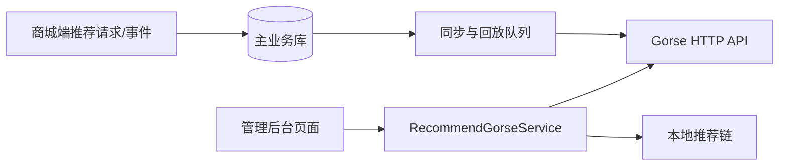

# Gorse 推荐服务管理平台设计

## 文档定位

本文档记录管理后台已落地的 Gorse 运维和调试能力，并明确仍由代码或配置文件控制的边界。人工运营的“热门推荐”与 Gorse 算法推荐并存，前者不替代后者。

## 当前实现

管理后台页面位于 `src/views/shop/admin/recommend/gorse`，接口封装位于 `src/api/shop/admin/recommend_gorse.ts`，服务端代理为 `shop.admin.v1.RecommendGorseService`。浏览器只调用后端 API；后端使用本地推荐配置连接 Gorse HTTP API。

| 页面/目录 | 已提供的能力 |
| --- | --- |
| `overview` | 推荐概览、指标卡、趋势和仪表盘推荐商品。 |
| `task` | Gorse 任务状态查看。 |
| `user` | 用户、相似用户、用户反馈和用户推荐结果。 |
| `item` | 商品、相似商品和商品关联结果。 |
| `advance` | 高级查询与调试入口。 |
| `flow` | 推荐编排的可视化编辑、节点预览和回退推荐器配置。 |
| `config` | 推荐服务配置的受控展示与编辑入口。 |

后台能力服务于排查和运营，不直接承担容器部署、训练节点维护或数据库运维。Gorse Docker、端口、存储和算法参数仍由 `gorse/docker-compose.yml` 与 `gorse/config/config.toml` 管理。

## 数据与责任边界

- Gorse 的用户、商品、反馈、任务和推荐结果由后端代理查询，避免 API Key 暴露给客户端。
- 推荐请求、事件和业务事实保留在主业务库，后台排查不能只看 Gorse 数据。
- Gorse 失败、冷启动或候选不足时，商城在线请求会走本地推荐兜底；后台指标需要区分远端结果和最终返回结果。
- 同步任务由后端 `RecommendSync` 和推荐队列处理，当前页面不应绕过队列直接篡改主业务对象。

## 场景与调试

商城当前使用首页、商品详情、购物车、个人中心、订单详情和支付成功等推荐场景。调试时应提供主体、场景、上下文商品、分页和推荐器等必要输入，并分别观察：

1. Gorse 原始候选与错误信息。
2. 后端责任链命中位置。
3. 商品有效性过滤后的最终结果。
4. 远端失败或候选不足时的本地兜底结果。

热门推荐页面用于人工固定坑位和专题运营；Gorse 页面用于算法链路观察、数据检查、用户/商品关系和候选调试，两者的权限与文案应保持区分。

## 演进边界

下列能力尚不应被描述为当前可用功能，除非后端持久化模型、权限、审计和发布流程已同步实现：

- 场景策略的版本化发布、灰度和回滚。
- 在线编辑完整 Gorse `config.toml` 或训练参数。
- 同步/事件回放任务的持久化操作审计与失败重试编排。
- 告警规则、告警通知和效果实验平台。

若要继续后台化推荐策略，应先把服务端责任链、配置生效方式、版本模型、权限和审计边界设计为一个完整闭环，再扩展页面。不能只添加前端开关而让配置无法持久化、无法回滚或绕过鉴权。

## 验证重点

- Gorse 未启动、API Key 无效、远端超时、远端空结果时，后台报错清晰且商城推荐仍可用。
- 受限角色不能访问高风险调试、配置或数据同步操作。
- 用户、商品、反馈和推荐结果的详情查询不泄露不应展示的凭据或内部配置。
- 页面展示的推荐器、场景和状态与后端实际返回值一致，不在前端维护第二套策略字典。
